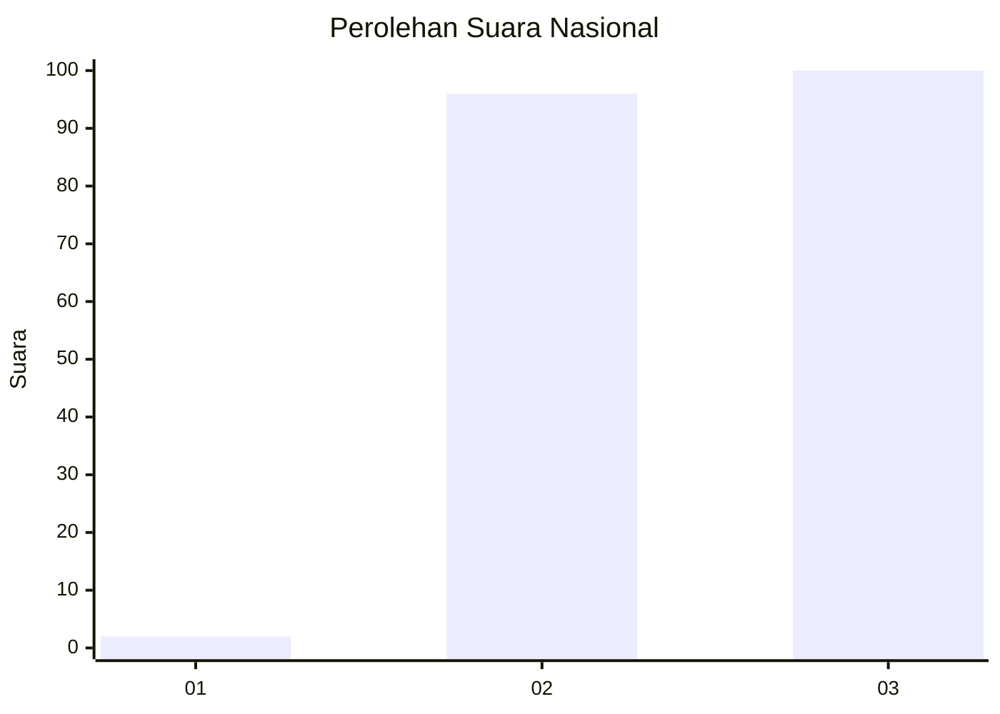
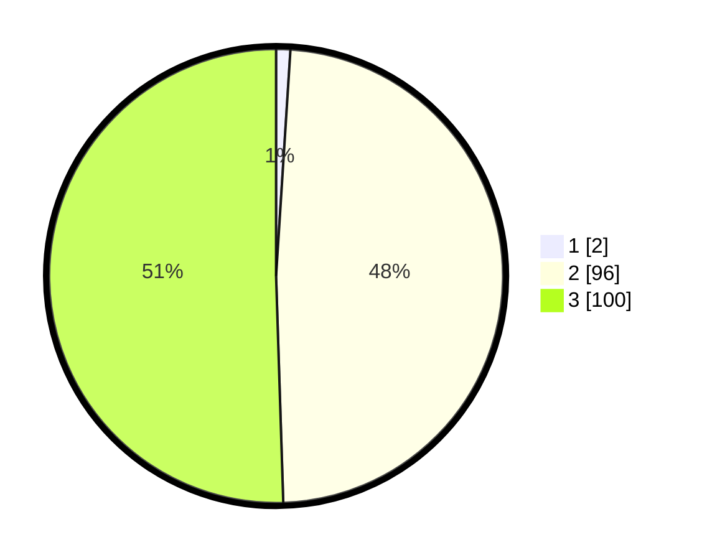

# Hasil

## Grafik

## Tabel

| No. | Nama Paslon    | Suara | Suara (raw) | Persentase |
|:--- |:-------------- | -----:| -----------:| ----------:|
| 1   | ANIES MUHAIMIN | 2     | [2][p-1]    | 1,01       |
| 2   | PRABOWO GIBRAN | 96    | [96][p-2]   | 48,48      |
| 3   | GANJAR MAHFUD  | 100   | [100][p-3]  | 50,51      |

[p-1]: https://github.com/gigit-pemilu/pemilu-2024/blob/main/pilpres/hitung-suara/sub/51-bali/sub/02-tabanan/sub/06-kediri/sub/2010-pandak-gede/sub/013-tps/sub/paslon-1.txt
[p-2]: https://github.com/gigit-pemilu/pemilu-2024/blob/main/pilpres/hitung-suara/sub/51-bali/sub/02-tabanan/sub/06-kediri/sub/2010-pandak-gede/sub/013-tps/sub/paslon-2.txt
[p-3]: https://github.com/gigit-pemilu/pemilu-2024/blob/main/pilpres/hitung-suara/sub/51-bali/sub/02-tabanan/sub/06-kediri/sub/2010-pandak-gede/sub/013-tps/sub/paslon-3.txt

## Foto C Plano

https://sirekap-obj-formc.kpu.go.id/5338/pemilu/ppwp/51/02/06/20/10/5102062010013-20240214-185420--cb2d566f-c536-4ea1-9d93-6a446ff49e8a.jpg

https://sirekap-obj-formc.kpu.go.id/5338/pemilu/ppwp/51/02/06/20/10/5102062010013-20240214-185425--f2de527a-7b05-4fd9-86b1-42d1d43c2b26.jpg

https://sirekap-obj-formc.kpu.go.id/5338/pemilu/ppwp/51/02/06/20/10/5102062010013-20240214-185430--17dcbd6c-8ee5-45a9-b1f5-18a18760d22d.jpg

## Metadata

| Key        | Value               |
| ---------- | ------------------- |
| Time Stamp | 2024-02-15 23:29:50 |

