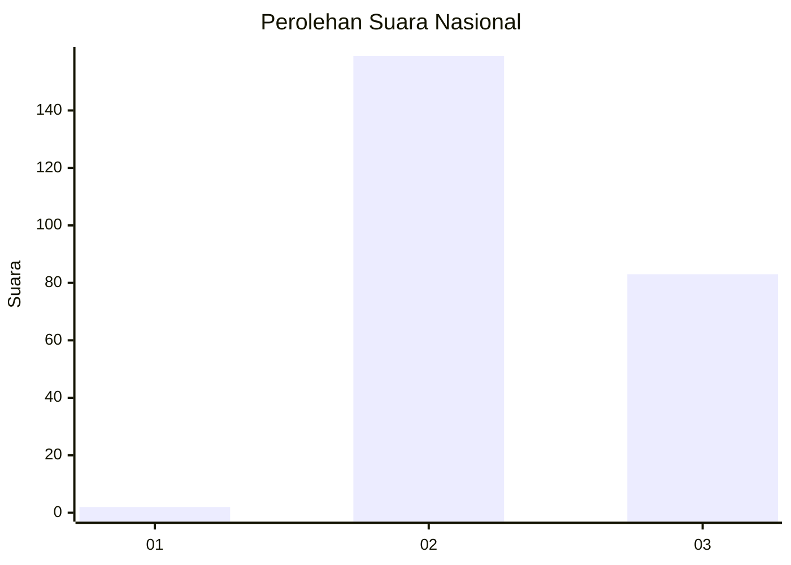
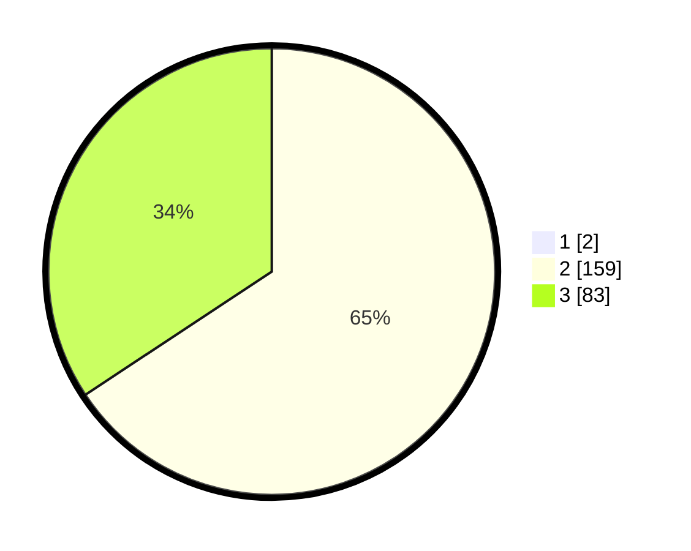

# Hasil

## Grafik

## Tabel

| No. | Nama Paslon    | Suara | Suara (raw) | Persentase |
|:--- |:-------------- | -----:| -----------:| ----------:|
| 1   | ANIES MUHAIMIN | 2     | [2][p-1]    | 0,82       |
| 2   | PRABOWO GIBRAN | 159   | [159][p-2]  | 65,16      |
| 3   | GANJAR MAHFUD  | 83    | [83][p-3]   | 34,02      |

[p-1]: https://github.com/gigit-pemilu/pemilu-2024/blob/main/pilpres/hitung-suara/sub/51-bali/sub/02-tabanan/sub/06-kediri/sub/2010-pandak-gede/sub/020-tps/sub/paslon-1.txt
[p-2]: https://github.com/gigit-pemilu/pemilu-2024/blob/main/pilpres/hitung-suara/sub/51-bali/sub/02-tabanan/sub/06-kediri/sub/2010-pandak-gede/sub/020-tps/sub/paslon-2.txt
[p-3]: https://github.com/gigit-pemilu/pemilu-2024/blob/main/pilpres/hitung-suara/sub/51-bali/sub/02-tabanan/sub/06-kediri/sub/2010-pandak-gede/sub/020-tps/sub/paslon-3.txt

## Foto C Plano

https://sirekap-obj-formc.kpu.go.id/f965/pemilu/ppwp/51/02/06/20/10/5102062010020-20240214-141034--f0d9f043-8058-47f6-b480-728900973e04.jpg

https://sirekap-obj-formc.kpu.go.id/f965/pemilu/ppwp/51/02/06/20/10/5102062010020-20240214-141125--f0dd4604-733f-4d22-9e03-8cb2d0096981.jpg

https://sirekap-obj-formc.kpu.go.id/f965/pemilu/ppwp/51/02/06/20/10/5102062010020-20240214-141045--5e5b1dbd-198b-45e7-ac17-4cfd3cd5fcb4.jpg

## Metadata

| Key        | Value               |
| ---------- | ------------------- |
| Time Stamp | 2024-02-15 23:29:50 |

