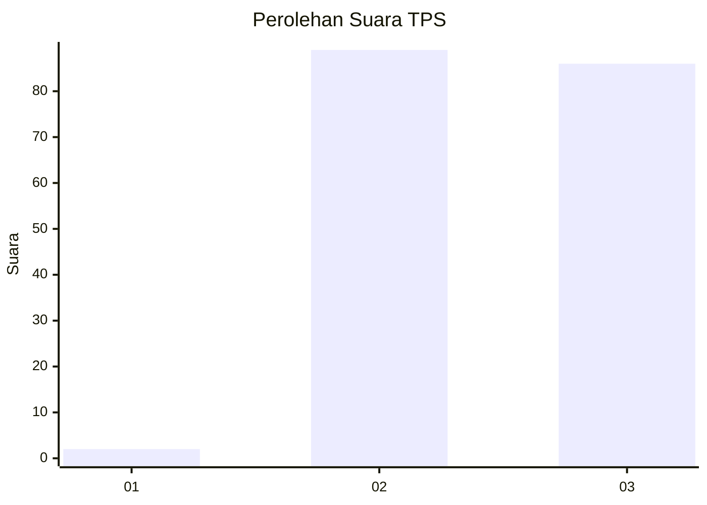
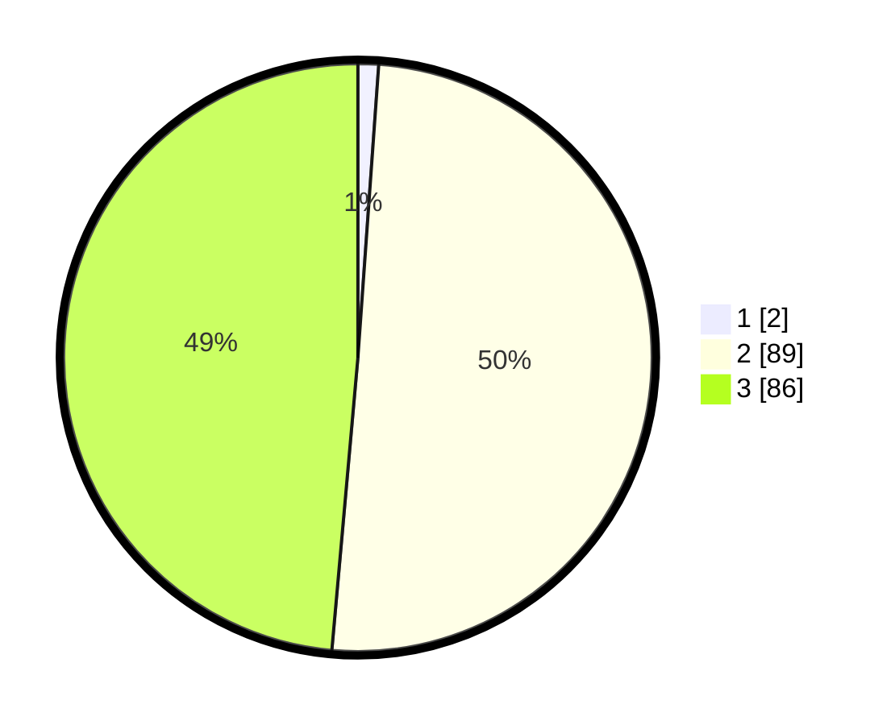

# Hasil

## Grafik

## Tabel

| No. | Nama Paslon    | Suara | Suara (raw) | Persentase |
|:--- |:-------------- | -----:| -----------:| ----------:|
| 1   | ANIES MUHAIMIN | 2     | [2][p-1]    | 1,13       |
| 2   | PRABOWO GIBRAN | 89    | [89][p-2]   | 50,28      |
| 3   | GANJAR MAHFUD  | 86    | [86][p-3]   | 48,59      |

[p-1]: https://github.com/gigit-pemilu/pemilu-2024-51-bali/blob/main/pilpres/hitung-suara/sub/51-bali/sub/02-tabanan/sub/06-kediri/sub/2011-nyitdah/sub/006-tps/sub/paslon-1.txt
[p-2]: https://github.com/gigit-pemilu/pemilu-2024-51-bali/blob/main/pilpres/hitung-suara/sub/51-bali/sub/02-tabanan/sub/06-kediri/sub/2011-nyitdah/sub/006-tps/sub/paslon-2.txt
[p-3]: https://github.com/gigit-pemilu/pemilu-2024-51-bali/blob/main/pilpres/hitung-suara/sub/51-bali/sub/02-tabanan/sub/06-kediri/sub/2011-nyitdah/sub/006-tps/sub/paslon-3.txt

## Foto C Plano

https://sirekap-obj-formc.kpu.go.id/743a/pemilu/ppwp/51/02/06/20/11/5102062011006-20240215-220051--b096e96c-92f1-49ca-9566-92cb2e8d5860.jpg

https://sirekap-obj-formc.kpu.go.id/743a/pemilu/ppwp/51/02/06/20/11/5102062011006-20240215-220053--baf0a1db-aa79-4767-b56c-fe90d7e75f61.jpg

https://sirekap-obj-formc.kpu.go.id/743a/pemilu/ppwp/51/02/06/20/11/5102062011006-20240215-220052--171d777f-b499-478d-bcd4-21ae178c20d8.jpg

## Metadata

| Key        | Value               |
| ---------- | ------------------- |
| Time Stamp | 2024-02-15 22:30:27 |

## DATA PEMILIH TETAP

Jumlah pemilih dalam DPT: **190**.
 * L: **92**.
 * P: **98**.

## DATA PENGGUNA HAK PILIH

Jumlah pengguna hak pilih dalam DPT: **179**.
 * L: **86**.
 * P: **93**.

Jumlah pengguna hak pilih dalam DPTb: **0**.
 * L: **0**.
 * P: **0**.

Jumlah pengguna hak pilih dalam DPK: **0**.
 * L: **0**.
 * P: **0**.

Jumlah pengguna hak pilih: **179**.
 * L: **86**.
 * P: **93**.

## JUMLAH SUARA SAH DAN TIDAK SAH

JUMLAH SELURUH SUARA SAH: **177**.

JUMLAH SUARA TIDAK SAH: **2**.

JUMLAH SELURUH SUARA SAH DAN SUARA TIDAK SAH: **179**.

