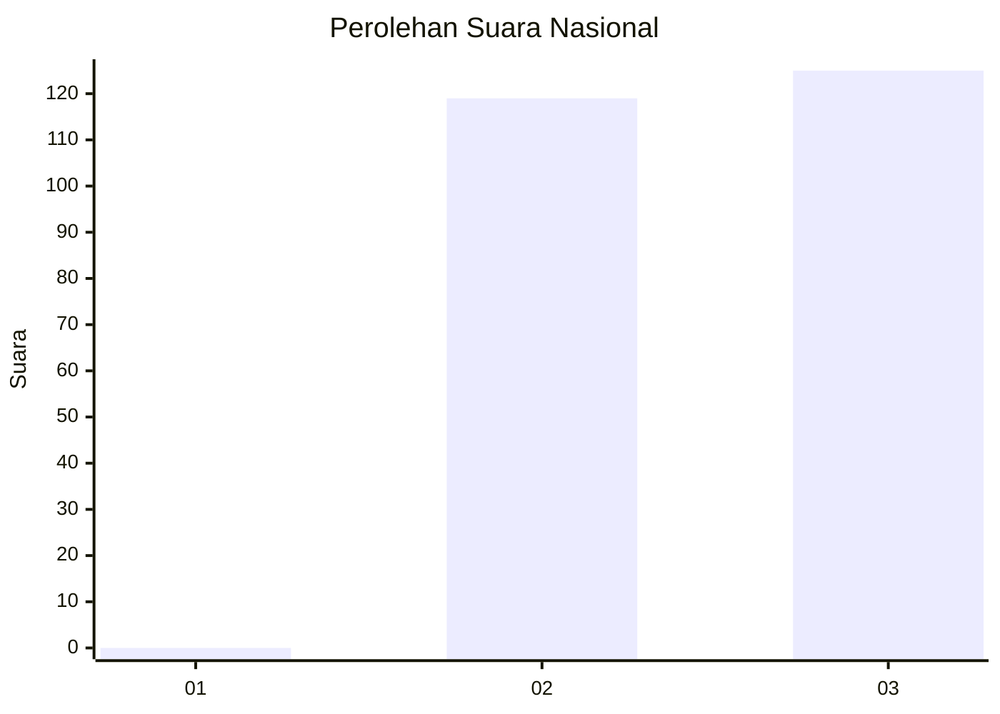
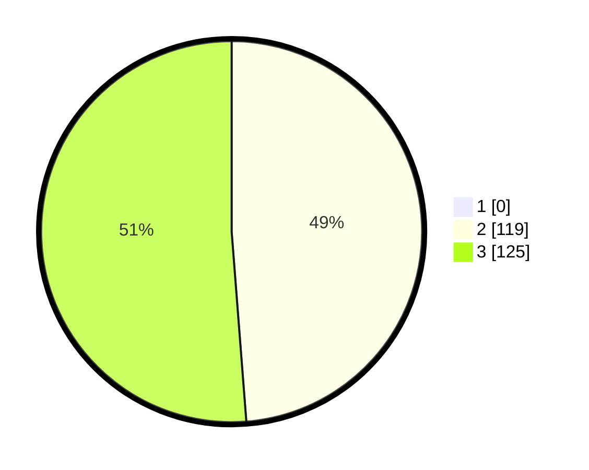

# Hasil

## Grafik

## Tabel

| No. | Nama Paslon    | Suara | Suara (raw) | Persentase |
|:--- |:-------------- | -----:| -----------:| ----------:|
| 1   | ANIES MUHAIMIN | 0     | [0][p-1]    | 0,00       |
| 2   | PRABOWO GIBRAN | 119   | [119][p-2]  | 48,77      |
| 3   | GANJAR MAHFUD  | 125   | [125][p-3]  | 51,23      |

[p-1]: https://github.com/gigit-pemilu/pemilu-2024/blob/main/pilpres/hitung-suara/sub/51-bali/sub/02-tabanan/sub/06-kediri/sub/2011-nyitdah/sub/010-tps/sub/paslon-1.txt
[p-2]: https://github.com/gigit-pemilu/pemilu-2024/blob/main/pilpres/hitung-suara/sub/51-bali/sub/02-tabanan/sub/06-kediri/sub/2011-nyitdah/sub/010-tps/sub/paslon-2.txt
[p-3]: https://github.com/gigit-pemilu/pemilu-2024/blob/main/pilpres/hitung-suara/sub/51-bali/sub/02-tabanan/sub/06-kediri/sub/2011-nyitdah/sub/010-tps/sub/paslon-3.txt

## Foto C Plano

https://sirekap-obj-formc.kpu.go.id/b973/pemilu/ppwp/51/02/06/20/11/5102062011010-20240215-232559--5be21cf5-0c20-4390-bf90-11afad3a76a5.jpg

https://sirekap-obj-formc.kpu.go.id/b973/pemilu/ppwp/51/02/06/20/11/5102062011010-20240215-232601--64c3903a-f692-4bbc-9cee-0087178bee9b.jpg

https://sirekap-obj-formc.kpu.go.id/b973/pemilu/ppwp/51/02/06/20/11/5102062011010-20240215-232600--00ed8e92-8f26-40bd-b1e0-0194f26e67b4.jpg

## Metadata

| Key        | Value               |
| ---------- | ------------------- |
| Time Stamp | 2024-02-16 11:00:29 |

## DATA PEMILIH TETAP

Jumlah pemilih dalam DPT: **278**.
 * L: **135**.
 * P: **143**.

## DATA PENGGUNA HAK PILIH

Jumlah pengguna hak pilih dalam DPT: **248**.
 * L: **121**.
 * P: **127**.

Jumlah pengguna hak pilih dalam DPTb: **0**.
 * L: **0**.
 * P: **0**.

Jumlah pengguna hak pilih dalam DPK: **0**.
 * L: **0**.
 * P: **0**.

Jumlah pengguna hak pilih: **248**.
 * L: **121**.
 * P: **127**.

## JUMLAH SUARA SAH DAN TIDAK SAH

JUMLAH SELURUH SUARA SAH: **244**.

JUMLAH SUARA TIDAK SAH: **4**.

JUMLAH SELURUH SUARA SAH DAN SUARA TIDAK SAH: **248**.

