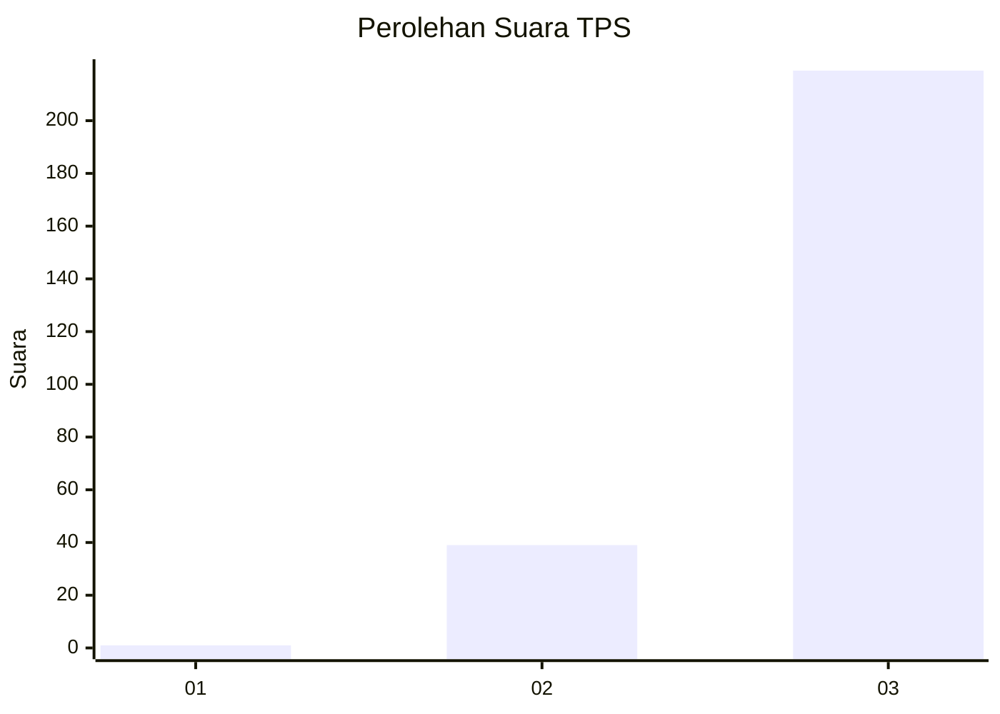
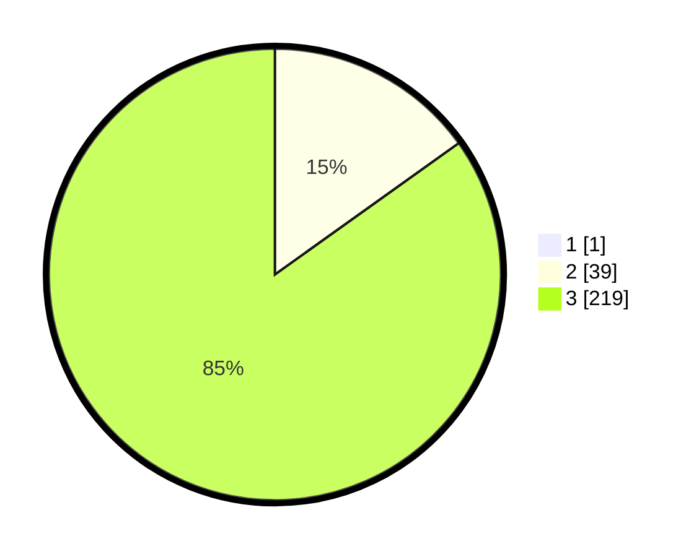

# Hasil

## Grafik

## Tabel

| No. | Nama Paslon    | Suara | Suara (raw) | Persentase |
|:--- |:-------------- | -----:| -----------:| ----------:|
| 1   | ANIES MUHAIMIN | 1     | [1][p-1]    | 0,39       |
| 2   | PRABOWO GIBRAN | 39    | [39][p-2]   | 15,06      |
| 3   | GANJAR MAHFUD  | 219   | [219][p-3]  | 84,56      |

[p-1]: https://github.com/gigit-pemilu/pemilu-2024-51-bali/blob/main/pilpres/hitung-suara/sub/51-bali/sub/02-tabanan/sub/06-kediri/sub/2011-nyitdah/sub/012-tps/sub/paslon-1.txt
[p-2]: https://github.com/gigit-pemilu/pemilu-2024-51-bali/blob/main/pilpres/hitung-suara/sub/51-bali/sub/02-tabanan/sub/06-kediri/sub/2011-nyitdah/sub/012-tps/sub/paslon-2.txt
[p-3]: https://github.com/gigit-pemilu/pemilu-2024-51-bali/blob/main/pilpres/hitung-suara/sub/51-bali/sub/02-tabanan/sub/06-kediri/sub/2011-nyitdah/sub/012-tps/sub/paslon-3.txt

## Foto C Plano

https://sirekap-obj-formc.kpu.go.id/1c64/pemilu/ppwp/51/02/06/20/11/5102062011012-20240216-042101--4e1444bf-36b1-428c-ab21-389b47da455f.jpg

https://sirekap-obj-formc.kpu.go.id/1c64/pemilu/ppwp/51/02/06/20/11/5102062011012-20240216-042104--5cbbcb8f-c78f-4b98-ba02-6424f25af119.jpg

https://sirekap-obj-formc.kpu.go.id/1c64/pemilu/ppwp/51/02/06/20/11/5102062011012-20240216-042102--72682d54-7099-40f4-96f3-b11c934a0271.jpg

## Metadata

| Key        | Value               |
| ---------- | ------------------- |
| Time Stamp | 2024-02-16 11:00:29 |

## DATA PEMILIH TETAP

Jumlah pemilih dalam DPT: **265**.
 * L: **133**.
 * P: **132**.

## DATA PENGGUNA HAK PILIH

Jumlah pengguna hak pilih dalam DPT: **260**.
 * L: **133**.
 * P: **127**.

Jumlah pengguna hak pilih dalam DPTb: **0**.
 * L: **0**.
 * P: **0**.

Jumlah pengguna hak pilih dalam DPK: **4**.
 * L: **1**.
 * P: **3**.

Jumlah pengguna hak pilih: **264**.
 * L: **134**.
 * P: **130**.

## JUMLAH SUARA SAH DAN TIDAK SAH

JUMLAH SELURUH SUARA SAH: **259**.

JUMLAH SUARA TIDAK SAH: **5**.

JUMLAH SELURUH SUARA SAH DAN SUARA TIDAK SAH: **264**.

