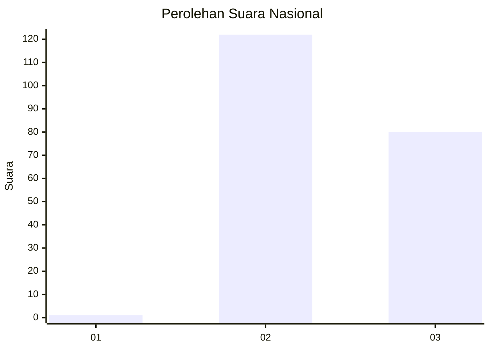
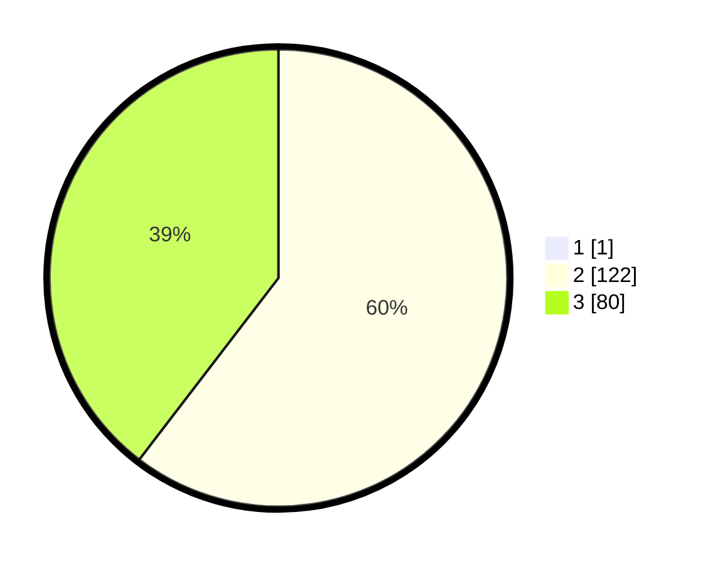

# Hasil

## Grafik

## Tabel

| No. | Nama Paslon    | Suara | Suara (raw) | Persentase |
|:--- |:-------------- | -----:| -----------:| ----------:|
| 1   | ANIES MUHAIMIN | 1     | [1][p-1]    | 0,49       |
| 2   | PRABOWO GIBRAN | 122   | [122][p-2]  | 60,10      |
| 3   | GANJAR MAHFUD  | 80    | [80][p-3]   | 39,41      |

[p-1]: https://github.com/gigit-pemilu/pemilu-2024/blob/main/pilpres/hitung-suara/sub/51-bali/sub/02-tabanan/sub/06-kediri/sub/2011-nyitdah/sub/013-tps/sub/paslon-1.txt
[p-2]: https://github.com/gigit-pemilu/pemilu-2024/blob/main/pilpres/hitung-suara/sub/51-bali/sub/02-tabanan/sub/06-kediri/sub/2011-nyitdah/sub/013-tps/sub/paslon-2.txt
[p-3]: https://github.com/gigit-pemilu/pemilu-2024/blob/main/pilpres/hitung-suara/sub/51-bali/sub/02-tabanan/sub/06-kediri/sub/2011-nyitdah/sub/013-tps/sub/paslon-3.txt

## Foto C Plano

https://sirekap-obj-formc.kpu.go.id/be97/pemilu/ppwp/51/02/06/20/11/5102062011013-20240214-225631--0ed453b1-3c48-4ee7-a45a-5a92783e5ac3.jpg

https://sirekap-obj-formc.kpu.go.id/be97/pemilu/ppwp/51/02/06/20/11/5102062011013-20240214-225706--4a44f4c1-0d1a-46cc-bb4e-f9f54018265a.jpg

https://sirekap-obj-formc.kpu.go.id/be97/pemilu/ppwp/51/02/06/20/11/5102062011013-20240214-225739--cba6d4a7-bff0-4af5-8204-c9a3fb6a390b.jpg

## Metadata

| Key        | Value               |
| ---------- | ------------------- |
| Time Stamp | 2024-02-24 22:31:28 |

