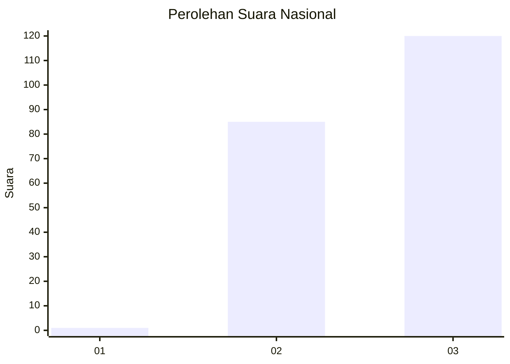
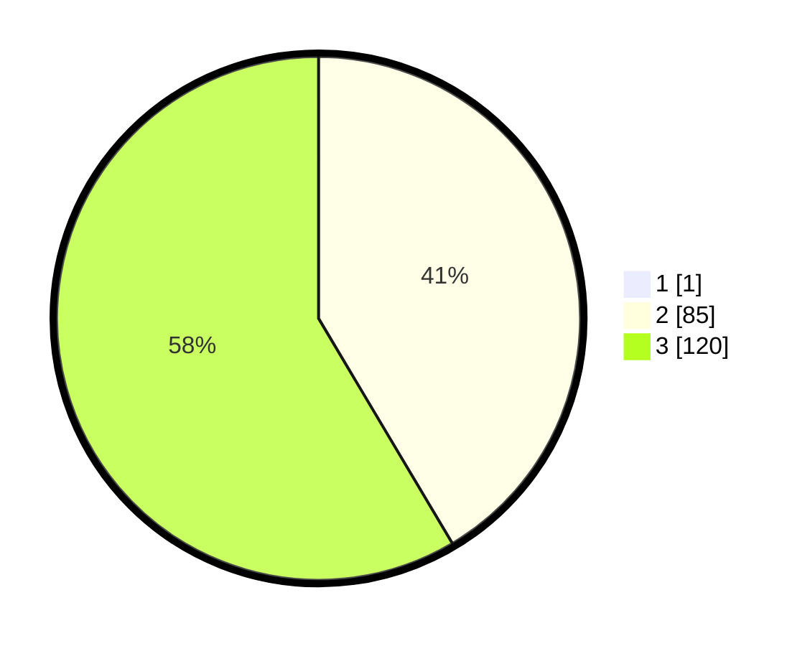

# Hasil

## Grafik

## Tabel

| No. | Nama Paslon    | Suara | Suara (raw) | Persentase |
|:--- |:-------------- | -----:| -----------:| ----------:|
| 1   | ANIES MUHAIMIN | 1     | [1][p-1]    | 0,49       |
| 2   | PRABOWO GIBRAN | 85    | [85][p-2]   | 41,26      |
| 3   | GANJAR MAHFUD  | 120   | [120][p-3]  | 58,25      |

[p-1]: https://github.com/gigit-pemilu/pemilu-2024/blob/main/pilpres/hitung-suara/sub/51-bali/sub/02-tabanan/sub/06-kediri/sub/2011-nyitdah/sub/014-tps/sub/paslon-1.txt
[p-2]: https://github.com/gigit-pemilu/pemilu-2024/blob/main/pilpres/hitung-suara/sub/51-bali/sub/02-tabanan/sub/06-kediri/sub/2011-nyitdah/sub/014-tps/sub/paslon-2.txt
[p-3]: https://github.com/gigit-pemilu/pemilu-2024/blob/main/pilpres/hitung-suara/sub/51-bali/sub/02-tabanan/sub/06-kediri/sub/2011-nyitdah/sub/014-tps/sub/paslon-3.txt

## Foto C Plano

https://sirekap-obj-formc.kpu.go.id/dede/pemilu/ppwp/51/02/06/20/11/5102062011014-20240216-150034--6b9edb68-2fba-4cb6-9ff6-7c8d06926b17.jpg

https://sirekap-obj-formc.kpu.go.id/dede/pemilu/ppwp/51/02/06/20/11/5102062011014-20240216-150036--f40e68f9-6fd3-4fc1-bc78-8c36de4b29dc.jpg

https://sirekap-obj-formc.kpu.go.id/dede/pemilu/ppwp/51/02/06/20/11/5102062011014-20240216-150035--17fdbd94-b50f-4fe9-9a3d-88629f37a0e2.jpg

## Metadata

| Key        | Value               |
| ---------- | ------------------- |
| Time Stamp | 2024-02-21 12:00:00 |

## DATA PEMILIH TETAP

Jumlah pemilih dalam DPT: **223**.
 * L: **116**.
 * P: **107**.

## DATA PENGGUNA HAK PILIH

Jumlah pengguna hak pilih dalam DPT: **210**.
 * L: **108**.
 * P: **102**.

Jumlah pengguna hak pilih dalam DPTb: **0**.
 * L: **0**.
 * P: **0**.

Jumlah pengguna hak pilih dalam DPK: **2**.
 * L: **0**.
 * P: **2**.

Jumlah pengguna hak pilih: **212**.
 * L: **108**.
 * P: **104**.

## JUMLAH SUARA SAH DAN TIDAK SAH

JUMLAH SELURUH SUARA SAH: **206**.

JUMLAH SUARA TIDAK SAH: **6**.

JUMLAH SELURUH SUARA SAH DAN SUARA TIDAK SAH: **212**.

