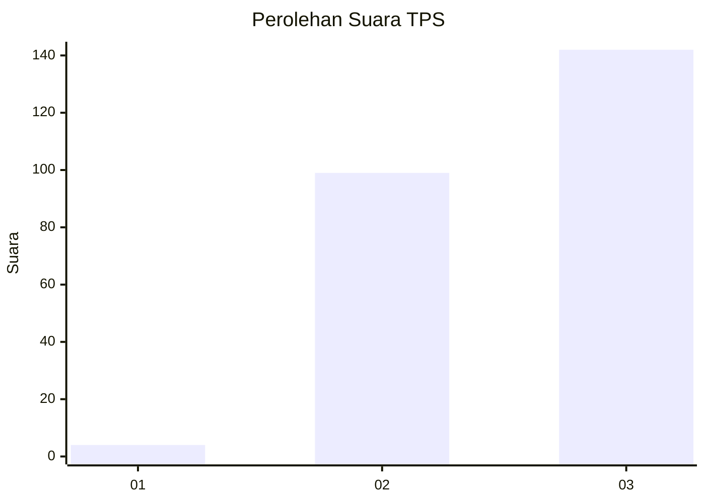
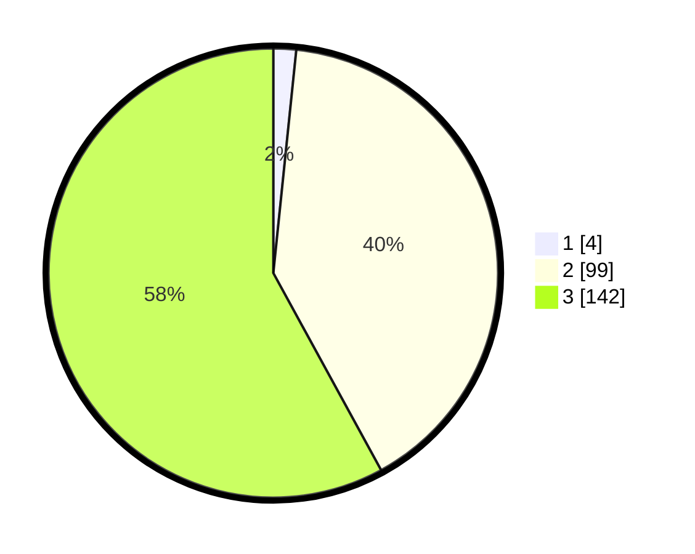

# Hasil

## Grafik

## Tabel

| No. | Nama Paslon    | Suara | Suara (raw) | Persentase |
|:--- |:-------------- | -----:| -----------:| ----------:|
| 1   | ANIES MUHAIMIN | 4     | [4][p-1]    | 1,63       |
| 2   | PRABOWO GIBRAN | 99    | [99][p-2]   | 40,41      |
| 3   | GANJAR MAHFUD  | 142   | [142][p-3]  | 57,96      |

[p-1]: https://github.com/gigit-pemilu/pemilu-2024-51-bali/blob/main/pilpres/hitung-suara/sub/51-bali/sub/02-tabanan/sub/06-kediri/sub/2012-pejaten/sub/003-tps/sub/paslon-1.txt
[p-2]: https://github.com/gigit-pemilu/pemilu-2024-51-bali/blob/main/pilpres/hitung-suara/sub/51-bali/sub/02-tabanan/sub/06-kediri/sub/2012-pejaten/sub/003-tps/sub/paslon-2.txt
[p-3]: https://github.com/gigit-pemilu/pemilu-2024-51-bali/blob/main/pilpres/hitung-suara/sub/51-bali/sub/02-tabanan/sub/06-kediri/sub/2012-pejaten/sub/003-tps/sub/paslon-3.txt

## Foto C Plano

https://sirekap-obj-formc.kpu.go.id/9861/pemilu/ppwp/51/02/06/20/12/5102062012003-20240214-131237--ce20d53a-7088-459c-9d91-46a735ecfab6.jpg

https://sirekap-obj-formc.kpu.go.id/9861/pemilu/ppwp/51/02/06/20/12/5102062012003-20240214-131333--381d7721-d390-4617-bde4-f30279ed8e25.jpg

https://sirekap-obj-formc.kpu.go.id/9861/pemilu/ppwp/51/02/06/20/12/5102062012003-20240214-131541--a595d749-285e-48ca-917b-093a1c2b0185.jpg

## Metadata

| Key        | Value               |
| ---------- | ------------------- |
| Time Stamp | 2024-02-14 21:46:01 |

## DATA PEMILIH TETAP

Jumlah pemilih dalam DPT: **261**.
 * L: **121**.
 * P: **140**.

## DATA PENGGUNA HAK PILIH

Jumlah pengguna hak pilih dalam DPT: **247**.
 * L: **113**.
 * P: **134**.

Jumlah pengguna hak pilih dalam DPTb: **0**.
 * L: **0**.
 * P: **0**.

Jumlah pengguna hak pilih dalam DPK: **0**.
 * L: **0**.
 * P: **0**.

Jumlah pengguna hak pilih: **247**.
 * L: **113**.
 * P: **134**.

## JUMLAH SUARA SAH DAN TIDAK SAH

JUMLAH SELURUH SUARA SAH: **245**.

JUMLAH SUARA TIDAK SAH: **2**.

JUMLAH SELURUH SUARA SAH DAN SUARA TIDAK SAH: **247**.

