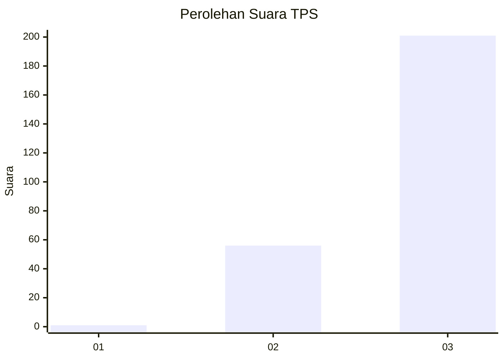
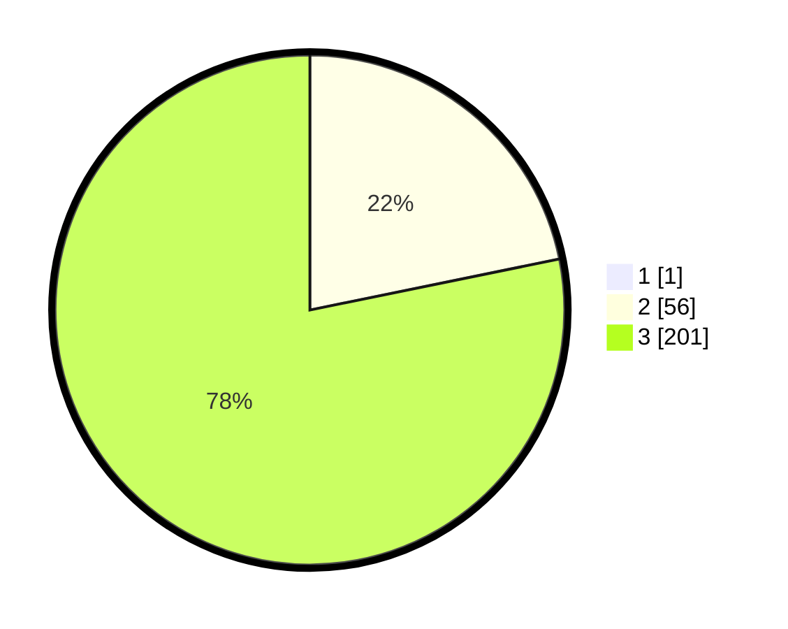

# Hasil

## Grafik

## Tabel

| No. | Nama Paslon    | Suara | Suara (raw) | Persentase |
|:--- |:-------------- | -----:| -----------:| ----------:|
| 1   | ANIES MUHAIMIN | 1     | [1][p-1]    | 0,39       |
| 2   | PRABOWO GIBRAN | 56    | [56][p-2]   | 21,71      |
| 3   | GANJAR MAHFUD  | 201   | [201][p-3]  | 77,91      |

[p-1]: https://github.com/gigit-pemilu/pemilu-2024-51-bali/blob/main/pilpres/hitung-suara/sub/51-bali/sub/02-tabanan/sub/06-kediri/sub/2012-pejaten/sub/007-tps/sub/paslon-1.txt
[p-2]: https://github.com/gigit-pemilu/pemilu-2024-51-bali/blob/main/pilpres/hitung-suara/sub/51-bali/sub/02-tabanan/sub/06-kediri/sub/2012-pejaten/sub/007-tps/sub/paslon-2.txt
[p-3]: https://github.com/gigit-pemilu/pemilu-2024-51-bali/blob/main/pilpres/hitung-suara/sub/51-bali/sub/02-tabanan/sub/06-kediri/sub/2012-pejaten/sub/007-tps/sub/paslon-3.txt

## Foto C Plano

https://sirekap-obj-formc.kpu.go.id/85b9/pemilu/ppwp/51/02/06/20/12/5102062012007-20240214-141043--3ab5ff51-53e2-43eb-b1cc-d8c4eaaa8e5b.jpg

https://sirekap-obj-formc.kpu.go.id/85b9/pemilu/ppwp/51/02/06/20/12/5102062012007-20240214-141053--e70d453d-83e1-447e-af69-0627e8b64d75.jpg

https://sirekap-obj-formc.kpu.go.id/85b9/pemilu/ppwp/51/02/06/20/12/5102062012007-20240214-155054--4a4c4d5e-501b-4274-90c0-58d1fbbcb55e.jpg

## Metadata

| Key        | Value               |
| ---------- | ------------------- |
| Time Stamp | 2024-02-14 21:46:01 |

## DATA PEMILIH TETAP

Jumlah pemilih dalam DPT: **269**.
 * L: **133**.
 * P: **136**.

## DATA PENGGUNA HAK PILIH

Jumlah pengguna hak pilih dalam DPT: **261**.
 * L: **129**.
 * P: **132**.

Jumlah pengguna hak pilih dalam DPTb: **0**.
 * L: **0**.
 * P: **0**.

Jumlah pengguna hak pilih dalam DPK: **0**.
 * L: **0**.
 * P: **0**.

Jumlah pengguna hak pilih: **261**.
 * L: **129**.
 * P: **132**.

## JUMLAH SUARA SAH DAN TIDAK SAH

JUMLAH SELURUH SUARA SAH: **258**.

JUMLAH SUARA TIDAK SAH: **3**.

JUMLAH SELURUH SUARA SAH DAN SUARA TIDAK SAH: **261**.

