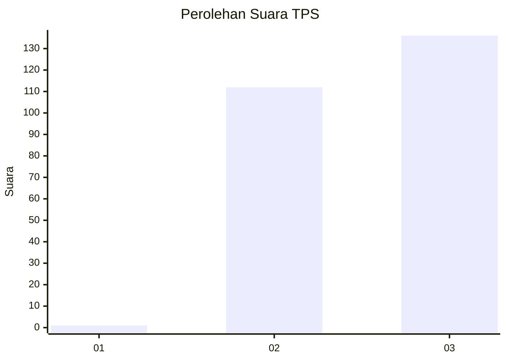
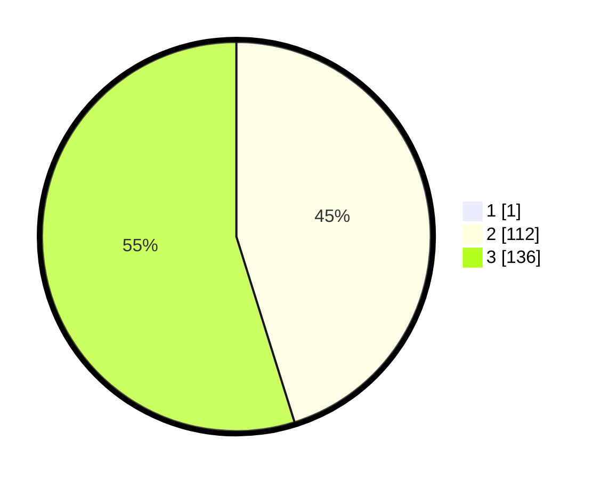

# Hasil

## Grafik

## Tabel

| No. | Nama Paslon    | Suara | Suara (raw) | Persentase |
|:--- |:-------------- | -----:| -----------:| ----------:|
| 1   | ANIES MUHAIMIN | 1     | [1][p-1]    | 0,40       |
| 2   | PRABOWO GIBRAN | 112   | [112][p-2]  | 44,98      |
| 3   | GANJAR MAHFUD  | 136   | [136][p-3]  | 54,62      |

[p-1]: https://github.com/gigit-pemilu/pemilu-2024-51-bali/blob/main/pilpres/hitung-suara/sub/51-bali/sub/02-tabanan/sub/06-kediri/sub/2012-pejaten/sub/009-tps/sub/paslon-1.txt
[p-2]: https://github.com/gigit-pemilu/pemilu-2024-51-bali/blob/main/pilpres/hitung-suara/sub/51-bali/sub/02-tabanan/sub/06-kediri/sub/2012-pejaten/sub/009-tps/sub/paslon-2.txt
[p-3]: https://github.com/gigit-pemilu/pemilu-2024-51-bali/blob/main/pilpres/hitung-suara/sub/51-bali/sub/02-tabanan/sub/06-kediri/sub/2012-pejaten/sub/009-tps/sub/paslon-3.txt

## Foto C Plano

https://sirekap-obj-formc.kpu.go.id/e489/pemilu/ppwp/51/02/06/20/12/5102062012009-20240214-230155--bce7145a-05d4-4631-8368-de22ac65a5b6.jpg

https://sirekap-obj-formc.kpu.go.id/e489/pemilu/ppwp/51/02/06/20/12/5102062012009-20240214-230212--0a5ce0b7-45df-4941-841c-b0eb7bf69fd3.jpg

https://sirekap-obj-formc.kpu.go.id/e489/pemilu/ppwp/51/02/06/20/12/5102062012009-20240214-230226--9bb4f181-79f7-4d74-8708-bf32fea73794.jpg

## Metadata

| Key        | Value               |
| ---------- | ------------------- |
| Time Stamp | 2024-02-15 23:29:50 |

