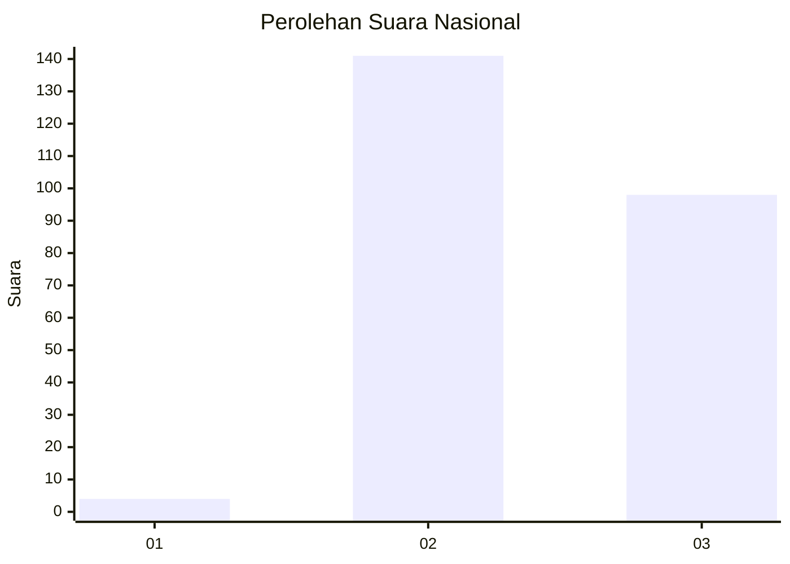
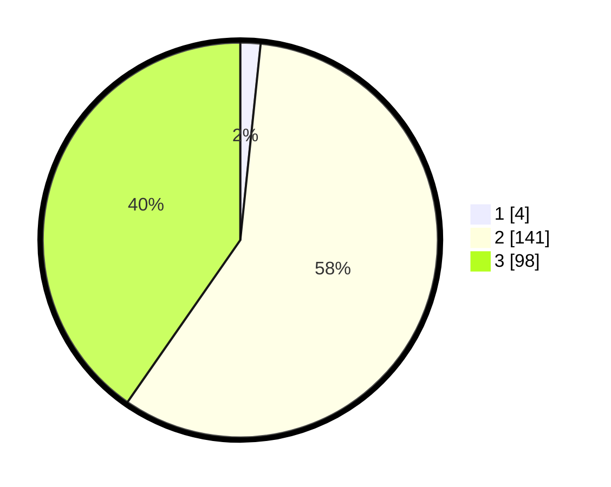

# Hasil

## Grafik

## Tabel

| No. | Nama Paslon    | Suara | Suara (raw) | Persentase |
|:--- |:-------------- | -----:| -----------:| ----------:|
| 1   | ANIES MUHAIMIN | 4     | [4][p-1]    | 1,65       |
| 2   | PRABOWO GIBRAN | 141   | [141][p-2]  | 58,02      |
| 3   | GANJAR MAHFUD  | 98    | [98][p-3]   | 40,33      |

[p-1]: https://github.com/gigit-pemilu/pemilu-2024/blob/main/pilpres/hitung-suara/sub/51-bali/sub/02-tabanan/sub/06-kediri/sub/2012-pejaten/sub/010-tps/sub/paslon-1.txt
[p-2]: https://github.com/gigit-pemilu/pemilu-2024/blob/main/pilpres/hitung-suara/sub/51-bali/sub/02-tabanan/sub/06-kediri/sub/2012-pejaten/sub/010-tps/sub/paslon-2.txt
[p-3]: https://github.com/gigit-pemilu/pemilu-2024/blob/main/pilpres/hitung-suara/sub/51-bali/sub/02-tabanan/sub/06-kediri/sub/2012-pejaten/sub/010-tps/sub/paslon-3.txt

## Foto C Plano

https://sirekap-obj-formc.kpu.go.id/b4a9/pemilu/ppwp/51/02/06/20/12/5102062012010-20240214-220951--11b5e465-dca9-4704-a628-96ab09ec4764.jpg

https://sirekap-obj-formc.kpu.go.id/b4a9/pemilu/ppwp/51/02/06/20/12/5102062012010-20240214-221000--db53813b-6a0c-42c9-b6b3-b3cc52efda80.jpg

## Metadata

| Key        | Value               |
| ---------- | ------------------- |
| Time Stamp | 2024-02-15 23:29:50 |

