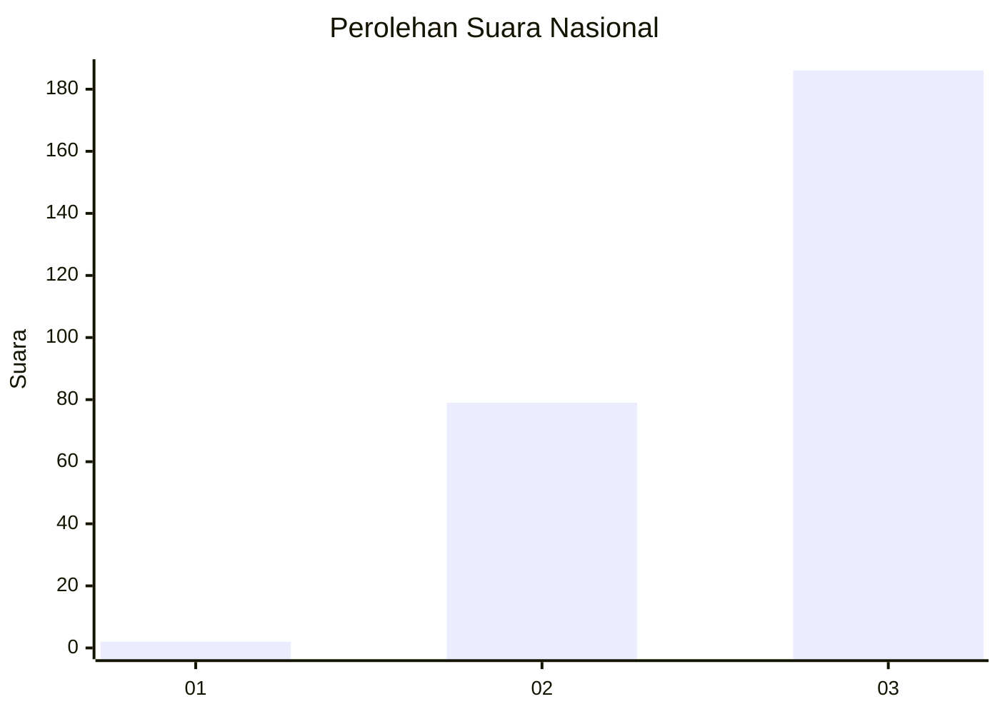
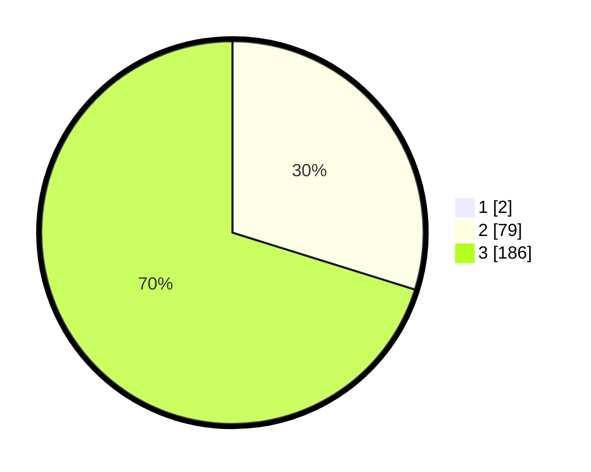

# Hasil

## Grafik

## Tabel

| No. | Nama Paslon    | Suara | Suara (raw) | Persentase |
|:--- |:-------------- | -----:| -----------:| ----------:|
| 1   | ANIES MUHAIMIN | 2     | [2][p-1]    | 0,75       |
| 2   | PRABOWO GIBRAN | 79    | [79][p-2]   | 29,59      |
| 3   | GANJAR MAHFUD  | 186   | [186][p-3]  | 69,66      |

[p-1]: https://github.com/gigit-pemilu/pemilu-2024/blob/main/pilpres/hitung-suara/sub/51-bali/sub/02-tabanan/sub/06-kediri/sub/2012-pejaten/sub/011-tps/sub/paslon-1.txt
[p-2]: https://github.com/gigit-pemilu/pemilu-2024/blob/main/pilpres/hitung-suara/sub/51-bali/sub/02-tabanan/sub/06-kediri/sub/2012-pejaten/sub/011-tps/sub/paslon-2.txt
[p-3]: https://github.com/gigit-pemilu/pemilu-2024/blob/main/pilpres/hitung-suara/sub/51-bali/sub/02-tabanan/sub/06-kediri/sub/2012-pejaten/sub/011-tps/sub/paslon-3.txt

## Foto C Plano

https://sirekap-obj-formc.kpu.go.id/df3c/pemilu/ppwp/51/02/06/20/12/5102062012011-20240214-184436--91b72079-49f9-41ba-9a70-3e3fceba0a9a.jpg

https://sirekap-obj-formc.kpu.go.id/df3c/pemilu/ppwp/51/02/06/20/12/5102062012011-20240214-195725--a3c70a41-1665-4d0e-83fd-b68d74ec4ae4.jpg

https://sirekap-obj-formc.kpu.go.id/df3c/pemilu/ppwp/51/02/06/20/12/5102062012011-20240214-184745--fe46af61-ae58-470f-8608-69d15d034c4f.jpg

## Metadata

| Key        | Value               |
| ---------- | ------------------- |
| Time Stamp | 2024-02-15 23:29:50 |

