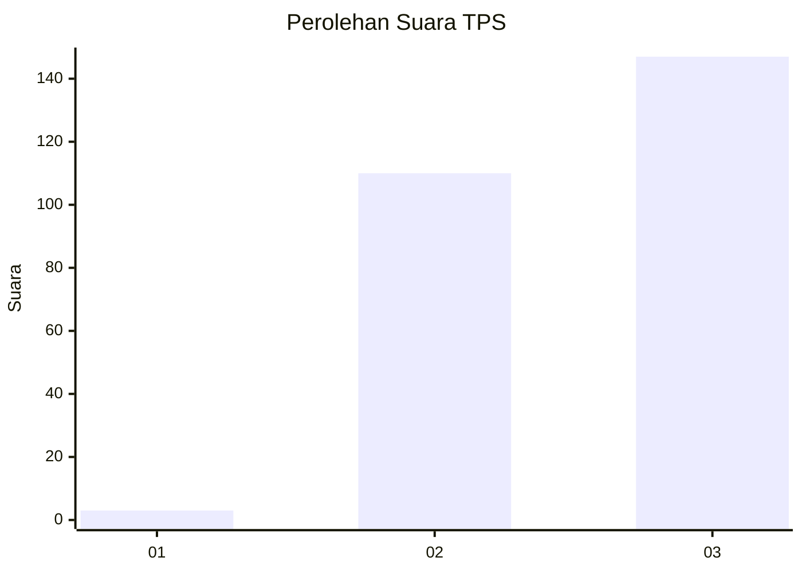
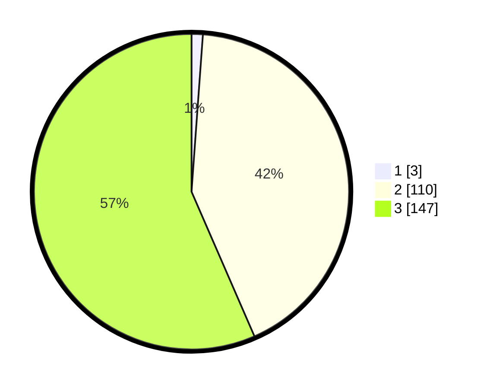

# Hasil

## Grafik

## Tabel

| No. | Nama Paslon    | Suara | Suara (raw) | Persentase |
|:--- |:-------------- | -----:| -----------:| ----------:|
| 1   | ANIES MUHAIMIN | 3     | [3][p-1]    | 1,15       |
| 2   | PRABOWO GIBRAN | 110   | [110][p-2]  | 42,31      |
| 3   | GANJAR MAHFUD  | 147   | [147][p-3]  | 56,54      |

[p-1]: https://github.com/gigit-pemilu/pemilu-2024-51-bali/blob/main/pilpres/hitung-suara/sub/51-bali/sub/02-tabanan/sub/06-kediri/sub/2012-pejaten/sub/012-tps/sub/paslon-1.txt
[p-2]: https://github.com/gigit-pemilu/pemilu-2024-51-bali/blob/main/pilpres/hitung-suara/sub/51-bali/sub/02-tabanan/sub/06-kediri/sub/2012-pejaten/sub/012-tps/sub/paslon-2.txt
[p-3]: https://github.com/gigit-pemilu/pemilu-2024-51-bali/blob/main/pilpres/hitung-suara/sub/51-bali/sub/02-tabanan/sub/06-kediri/sub/2012-pejaten/sub/012-tps/sub/paslon-3.txt

## Foto C Plano

https://sirekap-obj-formc.kpu.go.id/36e1/pemilu/ppwp/51/02/06/20/12/5102062012012-20240214-155627--e6b46b71-3272-47db-9450-248ec7930fb3.jpg

https://sirekap-obj-formc.kpu.go.id/36e1/pemilu/ppwp/51/02/06/20/12/5102062012012-20240214-155731--9408b7ee-a631-482e-861a-4e9727f0c6d9.jpg

https://sirekap-obj-formc.kpu.go.id/36e1/pemilu/ppwp/51/02/06/20/12/5102062012012-20240215-205533--533cec07-86ae-4fcc-93b2-1288425601fa.jpg

## Metadata

| Key        | Value               |
| ---------- | ------------------- |
| Time Stamp | 2024-02-15 21:01:18 |

## DATA PEMILIH TETAP

Jumlah pemilih dalam DPT: **294**.
 * L: **146**.
 * P: **148**.

## DATA PENGGUNA HAK PILIH

Jumlah pengguna hak pilih dalam DPT: **267**.
 * L: **132**.
 * P: **135**.

Jumlah pengguna hak pilih dalam DPTb: **0**.
 * L: **0**.
 * P: **0**.

Jumlah pengguna hak pilih dalam DPK: **0**.
 * L: **0**.
 * P: **0**.

Jumlah pengguna hak pilih: **267**.
 * L: **132**.
 * P: **135**.

## JUMLAH SUARA SAH DAN TIDAK SAH

JUMLAH SELURUH SUARA SAH: **260**.

JUMLAH SUARA TIDAK SAH: **7**.

JUMLAH SELURUH SUARA SAH DAN SUARA TIDAK SAH: **267**.

