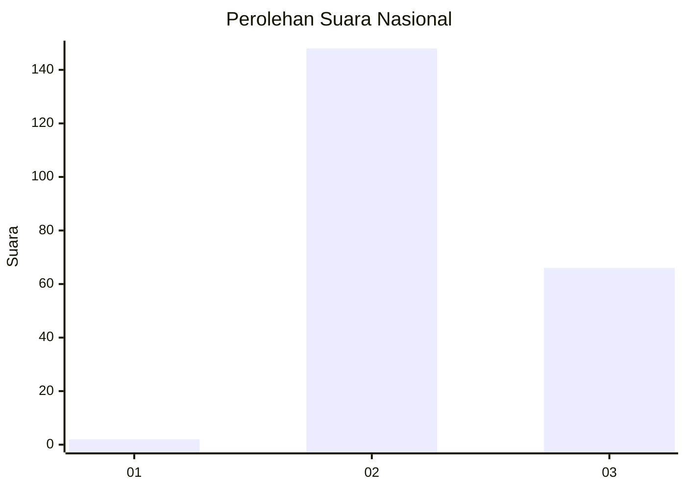
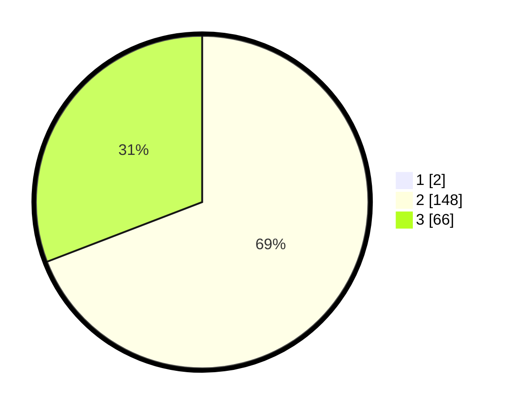

# Hasil

## Grafik

## Tabel

| No. | Nama Paslon    | Suara | Suara (raw) | Persentase |
|:--- |:-------------- | -----:| -----------:| ----------:|
| 1   | ANIES MUHAIMIN | 2     | [2][p-1]    | 0,93       |
| 2   | PRABOWO GIBRAN | 148   | [148][p-2]  | 68,52      |
| 3   | GANJAR MAHFUD  | 66    | [66][p-3]   | 30,56      |

[p-1]: https://github.com/gigit-pemilu/pemilu-2024/blob/main/pilpres/hitung-suara/sub/51-bali/sub/02-tabanan/sub/06-kediri/sub/2013-kediri/sub/004-tps/sub/paslon-1.txt
[p-2]: https://github.com/gigit-pemilu/pemilu-2024/blob/main/pilpres/hitung-suara/sub/51-bali/sub/02-tabanan/sub/06-kediri/sub/2013-kediri/sub/004-tps/sub/paslon-2.txt
[p-3]: https://github.com/gigit-pemilu/pemilu-2024/blob/main/pilpres/hitung-suara/sub/51-bali/sub/02-tabanan/sub/06-kediri/sub/2013-kediri/sub/004-tps/sub/paslon-3.txt

## Foto C Plano

https://sirekap-obj-formc.kpu.go.id/0a65/pemilu/ppwp/51/02/06/20/13/5102062013004-20240215-080302--48af709f-c8a8-4383-b2c6-465d996a44fc.jpg

https://sirekap-obj-formc.kpu.go.id/0a65/pemilu/ppwp/51/02/06/20/13/5102062013004-20240215-080323--31664708-f1e9-48a6-adfb-d50f46c04970.jpg

https://sirekap-obj-formc.kpu.go.id/0a65/pemilu/ppwp/51/02/06/20/13/5102062013004-20240215-080313--431b2c3f-4212-41c7-a90b-c5ce5bace776.jpg

## Metadata

| Key        | Value               |
| ---------- | ------------------- |
| Time Stamp | 2024-02-15 22:30:27 |

## DATA PEMILIH TETAP

Jumlah pemilih dalam DPT: **285**.
 * L: **147**.
 * P: **138**.

## DATA PENGGUNA HAK PILIH

Jumlah pengguna hak pilih dalam DPT: **217**.
 * L: **113**.
 * P: **104**.

Jumlah pengguna hak pilih dalam DPTb: **2**.
 * L: **1**.
 * P: **1**.

Jumlah pengguna hak pilih dalam DPK: **0**.
 * L: **0**.
 * P: **0**.

Jumlah pengguna hak pilih: **219**.
 * L: **114**.
 * P: **105**.

## JUMLAH SUARA SAH DAN TIDAK SAH

JUMLAH SELURUH SUARA SAH: **216**.

JUMLAH SUARA TIDAK SAH: **3**.

JUMLAH SELURUH SUARA SAH DAN SUARA TIDAK SAH: **219**.

