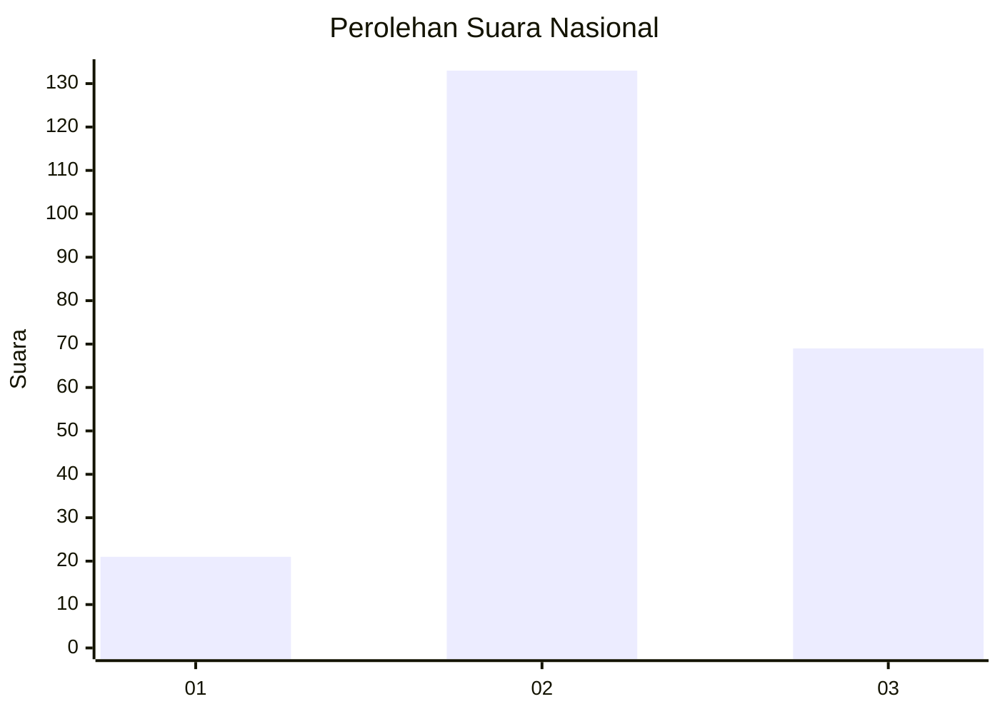
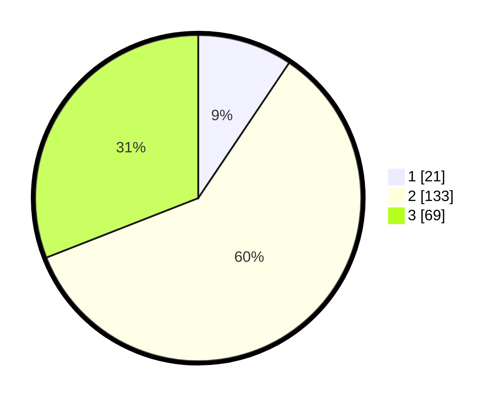

# Hasil

## Grafik

## Tabel

| No. | Nama Paslon    | Suara | Suara (raw) | Persentase |
|:--- |:-------------- | -----:| -----------:| ----------:|
| 1   | ANIES MUHAIMIN | 21    | [21][p-1]   | 9,42       |
| 2   | PRABOWO GIBRAN | 133   | [133][p-2]  | 59,64      |
| 3   | GANJAR MAHFUD  | 69    | [69][p-3]   | 30,94      |

[p-1]: https://github.com/gigit-pemilu/pemilu-2024/blob/main/pilpres/hitung-suara/sub/51-bali/sub/02-tabanan/sub/06-kediri/sub/2013-kediri/sub/006-tps/sub/paslon-1.txt
[p-2]: https://github.com/gigit-pemilu/pemilu-2024/blob/main/pilpres/hitung-suara/sub/51-bali/sub/02-tabanan/sub/06-kediri/sub/2013-kediri/sub/006-tps/sub/paslon-2.txt
[p-3]: https://github.com/gigit-pemilu/pemilu-2024/blob/main/pilpres/hitung-suara/sub/51-bali/sub/02-tabanan/sub/06-kediri/sub/2013-kediri/sub/006-tps/sub/paslon-3.txt

## Foto C Plano

https://sirekap-obj-formc.kpu.go.id/e8dd/pemilu/ppwp/51/02/06/20/13/5102062013006-20240215-204754--526e4f8f-c71e-4b57-af62-18298579ca3c.jpg

https://sirekap-obj-formc.kpu.go.id/e8dd/pemilu/ppwp/51/02/06/20/13/5102062013006-20240215-204757--970798cd-e502-4a2f-a622-ecc8fbbe7746.jpg

https://sirekap-obj-formc.kpu.go.id/e8dd/pemilu/ppwp/51/02/06/20/13/5102062013006-20240215-204756--0da621da-847e-4cb7-80e5-99d725275a3c.jpg

## Metadata

| Key        | Value               |
| ---------- | ------------------- |
| Time Stamp | 2024-02-15 22:30:27 |

## DATA PEMILIH TETAP

Jumlah pemilih dalam DPT: **286**.
 * L: **152**.
 * P: **134**.

## DATA PENGGUNA HAK PILIH

Jumlah pengguna hak pilih dalam DPT: **221**.
 * L: **115**.
 * P: **106**.

Jumlah pengguna hak pilih dalam DPTb: **0**.
 * L: **0**.
 * P: **0**.

Jumlah pengguna hak pilih dalam DPK: **2**.
 * L: **0**.
 * P: **2**.

Jumlah pengguna hak pilih: **223**.
 * L: **115**.
 * P: **108**.

## JUMLAH SUARA SAH DAN TIDAK SAH

JUMLAH SELURUH SUARA SAH: **223**.

JUMLAH SUARA TIDAK SAH: **0**.

JUMLAH SELURUH SUARA SAH DAN SUARA TIDAK SAH: **223**.

