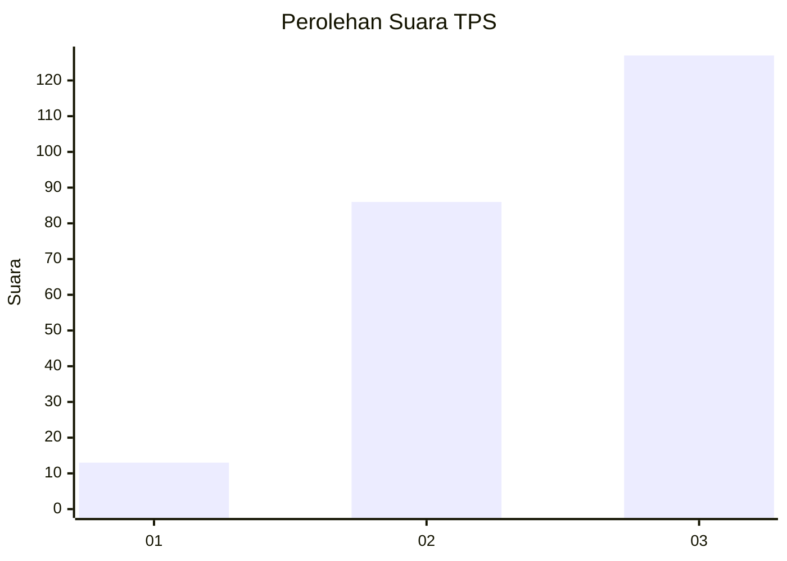
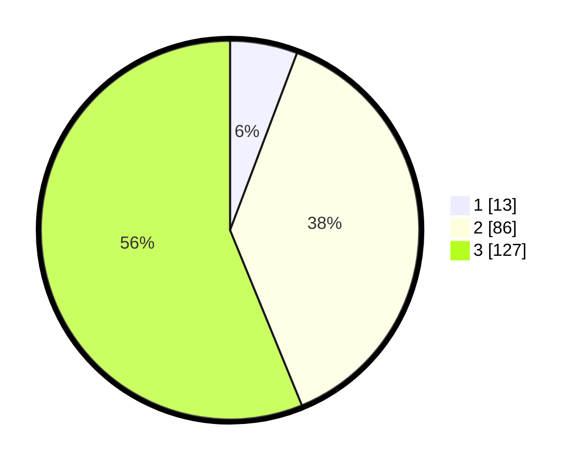

# Hasil

## Grafik

## Tabel

| No. | Nama Paslon    | Suara | Suara (raw) | Persentase |
|:--- |:-------------- | -----:| -----------:| ----------:|
| 1   | ANIES MUHAIMIN | 13    | [13][p-1]   | 5,75       |
| 2   | PRABOWO GIBRAN | 86    | [86][p-2]   | 38,05      |
| 3   | GANJAR MAHFUD  | 127   | [127][p-3]  | 56,19      |

[p-1]: https://github.com/gigit-pemilu/pemilu-2024-51-bali/blob/main/pilpres/hitung-suara/sub/51-bali/sub/02-tabanan/sub/06-kediri/sub/2013-kediri/sub/007-tps/sub/paslon-1.txt
[p-2]: https://github.com/gigit-pemilu/pemilu-2024-51-bali/blob/main/pilpres/hitung-suara/sub/51-bali/sub/02-tabanan/sub/06-kediri/sub/2013-kediri/sub/007-tps/sub/paslon-2.txt
[p-3]: https://github.com/gigit-pemilu/pemilu-2024-51-bali/blob/main/pilpres/hitung-suara/sub/51-bali/sub/02-tabanan/sub/06-kediri/sub/2013-kediri/sub/007-tps/sub/paslon-3.txt

## Foto C Plano

https://sirekap-obj-formc.kpu.go.id/8deb/pemilu/ppwp/51/02/06/20/13/5102062013007-20240215-204256--f02fa3cb-ace7-4416-816d-b1c34610106b.jpg

https://sirekap-obj-formc.kpu.go.id/8deb/pemilu/ppwp/51/02/06/20/13/5102062013007-20240215-204258--b62bd058-cab6-4af4-af97-032d6db780a7.jpg

https://sirekap-obj-formc.kpu.go.id/8deb/pemilu/ppwp/51/02/06/20/13/5102062013007-20240215-204257--22772de8-e8cc-42c2-b904-e5f401b0d15c.jpg

## Metadata

| Key        | Value               |
| ---------- | ------------------- |
| Time Stamp | 2024-02-15 22:30:27 |

## DATA PEMILIH TETAP

Jumlah pemilih dalam DPT: **284**.
 * L: **141**.
 * P: **143**.

## DATA PENGGUNA HAK PILIH

Jumlah pengguna hak pilih dalam DPT: **227**.
 * L: **116**.
 * P: **111**.

Jumlah pengguna hak pilih dalam DPTb: **1**.
 * L: **0**.
 * P: **1**.

Jumlah pengguna hak pilih dalam DPK: **2**.
 * L: **1**.
 * P: **1**.

Jumlah pengguna hak pilih: **0**.
 * L: **0**.
 * P: **0**.

## JUMLAH SUARA SAH DAN TIDAK SAH

JUMLAH SELURUH SUARA SAH: **226**.

JUMLAH SUARA TIDAK SAH: **4**.

JUMLAH SELURUH SUARA SAH DAN SUARA TIDAK SAH: **230**.

