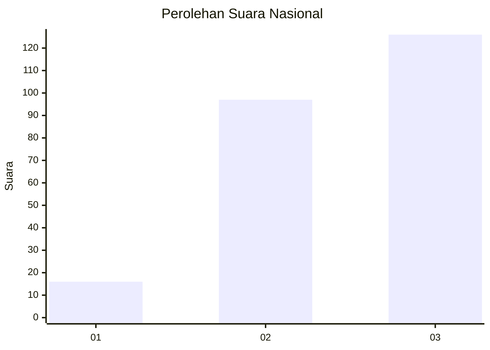
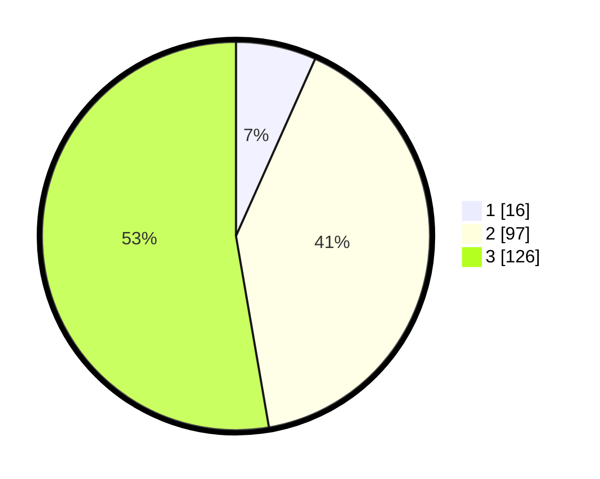

# Hasil

## Grafik

## Tabel

| No. | Nama Paslon    | Suara | Suara (raw) | Persentase |
|:--- |:-------------- | -----:| -----------:| ----------:|
| 1   | ANIES MUHAIMIN | 16    | [16][p-1]   | 6,69       |
| 2   | PRABOWO GIBRAN | 97    | [97][p-2]   | 40,59      |
| 3   | GANJAR MAHFUD  | 126   | [126][p-3]  | 52,72      |

[p-1]: https://github.com/gigit-pemilu/pemilu-2024/blob/main/pilpres/hitung-suara/sub/51-bali/sub/02-tabanan/sub/06-kediri/sub/2013-kediri/sub/009-tps/sub/paslon-1.txt
[p-2]: https://github.com/gigit-pemilu/pemilu-2024/blob/main/pilpres/hitung-suara/sub/51-bali/sub/02-tabanan/sub/06-kediri/sub/2013-kediri/sub/009-tps/sub/paslon-2.txt
[p-3]: https://github.com/gigit-pemilu/pemilu-2024/blob/main/pilpres/hitung-suara/sub/51-bali/sub/02-tabanan/sub/06-kediri/sub/2013-kediri/sub/009-tps/sub/paslon-3.txt

## Foto C Plano

https://sirekap-obj-formc.kpu.go.id/3823/pemilu/ppwp/51/02/06/20/13/5102062013009-20240216-142330--756cc296-74d8-479d-a297-d7e6264f4c2b.jpg

https://sirekap-obj-formc.kpu.go.id/3823/pemilu/ppwp/51/02/06/20/13/5102062013009-20240216-142331--fcd6fb44-cacb-469d-962e-28d75f1496aa.jpg

https://sirekap-obj-formc.kpu.go.id/3823/pemilu/ppwp/51/02/06/20/13/5102062013009-20240216-142330--91f3ad68-15e0-44f2-9531-343f8f27c0a8.jpg

## Metadata

| Key        | Value               |
| ---------- | ------------------- |
| Time Stamp | 2024-02-21 12:00:00 |

## DATA PEMILIH TETAP

Jumlah pemilih dalam DPT: **285**.
 * L: **139**.
 * P: **146**.

## DATA PENGGUNA HAK PILIH

Jumlah pengguna hak pilih dalam DPT: **241**.
 * L: **115**.
 * P: **126**.

Jumlah pengguna hak pilih dalam DPTb: **0**.
 * L: **0**.
 * P: **0**.

Jumlah pengguna hak pilih dalam DPK: **0**.
 * L: **1**.
 * P: **0**.

Jumlah pengguna hak pilih: **242**.
 * L: **116**.
 * P: **126**.

## JUMLAH SUARA SAH DAN TIDAK SAH

JUMLAH SELURUH SUARA SAH: **239**.

JUMLAH SUARA TIDAK SAH: **3**.

JUMLAH SELURUH SUARA SAH DAN SUARA TIDAK SAH: **242**.

