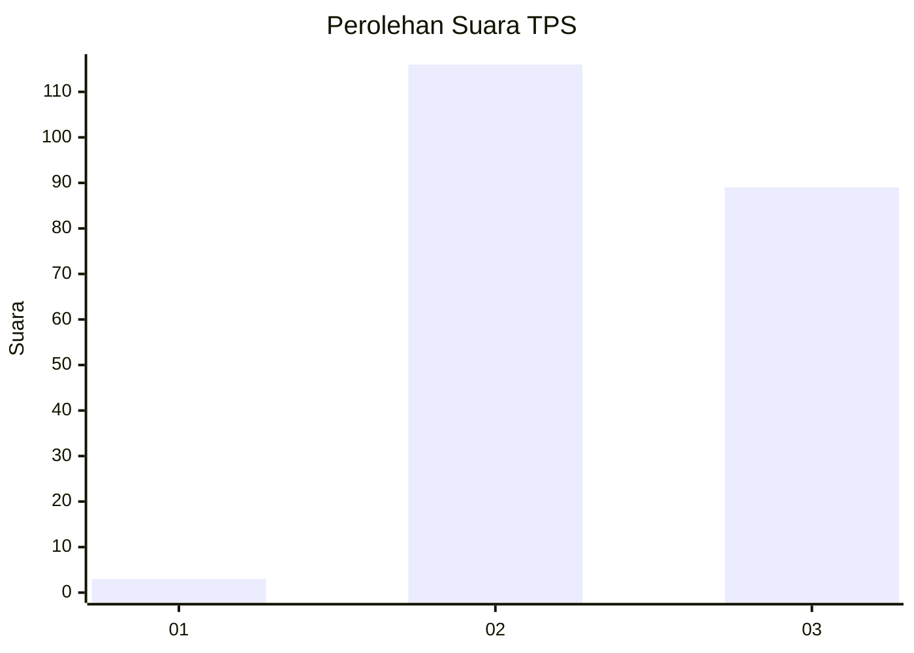
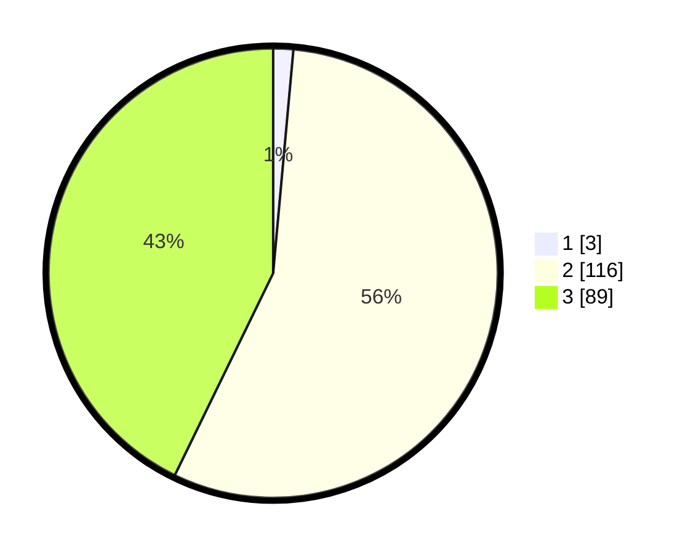

# Hasil

## Grafik

## Tabel

| No. | Nama Paslon    | Suara | Suara (raw) | Persentase |
|:--- |:-------------- | -----:| -----------:| ----------:|
| 1   | ANIES MUHAIMIN | 3     | [3][p-1]    | 1,44       |
| 2   | PRABOWO GIBRAN | 116   | [116][p-2]  | 55,77      |
| 3   | GANJAR MAHFUD  | 89    | [89][p-3]   | 42,79      |

[p-1]: https://github.com/gigit-pemilu/pemilu-2024-51-bali/blob/main/pilpres/hitung-suara/sub/51-bali/sub/02-tabanan/sub/06-kediri/sub/2013-kediri/sub/014-tps/sub/paslon-1.txt
[p-2]: https://github.com/gigit-pemilu/pemilu-2024-51-bali/blob/main/pilpres/hitung-suara/sub/51-bali/sub/02-tabanan/sub/06-kediri/sub/2013-kediri/sub/014-tps/sub/paslon-2.txt
[p-3]: https://github.com/gigit-pemilu/pemilu-2024-51-bali/blob/main/pilpres/hitung-suara/sub/51-bali/sub/02-tabanan/sub/06-kediri/sub/2013-kediri/sub/014-tps/sub/paslon-3.txt

## Foto C Plano

https://sirekap-obj-formc.kpu.go.id/98da/pemilu/ppwp/51/02/06/20/13/5102062013014-20240215-212835--8950c214-a4ba-4f08-9538-812053ab65e5.jpg

https://sirekap-obj-formc.kpu.go.id/98da/pemilu/ppwp/51/02/06/20/13/5102062013014-20240215-212837--54dc8c80-fe18-4d79-9d1a-c6d8253ffa54.jpg

https://sirekap-obj-formc.kpu.go.id/98da/pemilu/ppwp/51/02/06/20/13/5102062013014-20240215-212836--fbc69a24-e89b-43f0-a6c8-27150035dc09.jpg

## Metadata

| Key        | Value               |
| ---------- | ------------------- |
| Time Stamp | 2024-02-15 22:40:13 |

## DATA PEMILIH TETAP

Jumlah pemilih dalam DPT: **241**.
 * L: **120**.
 * P: **121**.

## DATA PENGGUNA HAK PILIH

Jumlah pengguna hak pilih dalam DPT: **202**.
 * L: **97**.
 * P: **105**.

Jumlah pengguna hak pilih dalam DPTb: **0**.
 * L: **0**.
 * P: **0**.

Jumlah pengguna hak pilih dalam DPK: **0**.
 * L: **0**.
 * P: **0**.

Jumlah pengguna hak pilih: **202**.
 * L: **97**.
 * P: **105**.

## JUMLAH SUARA SAH DAN TIDAK SAH

JUMLAH SELURUH SUARA SAH: **202**.

JUMLAH SUARA TIDAK SAH: **0**.

JUMLAH SELURUH SUARA SAH DAN SUARA TIDAK SAH: **202**.

