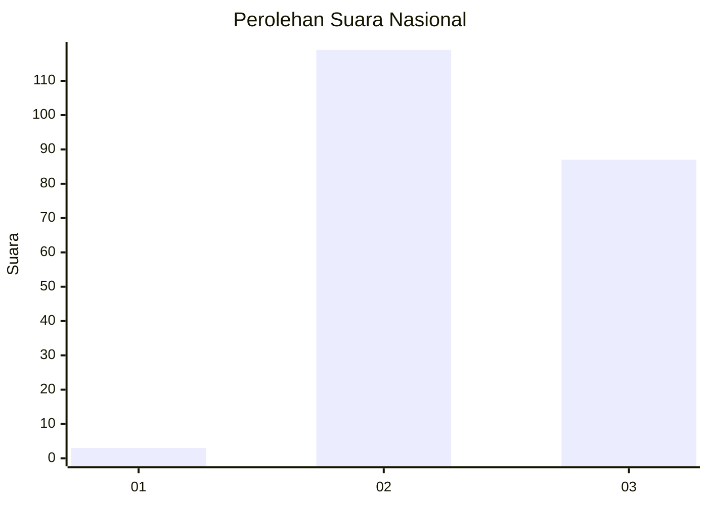
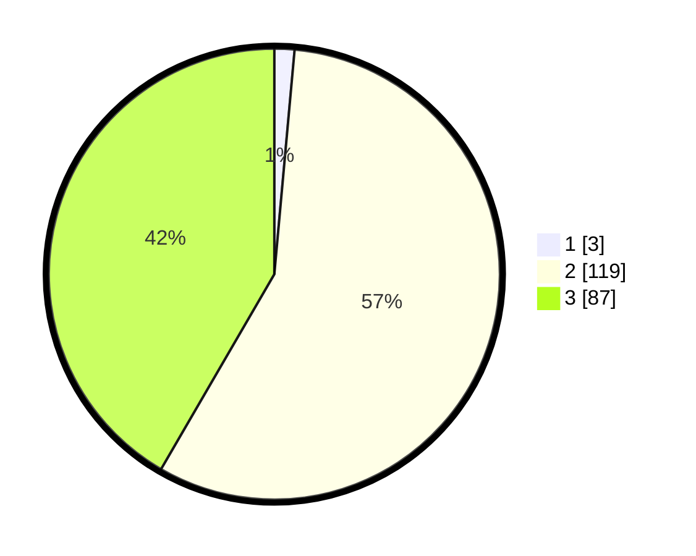

# Hasil

## Grafik

## Tabel

| No. | Nama Paslon    | Suara | Suara (raw) | Persentase |
|:--- |:-------------- | -----:| -----------:| ----------:|
| 1   | ANIES MUHAIMIN | 3     | [3][p-1]    | 1,44       |
| 2   | PRABOWO GIBRAN | 119   | [119][p-2]  | 56,94      |
| 3   | GANJAR MAHFUD  | 87    | [87][p-3]   | 41,63      |

[p-1]: https://github.com/gigit-pemilu/pemilu-2024/blob/main/pilpres/hitung-suara/sub/51-bali/sub/02-tabanan/sub/06-kediri/sub/2013-kediri/sub/015-tps/sub/paslon-1.txt
[p-2]: https://github.com/gigit-pemilu/pemilu-2024/blob/main/pilpres/hitung-suara/sub/51-bali/sub/02-tabanan/sub/06-kediri/sub/2013-kediri/sub/015-tps/sub/paslon-2.txt
[p-3]: https://github.com/gigit-pemilu/pemilu-2024/blob/main/pilpres/hitung-suara/sub/51-bali/sub/02-tabanan/sub/06-kediri/sub/2013-kediri/sub/015-tps/sub/paslon-3.txt

## Foto C Plano

https://sirekap-obj-formc.kpu.go.id/1ce7/pemilu/ppwp/51/02/06/20/13/5102062013015-20240214-132211--be455758-24c6-4387-bc92-e7e5b416c7ae.jpg

https://sirekap-obj-formc.kpu.go.id/1ce7/pemilu/ppwp/51/02/06/20/13/5102062013015-20240214-185207--ffdf2e3f-98d4-4031-8838-797eb159776d.jpg

https://sirekap-obj-formc.kpu.go.id/1ce7/pemilu/ppwp/51/02/06/20/13/5102062013015-20240214-185320--b29fb8ed-5838-4f08-a9d2-dd51f06ff440.jpg

## Metadata

| Key        | Value               |
| ---------- | ------------------- |
| Time Stamp | 2024-02-15 22:40:13 |

## DATA PEMILIH TETAP

Jumlah pemilih dalam DPT: **233**.
 * L: **107**.
 * P: **126**.

## DATA PENGGUNA HAK PILIH

Jumlah pengguna hak pilih dalam DPT: **205**.
 * L: **97**.
 * P: **108**.

Jumlah pengguna hak pilih dalam DPTb: **2**.
 * L: **1**.
 * P: **1**.

Jumlah pengguna hak pilih dalam DPK: **3**.
 * L: **2**.
 * P: **1**.

Jumlah pengguna hak pilih: **210**.
 * L: **100**.
 * P: **110**.

## JUMLAH SUARA SAH DAN TIDAK SAH

JUMLAH SELURUH SUARA SAH: **209**.

JUMLAH SUARA TIDAK SAH: **1**.

JUMLAH SELURUH SUARA SAH DAN SUARA TIDAK SAH: **210**.

