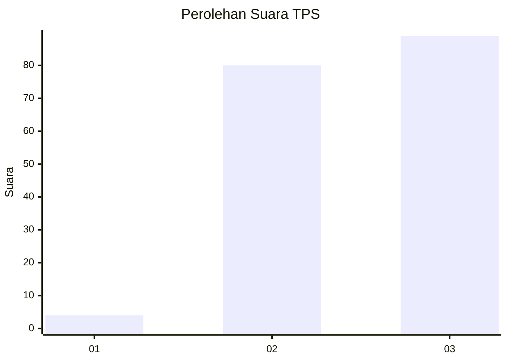
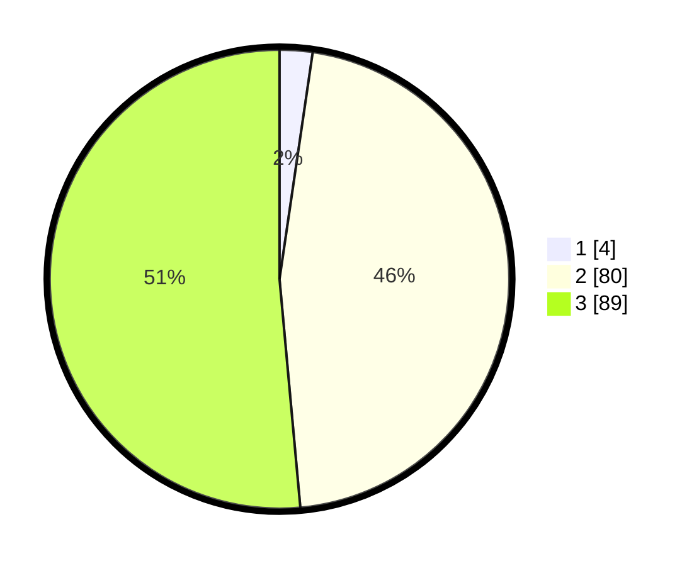

# Hasil

## Grafik

## Tabel

| No. | Nama Paslon    | Suara | Suara (raw) | Persentase |
|:--- |:-------------- | -----:| -----------:| ----------:|
| 1   | ANIES MUHAIMIN | 4     | [4][p-1]    | 2,31       |
| 2   | PRABOWO GIBRAN | 80    | [80][p-2]   | 46,24      |
| 3   | GANJAR MAHFUD  | 89    | [89][p-3]   | 51,45      |

[p-1]: https://github.com/gigit-pemilu/pemilu-2024-51-bali/blob/main/pilpres/hitung-suara/sub/51-bali/sub/02-tabanan/sub/06-kediri/sub/2013-kediri/sub/028-tps/sub/paslon-1.txt
[p-2]: https://github.com/gigit-pemilu/pemilu-2024-51-bali/blob/main/pilpres/hitung-suara/sub/51-bali/sub/02-tabanan/sub/06-kediri/sub/2013-kediri/sub/028-tps/sub/paslon-2.txt
[p-3]: https://github.com/gigit-pemilu/pemilu-2024-51-bali/blob/main/pilpres/hitung-suara/sub/51-bali/sub/02-tabanan/sub/06-kediri/sub/2013-kediri/sub/028-tps/sub/paslon-3.txt

## Foto C Plano

https://sirekap-obj-formc.kpu.go.id/a902/pemilu/ppwp/51/02/06/20/13/5102062013028-20240216-181900--8acf2565-51ca-41db-a27f-bb4e2b78bf63.jpg

https://sirekap-obj-formc.kpu.go.id/a902/pemilu/ppwp/51/02/06/20/13/5102062013028-20240216-181901--5f5a80f4-5441-4a73-a321-eb164dd1d2ca.jpg

https://sirekap-obj-formc.kpu.go.id/a902/pemilu/ppwp/51/02/06/20/13/5102062013028-20240216-181901--880177b3-b9f2-4945-84e2-6473d3a91216.jpg

## Metadata

| Key        | Value               |
| ---------- | ------------------- |
| Time Stamp | 2024-02-21 10:00:00 |

## DATA PEMILIH TETAP

Jumlah pemilih dalam DPT: **229**.
 * L: **111**.
 * P: **118**.

## DATA PENGGUNA HAK PILIH

Jumlah pengguna hak pilih dalam DPT: **175**.
 * L: **83**.
 * P: **92**.

Jumlah pengguna hak pilih dalam DPTb: **0**.
 * L: **0**.
 * P: **0**.

Jumlah pengguna hak pilih dalam DPK: **0**.
 * L: **0**.
 * P: **0**.

Jumlah pengguna hak pilih: **175**.
 * L: **83**.
 * P: **92**.

## JUMLAH SUARA SAH DAN TIDAK SAH

JUMLAH SELURUH SUARA SAH: **173**.

JUMLAH SUARA TIDAK SAH: **2**.

JUMLAH SELURUH SUARA SAH DAN SUARA TIDAK SAH: **175**.

