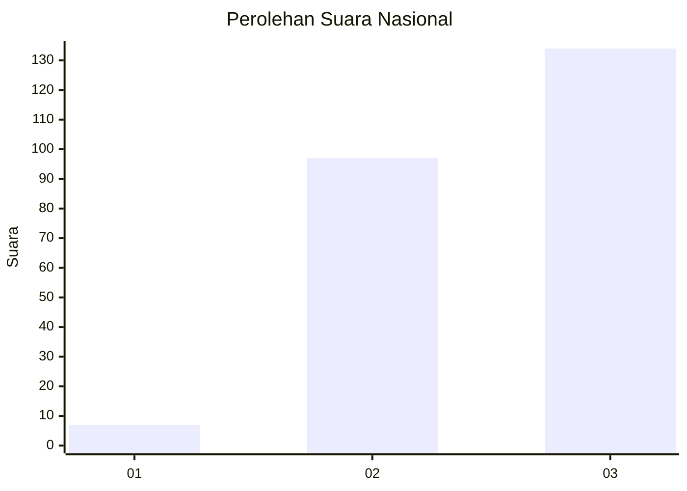
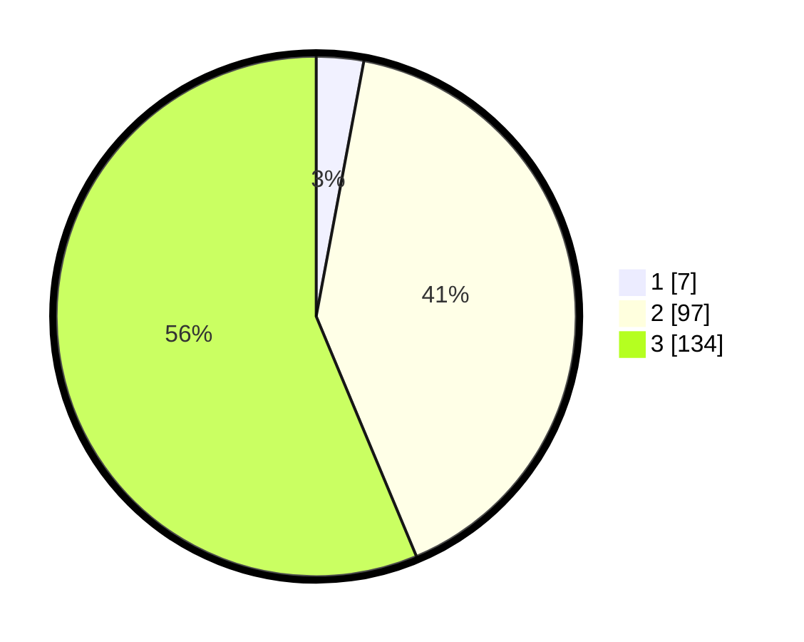

# Hasil

## Grafik

## Tabel

| No. | Nama Paslon    | Suara | Suara (raw) | Persentase |
|:--- |:-------------- | -----:| -----------:| ----------:|
| 1   | ANIES MUHAIMIN | 7     | [7][p-1]    | 2,94       |
| 2   | PRABOWO GIBRAN | 97    | [97][p-2]   | 40,76      |
| 3   | GANJAR MAHFUD  | 134   | [134][p-3]  | 56,30      |

[p-1]: https://github.com/gigit-pemilu/pemilu-2024/blob/main/pilpres/hitung-suara/sub/51-bali/sub/02-tabanan/sub/06-kediri/sub/2014-abian-tuwung/sub/006-tps/sub/paslon-1.txt
[p-2]: https://github.com/gigit-pemilu/pemilu-2024/blob/main/pilpres/hitung-suara/sub/51-bali/sub/02-tabanan/sub/06-kediri/sub/2014-abian-tuwung/sub/006-tps/sub/paslon-2.txt
[p-3]: https://github.com/gigit-pemilu/pemilu-2024/blob/main/pilpres/hitung-suara/sub/51-bali/sub/02-tabanan/sub/06-kediri/sub/2014-abian-tuwung/sub/006-tps/sub/paslon-3.txt

## Foto C Plano

https://sirekap-obj-formc.kpu.go.id/519f/pemilu/ppwp/51/02/06/20/14/5102062014006-20240215-201020--ede05d63-69ca-4c92-bef2-8ab6730530a7.jpg

https://sirekap-obj-formc.kpu.go.id/519f/pemilu/ppwp/51/02/06/20/14/5102062014006-20240218-144233--df93108c-9a75-47df-b85b-0cc370f1391b.jpg

https://sirekap-obj-formc.kpu.go.id/519f/pemilu/ppwp/51/02/06/20/14/5102062014006-20240218-144231--abe570dd-8b37-4696-9530-46afabcc4be7.jpg

## Metadata

| Key        | Value               |
| ---------- | ------------------- |
| Time Stamp | 2024-02-21 15:00:00 |

## DATA PEMILIH TETAP

Jumlah pemilih dalam DPT: **268**.
 * L: **132**.
 * P: **136**.

## DATA PENGGUNA HAK PILIH

Jumlah pengguna hak pilih dalam DPT: **238**.
 * L: **121**.
 * P: **117**.

Jumlah pengguna hak pilih dalam DPTb: **0**.
 * L: **0**.
 * P: **0**.

Jumlah pengguna hak pilih dalam DPK: **4**.
 * L: **1**.
 * P: **3**.

Jumlah pengguna hak pilih: **242**.
 * L: **122**.
 * P: **120**.

## JUMLAH SUARA SAH DAN TIDAK SAH

JUMLAH SELURUH SUARA SAH: **238**.

JUMLAH SUARA TIDAK SAH: **4**.

JUMLAH SELURUH SUARA SAH DAN SUARA TIDAK SAH: **242**.

