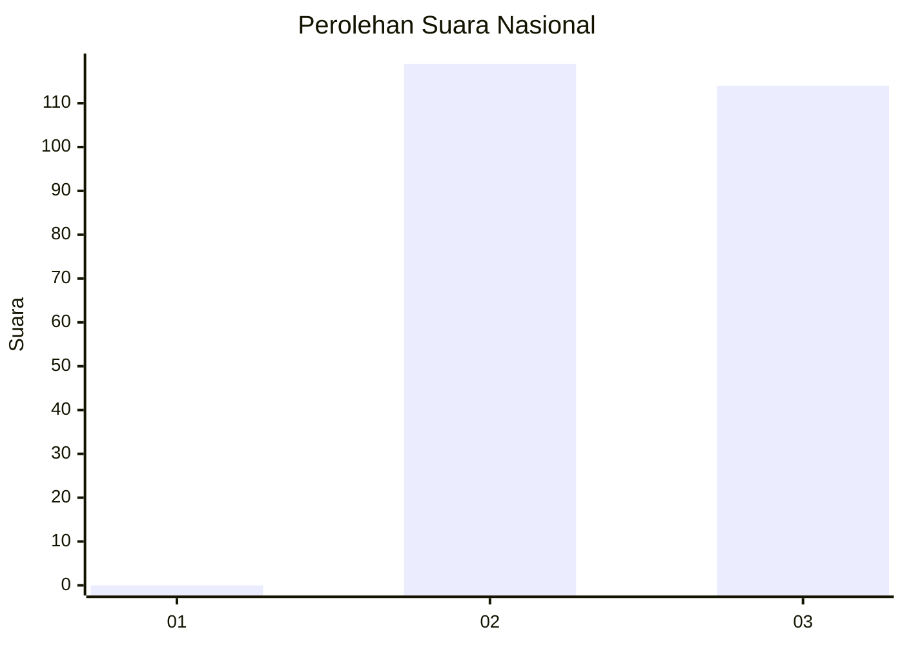
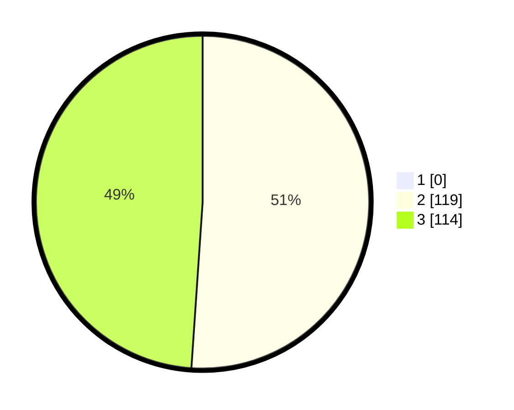

# Hasil

## Grafik

## Tabel

| No. | Nama Paslon    | Suara | Suara (raw) | Persentase |
|:--- |:-------------- | -----:| -----------:| ----------:|
| 1   | ANIES MUHAIMIN | 0     | [0][p-1]    | 0,00       |
| 2   | PRABOWO GIBRAN | 119   | [119][p-2]  | 51,07      |
| 3   | GANJAR MAHFUD  | 114   | [114][p-3]  | 48,93      |

[p-1]: https://github.com/gigit-pemilu/pemilu-2024/blob/main/pilpres/hitung-suara/sub/51-bali/sub/02-tabanan/sub/06-kediri/sub/2014-abian-tuwung/sub/008-tps/sub/paslon-1.txt
[p-2]: https://github.com/gigit-pemilu/pemilu-2024/blob/main/pilpres/hitung-suara/sub/51-bali/sub/02-tabanan/sub/06-kediri/sub/2014-abian-tuwung/sub/008-tps/sub/paslon-2.txt
[p-3]: https://github.com/gigit-pemilu/pemilu-2024/blob/main/pilpres/hitung-suara/sub/51-bali/sub/02-tabanan/sub/06-kediri/sub/2014-abian-tuwung/sub/008-tps/sub/paslon-3.txt

## Foto C Plano

https://sirekap-obj-formc.kpu.go.id/4378/pemilu/ppwp/51/02/06/20/14/5102062014008-20240214-212336--6e07c3e3-f40f-4770-9af0-0ea90891c936.jpg

https://sirekap-obj-formc.kpu.go.id/4378/pemilu/ppwp/51/02/06/20/14/5102062014008-20240214-203024--cfe08f40-65ff-4834-b3ea-2090335f8be2.jpg

https://sirekap-obj-formc.kpu.go.id/4378/pemilu/ppwp/51/02/06/20/14/5102062014008-20240214-212536--c58bfb08-8649-4aa5-9919-6f6514313b5f.jpg

## Metadata

| Key        | Value               |
| ---------- | ------------------- |
| Time Stamp | 2024-02-15 03:06:03 |

