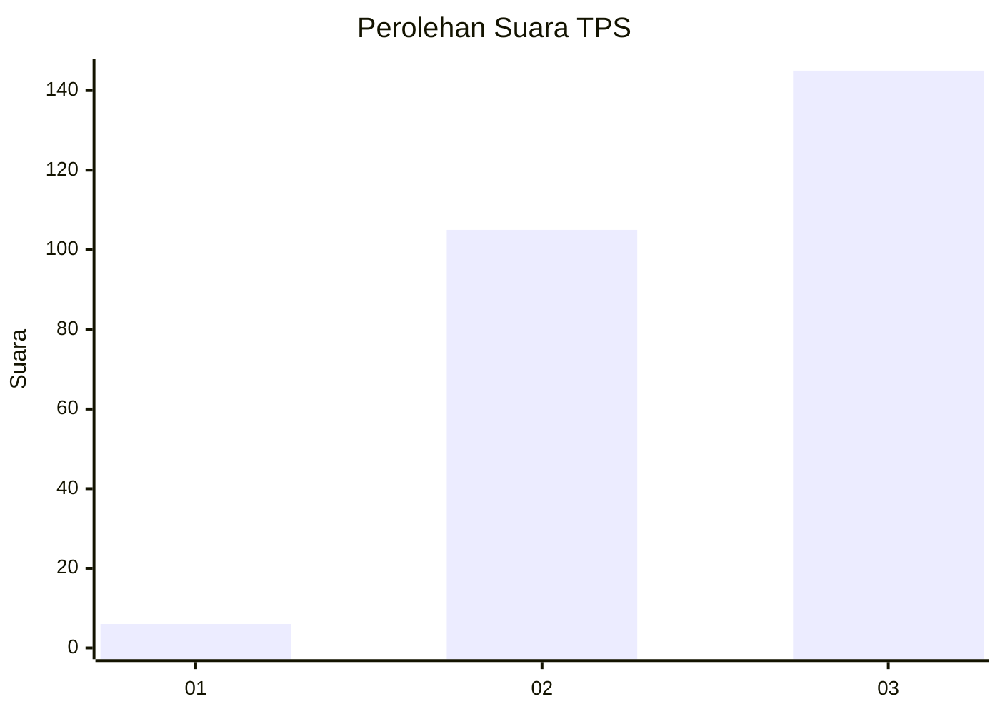
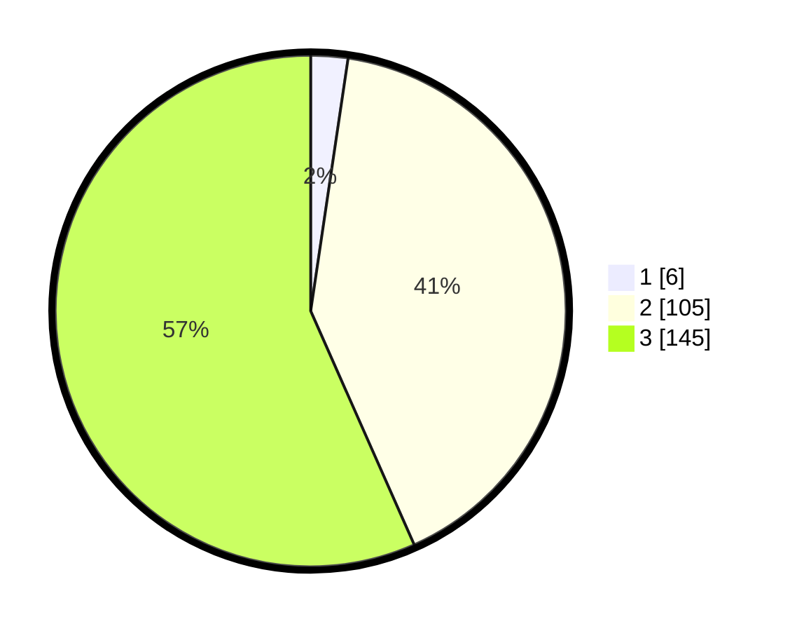

# Hasil

## Grafik

## Tabel

| No. | Nama Paslon    | Suara | Suara (raw) | Persentase |
|:--- |:-------------- | -----:| -----------:| ----------:|
| 1   | ANIES MUHAIMIN | 6     | [6][p-1]    | 2,34       |
| 2   | PRABOWO GIBRAN | 105   | [105][p-2]  | 41,02      |
| 3   | GANJAR MAHFUD  | 145   | [145][p-3]  | 56,64      |

[p-1]: https://github.com/gigit-pemilu/pemilu-2024-51-bali/blob/main/pilpres/hitung-suara/sub/51-bali/sub/02-tabanan/sub/06-kediri/sub/2014-abian-tuwung/sub/009-tps/sub/paslon-1.txt
[p-2]: https://github.com/gigit-pemilu/pemilu-2024-51-bali/blob/main/pilpres/hitung-suara/sub/51-bali/sub/02-tabanan/sub/06-kediri/sub/2014-abian-tuwung/sub/009-tps/sub/paslon-2.txt
[p-3]: https://github.com/gigit-pemilu/pemilu-2024-51-bali/blob/main/pilpres/hitung-suara/sub/51-bali/sub/02-tabanan/sub/06-kediri/sub/2014-abian-tuwung/sub/009-tps/sub/paslon-3.txt

## Foto C Plano

https://sirekap-obj-formc.kpu.go.id/90f4/pemilu/ppwp/51/02/06/20/14/5102062014009-20240214-213116--9ec4b024-ff58-4b43-b058-ff3785ce3606.jpg

https://sirekap-obj-formc.kpu.go.id/90f4/pemilu/ppwp/51/02/06/20/14/5102062014009-20240214-213254--a1e9d76d-14b4-4bc5-954c-7543173156d9.jpg

https://sirekap-obj-formc.kpu.go.id/90f4/pemilu/ppwp/51/02/06/20/14/5102062014009-20240214-213346--3061f2df-2217-4462-bdf6-66a29c367f7a.jpg

## Metadata

| Key        | Value               |
| ---------- | ------------------- |
| Time Stamp | 2024-02-15 23:29:50 |

## DATA PEMILIH TETAP

Jumlah pemilih dalam DPT: **280**.
 * L: **139**.
 * P: **141**.

## DATA PENGGUNA HAK PILIH

Jumlah pengguna hak pilih dalam DPT: **260**.
 * L: **129**.
 * P: **131**.

Jumlah pengguna hak pilih dalam DPTb: **2**.
 * L: **1**.
 * P: **1**.

Jumlah pengguna hak pilih dalam DPK: **0**.
 * L: **0**.
 * P: **0**.

Jumlah pengguna hak pilih: **262**.
 * L: **130**.
 * P: **132**.

## JUMLAH SUARA SAH DAN TIDAK SAH

JUMLAH SELURUH SUARA SAH: **256**.

JUMLAH SUARA TIDAK SAH: **6**.

JUMLAH SELURUH SUARA SAH DAN SUARA TIDAK SAH: **262**.

