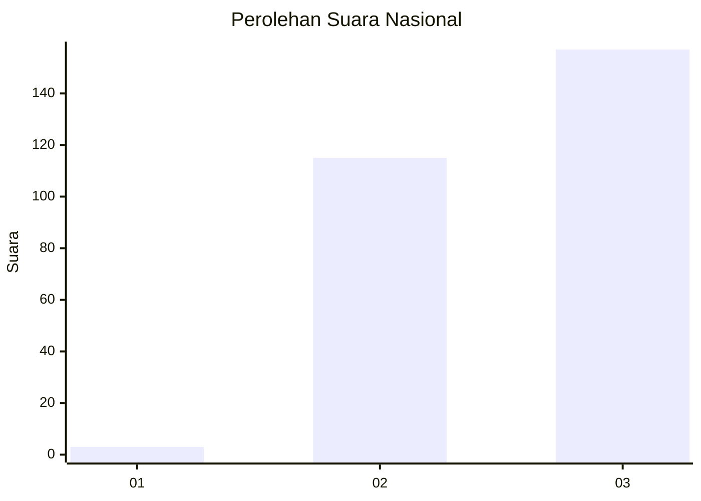
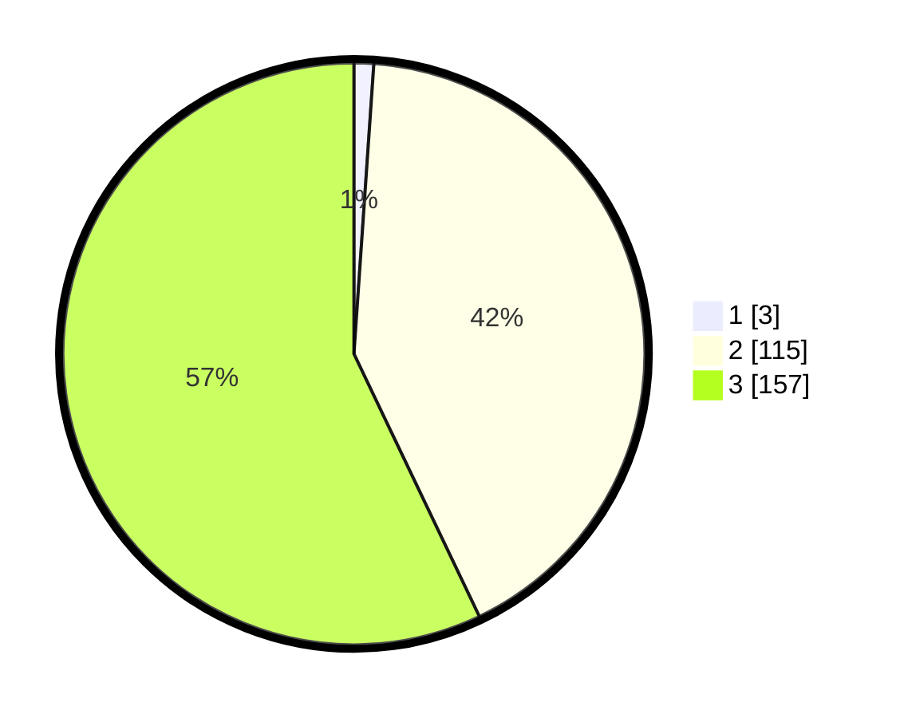

# Hasil

## Grafik

## Tabel

| No. | Nama Paslon    | Suara | Suara (raw) | Persentase |
|:--- |:-------------- | -----:| -----------:| ----------:|
| 1   | ANIES MUHAIMIN | 3     | [3][p-1]    | 1,09       |
| 2   | PRABOWO GIBRAN | 115   | [115][p-2]  | 41,82      |
| 3   | GANJAR MAHFUD  | 157   | [157][p-3]  | 57,09      |

[p-1]: https://github.com/gigit-pemilu/pemilu-2024/blob/main/pilpres/hitung-suara/sub/51-bali/sub/02-tabanan/sub/06-kediri/sub/2014-abian-tuwung/sub/010-tps/sub/paslon-1.txt
[p-2]: https://github.com/gigit-pemilu/pemilu-2024/blob/main/pilpres/hitung-suara/sub/51-bali/sub/02-tabanan/sub/06-kediri/sub/2014-abian-tuwung/sub/010-tps/sub/paslon-2.txt
[p-3]: https://github.com/gigit-pemilu/pemilu-2024/blob/main/pilpres/hitung-suara/sub/51-bali/sub/02-tabanan/sub/06-kediri/sub/2014-abian-tuwung/sub/010-tps/sub/paslon-3.txt

## Foto C Plano

https://sirekap-obj-formc.kpu.go.id/8d2e/pemilu/ppwp/51/02/06/20/14/5102062014010-20240214-230933--0c2f59ef-67d3-4cdc-9832-d3601073777b.jpg

https://sirekap-obj-formc.kpu.go.id/8d2e/pemilu/ppwp/51/02/06/20/14/5102062014010-20240214-231045--ddccf72f-dcb2-4e4e-8690-2f19fe71220d.jpg

https://sirekap-obj-formc.kpu.go.id/8d2e/pemilu/ppwp/51/02/06/20/14/5102062014010-20240214-205611--f85a0b81-4234-46ec-992f-5a1da3d84839.jpg

## Metadata

| Key        | Value               |
| ---------- | ------------------- |
| Time Stamp | 2024-02-24 22:31:28 |

