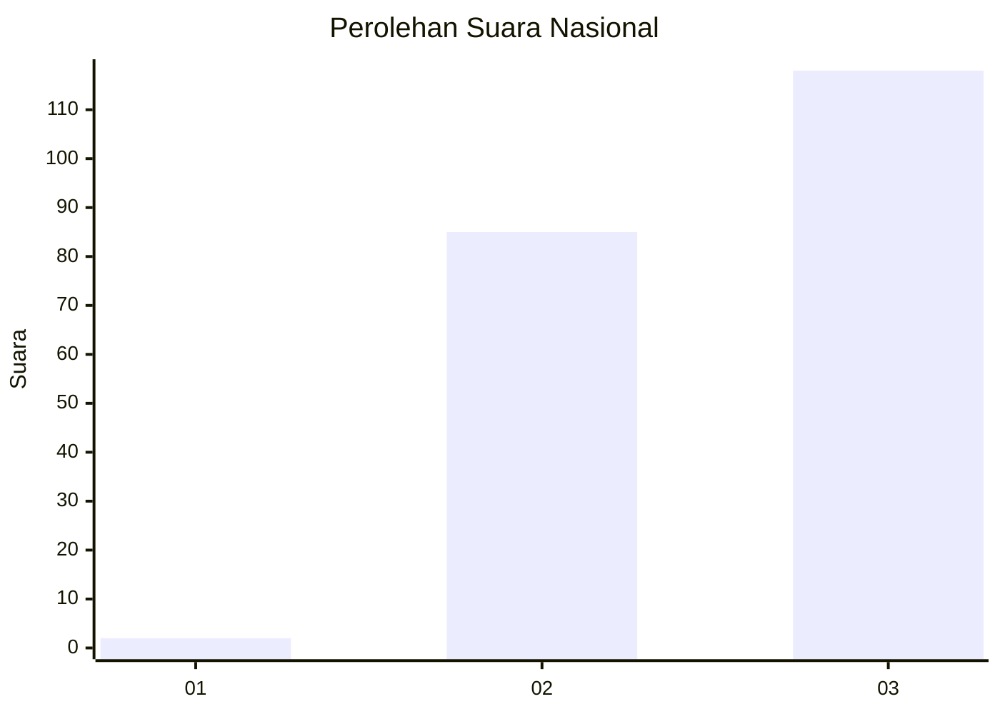
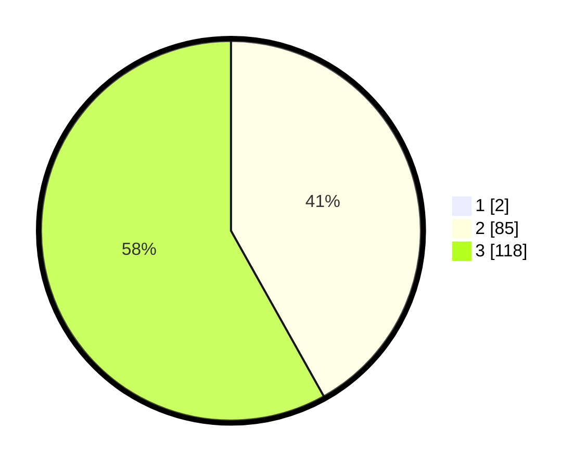

# Hasil

## Grafik

## Tabel

| No. | Nama Paslon    | Suara | Suara (raw) | Persentase |
|:--- |:-------------- | -----:| -----------:| ----------:|
| 1   | ANIES MUHAIMIN | 2     | [2][p-1]    | 0,98       |
| 2   | PRABOWO GIBRAN | 85    | [85][p-2]   | 41,46      |
| 3   | GANJAR MAHFUD  | 118   | [118][p-3]  | 57,56      |

[p-1]: https://github.com/gigit-pemilu/pemilu-2024/blob/main/pilpres/hitung-suara/sub/51-bali/sub/02-tabanan/sub/06-kediri/sub/2014-abian-tuwung/sub/011-tps/sub/paslon-1.txt
[p-2]: https://github.com/gigit-pemilu/pemilu-2024/blob/main/pilpres/hitung-suara/sub/51-bali/sub/02-tabanan/sub/06-kediri/sub/2014-abian-tuwung/sub/011-tps/sub/paslon-2.txt
[p-3]: https://github.com/gigit-pemilu/pemilu-2024/blob/main/pilpres/hitung-suara/sub/51-bali/sub/02-tabanan/sub/06-kediri/sub/2014-abian-tuwung/sub/011-tps/sub/paslon-3.txt

## Foto C Plano

https://sirekap-obj-formc.kpu.go.id/e6dc/pemilu/ppwp/51/02/06/20/14/5102062014011-20240214-201744--2652eba2-0d30-4d32-9402-f44e8d334511.jpg

https://sirekap-obj-formc.kpu.go.id/e6dc/pemilu/ppwp/51/02/06/20/14/5102062014011-20240214-201903--e964572f-ed4a-458b-bf07-3ada2c62076d.jpg

https://sirekap-obj-formc.kpu.go.id/e6dc/pemilu/ppwp/51/02/06/20/14/5102062014011-20240214-204128--868dfbd7-b02e-421a-b26a-6242a0fc633f.jpg

## Metadata

| Key        | Value               |
| ---------- | ------------------- |
| Time Stamp | 2024-02-15 23:29:50 |

