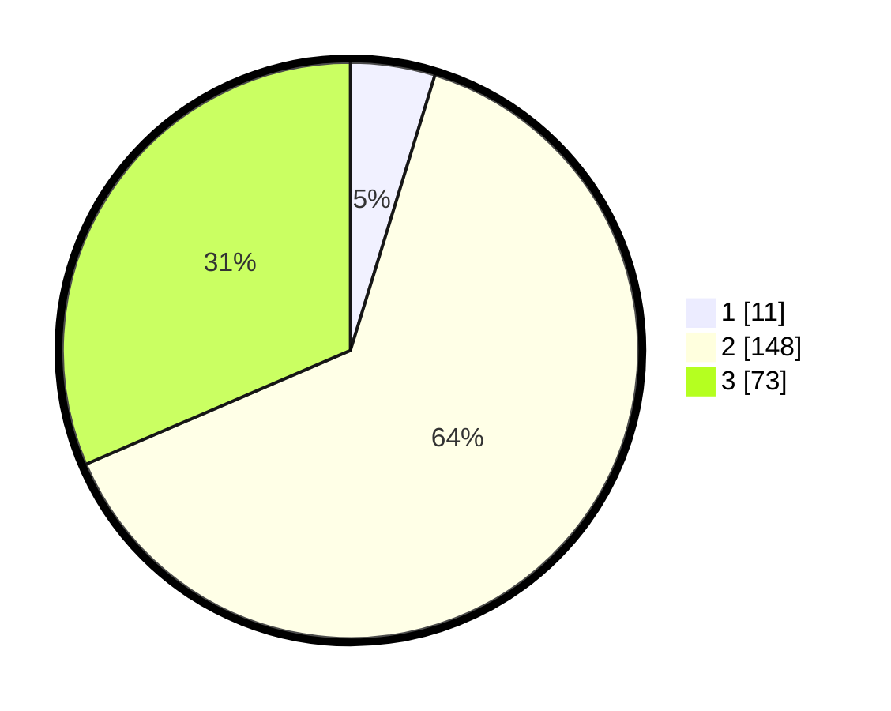

# Hasil

## Grafik

## Tabel

| No. | Nama Paslon    | Suara | Suara (raw) | Persentase |
|:--- |:-------------- | -----:| -----------:| ----------:|
| 1   | ANIES MUHAIMIN | 11    | [11][p-1]   | 4,74       |
| 2   | PRABOWO GIBRAN | 148   | [148][p-2]  | 63,79      |
| 3   | GANJAR MAHFUD  | 73    | [73][p-3]   | 31,47      |

[p-1]: https://github.com/gigit-pemilu/pemilu-2024-51-bali/blob/main/pilpres/hitung-suara/sub/51-bali/sub/02-tabanan/sub/06-kediri/sub/2014-abian-tuwung/sub/023-tps/sub/paslon-1.txt
[p-2]: https://github.com/gigit-pemilu/pemilu-2024-51-bali/blob/main/pilpres/hitung-suara/sub/51-bali/sub/02-tabanan/sub/06-kediri/sub/2014-abian-tuwung/sub/023-tps/sub/paslon-2.txt
[p-3]: https://github.com/gigit-pemilu/pemilu-2024-51-bali/blob/main/pilpres/hitung-suara/sub/51-bali/sub/02-tabanan/sub/06-kediri/sub/2014-abian-tuwung/sub/023-tps/sub/paslon-3.txt

## Foto C Plano

https://sirekap-obj-formc.kpu.go.id/3fd5/pemilu/ppwp/51/02/06/20/14/5102062014023-20240214-213841--53e50f85-a6b4-48d5-9585-03cde1c4f01b.jpg

https://sirekap-obj-formc.kpu.go.id/3fd5/pemilu/ppwp/51/02/06/20/14/5102062014023-20240214-213854--d8695174-28d5-4206-b01d-18505481ef91.jpg

https://sirekap-obj-formc.kpu.go.id/3fd5/pemilu/ppwp/51/02/06/20/14/5102062014023-20240214-213901--c14c0809-cfa6-4491-8371-ba5da3269ed3.jpg

## Metadata

| Key        | Value               |
| ---------- | ------------------- |
| Time Stamp | 2024-02-24 22:31:28 |

## DATA PEMILIH TETAP

Jumlah pemilih dalam DPT: **259**.
 * L: **120**.
 * P: **139**.

## DATA PENGGUNA HAK PILIH

Jumlah pengguna hak pilih dalam DPT: **226**.
 * L: **107**.
 * P: **119**.

Jumlah pengguna hak pilih dalam DPTb: **11**.
 * L: **7**.
 * P: **4**.

Jumlah pengguna hak pilih dalam DPK: **0**.
 * L: **0**.
 * P: **0**.

Jumlah pengguna hak pilih: **237**.
 * L: **114**.
 * P: **123**.

## JUMLAH SUARA SAH DAN TIDAK SAH

JUMLAH SELURUH SUARA SAH: **232**.

JUMLAH SUARA TIDAK SAH: **5**.

JUMLAH SELURUH SUARA SAH DAN SUARA TIDAK SAH: **237**.

