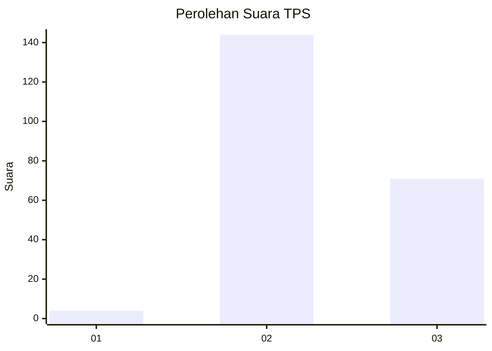
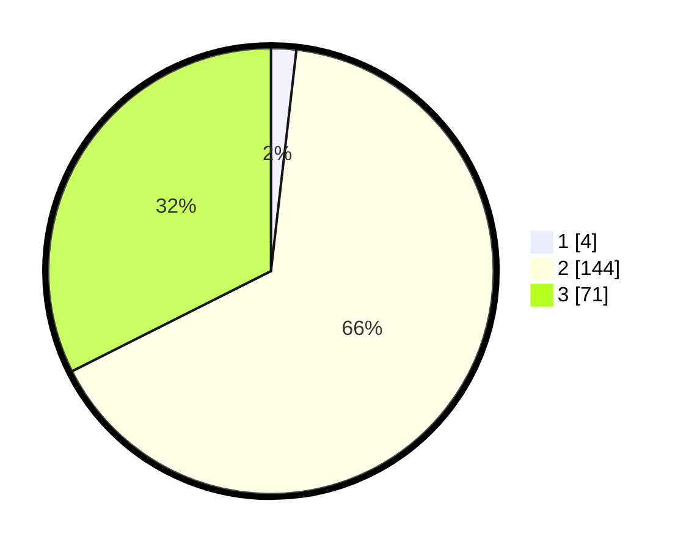

# Hasil

## Grafik

## Tabel

| No. | Nama Paslon    | Suara | Suara (raw) | Persentase |
|:--- |:-------------- | -----:| -----------:| ----------:|
| 1   | ANIES MUHAIMIN | 4     | [4][p-1]    | 1,83       |
| 2   | PRABOWO GIBRAN | 144   | [144][p-2]  | 65,75      |
| 3   | GANJAR MAHFUD  | 71    | [71][p-3]   | 32,42      |

[p-1]: https://github.com/gigit-pemilu/pemilu-2024-51-bali/blob/main/pilpres/hitung-suara/sub/51-bali/sub/02-tabanan/sub/06-kediri/sub/2014-abian-tuwung/sub/024-tps/sub/paslon-1.txt
[p-2]: https://github.com/gigit-pemilu/pemilu-2024-51-bali/blob/main/pilpres/hitung-suara/sub/51-bali/sub/02-tabanan/sub/06-kediri/sub/2014-abian-tuwung/sub/024-tps/sub/paslon-2.txt
[p-3]: https://github.com/gigit-pemilu/pemilu-2024-51-bali/blob/main/pilpres/hitung-suara/sub/51-bali/sub/02-tabanan/sub/06-kediri/sub/2014-abian-tuwung/sub/024-tps/sub/paslon-3.txt

## Foto C Plano

https://sirekap-obj-formc.kpu.go.id/927b/pemilu/ppwp/51/02/06/20/14/5102062014024-20240214-130114--b17b5503-d321-459c-89d3-d6c97390bba3.jpg

https://sirekap-obj-formc.kpu.go.id/927b/pemilu/ppwp/51/02/06/20/14/5102062014024-20240214-123904--740c1593-23ae-48d5-aab2-5b07f1df8c6f.jpg

https://sirekap-obj-formc.kpu.go.id/927b/pemilu/ppwp/51/02/06/20/14/5102062014024-20240214-124142--78b36e86-e8a7-491c-8cf3-beb6d9cea2b6.jpg

## Metadata

| Key        | Value               |
| ---------- | ------------------- |
| Time Stamp | 2024-02-15 23:29:50 |

