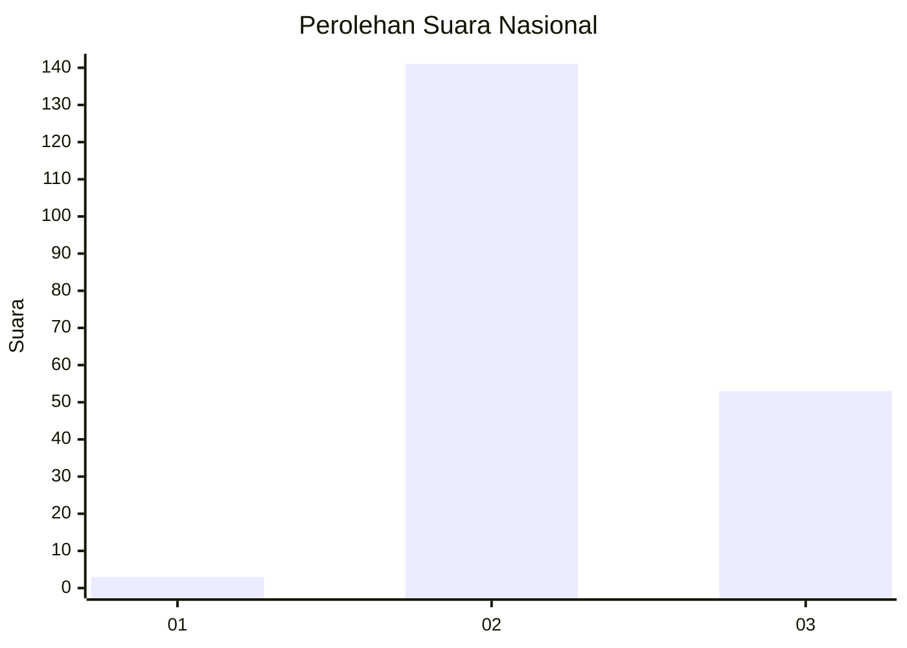
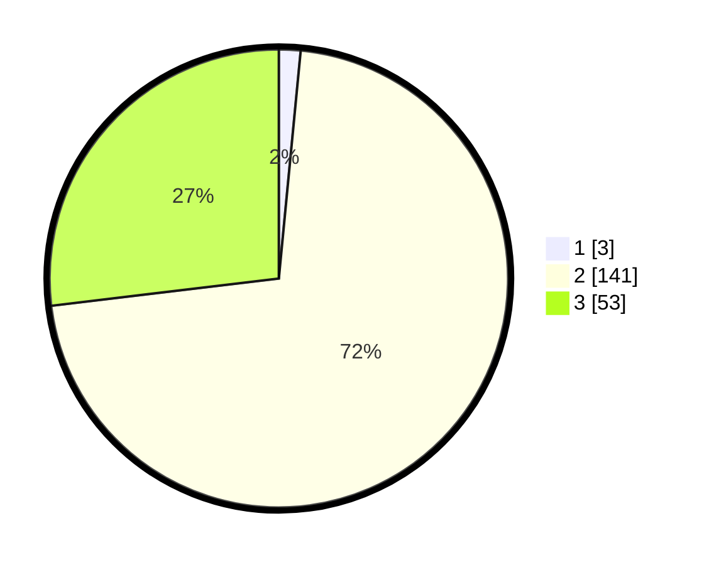

# Hasil

## Grafik

## Tabel

| No. | Nama Paslon    | Suara | Suara (raw) | Persentase |
|:--- |:-------------- | -----:| -----------:| ----------:|
| 1   | ANIES MUHAIMIN | 3     | [3][p-1]    | 1,52       |
| 2   | PRABOWO GIBRAN | 141   | [141][p-2]  | 71,57      |
| 3   | GANJAR MAHFUD  | 53    | [53][p-3]   | 26,90      |

[p-1]: https://github.com/gigit-pemilu/pemilu-2024/blob/main/pilpres/hitung-suara/sub/51-bali/sub/02-tabanan/sub/06-kediri/sub/2014-abian-tuwung/sub/026-tps/sub/paslon-1.txt
[p-2]: https://github.com/gigit-pemilu/pemilu-2024/blob/main/pilpres/hitung-suara/sub/51-bali/sub/02-tabanan/sub/06-kediri/sub/2014-abian-tuwung/sub/026-tps/sub/paslon-2.txt
[p-3]: https://github.com/gigit-pemilu/pemilu-2024/blob/main/pilpres/hitung-suara/sub/51-bali/sub/02-tabanan/sub/06-kediri/sub/2014-abian-tuwung/sub/026-tps/sub/paslon-3.txt

## Foto C Plano

https://sirekap-obj-formc.kpu.go.id/bfc7/pemilu/ppwp/51/02/06/20/14/5102062014026-20240214-210658--2bc4e0e7-9b57-44d2-8075-8ada48177c20.jpg

https://sirekap-obj-formc.kpu.go.id/bfc7/pemilu/ppwp/51/02/06/20/14/5102062014026-20240214-210442--d2699077-0780-467e-af65-7b4e94816e51.jpg

https://sirekap-obj-formc.kpu.go.id/bfc7/pemilu/ppwp/51/02/06/20/14/5102062014026-20240214-210734--1a6695cc-e75f-4f3a-825e-11eedbf064f8.jpg

## Metadata

| Key        | Value               |
| ---------- | ------------------- |
| Time Stamp | 2024-02-15 23:29:50 |

## DATA PEMILIH TETAP

Jumlah pemilih dalam DPT: **257**.
 * L: **128**.
 * P: **129**.

## DATA PENGGUNA HAK PILIH

Jumlah pengguna hak pilih dalam DPT: **202**.
 * L: **101**.
 * P: **101**.

Jumlah pengguna hak pilih dalam DPTb: **0**.
 * L: **0**.
 * P: **0**.

Jumlah pengguna hak pilih dalam DPK: **0**.
 * L: **0**.
 * P: **0**.

Jumlah pengguna hak pilih: **202**.
 * L: **101**.
 * P: **101**.

## JUMLAH SUARA SAH DAN TIDAK SAH

JUMLAH SELURUH SUARA SAH: **197**.

JUMLAH SUARA TIDAK SAH: **5**.

JUMLAH SELURUH SUARA SAH DAN SUARA TIDAK SAH: **202**.

