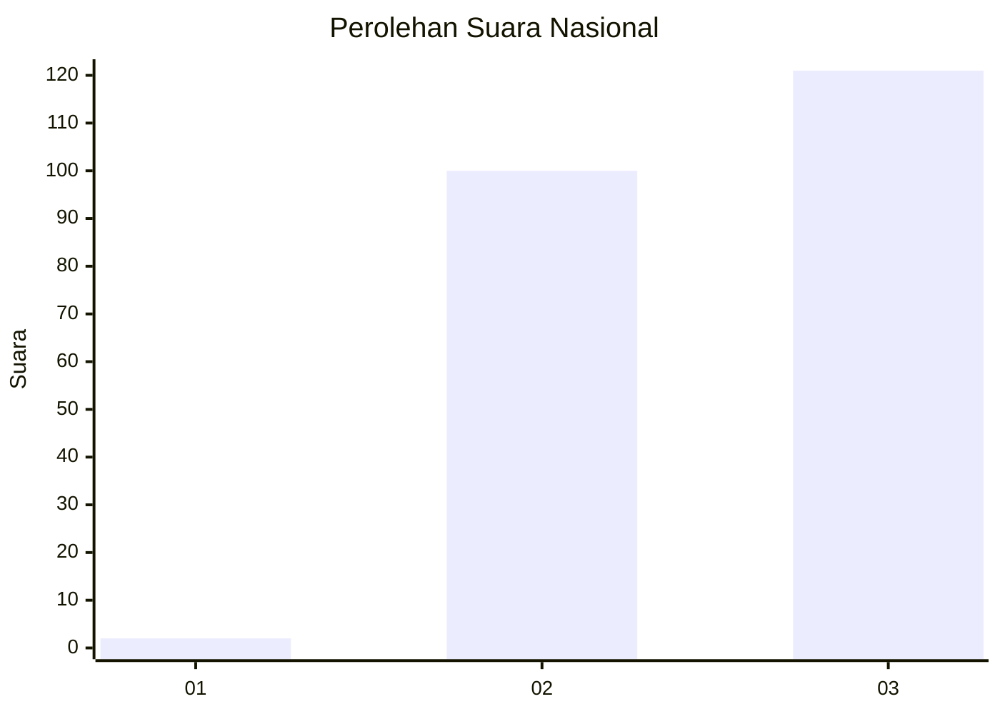
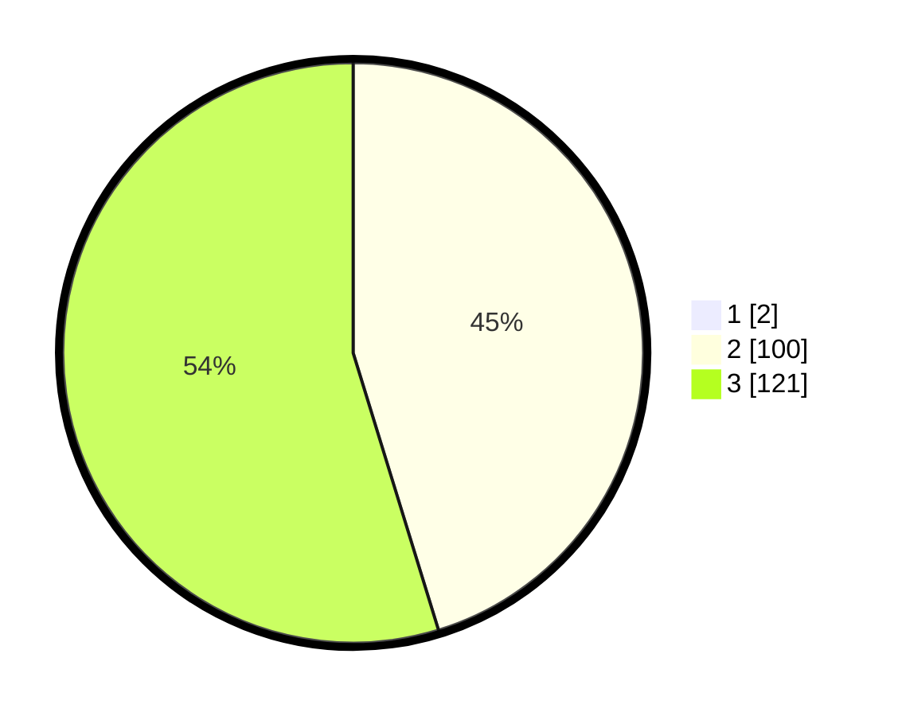

# Hasil

## Grafik

## Tabel

| No. | Nama Paslon    | Suara | Suara (raw) | Persentase |
|:--- |:-------------- | -----:| -----------:| ----------:|
| 1   | ANIES MUHAIMIN | 2     | [2][p-1]    | 0,90       |
| 2   | PRABOWO GIBRAN | 100   | [100][p-2]  | 44,84      |
| 3   | GANJAR MAHFUD  | 121   | [121][p-3]  | 54,26      |

[p-1]: https://github.com/gigit-pemilu/pemilu-2024/blob/main/pilpres/hitung-suara/sub/51-bali/sub/02-tabanan/sub/06-kediri/sub/2014-abian-tuwung/sub/029-tps/sub/paslon-1.txt
[p-2]: https://github.com/gigit-pemilu/pemilu-2024/blob/main/pilpres/hitung-suara/sub/51-bali/sub/02-tabanan/sub/06-kediri/sub/2014-abian-tuwung/sub/029-tps/sub/paslon-2.txt
[p-3]: https://github.com/gigit-pemilu/pemilu-2024/blob/main/pilpres/hitung-suara/sub/51-bali/sub/02-tabanan/sub/06-kediri/sub/2014-abian-tuwung/sub/029-tps/sub/paslon-3.txt

## Foto C Plano

https://sirekap-obj-formc.kpu.go.id/c470/pemilu/ppwp/51/02/06/20/14/5102062014029-20240214-220735--216a3b86-bfd3-4470-9215-6488d2067ae6.jpg

https://sirekap-obj-formc.kpu.go.id/c470/pemilu/ppwp/51/02/06/20/14/5102062014029-20240214-220811--26d53ec1-7651-4d06-8c45-816f02b647b0.jpg

https://sirekap-obj-formc.kpu.go.id/c470/pemilu/ppwp/51/02/06/20/14/5102062014029-20240214-220826--f198e0c6-eb90-4c5d-8b7d-be4fd0598c58.jpg

## Metadata

| Key        | Value               |
| ---------- | ------------------- |
| Time Stamp | 2024-02-15 23:29:50 |

