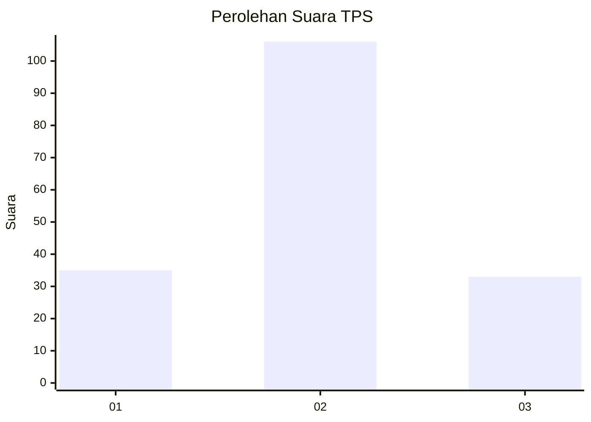
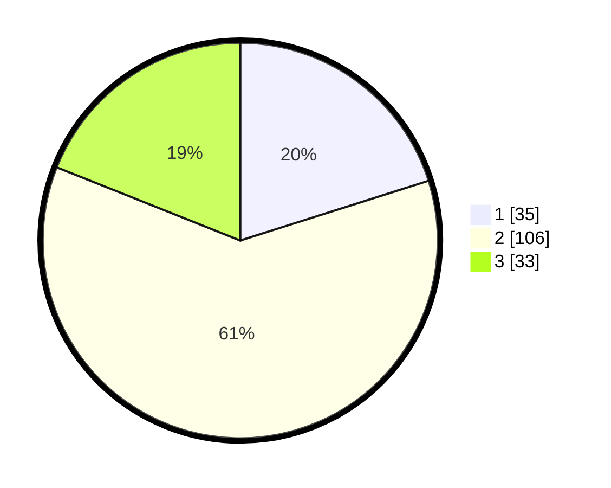

# Hasil

## Grafik

## Tabel

| No. | Nama Paslon    | Suara | Suara (raw) | Persentase |
|:--- |:-------------- | -----:| -----------:| ----------:|
| 1   | ANIES MUHAIMIN | 35    | [35][p-1]   | 20,11      |
| 2   | PRABOWO GIBRAN | 106   | [106][p-2]  | 60,92      |
| 3   | GANJAR MAHFUD  | 33    | [33][p-3]   | 18,97      |

[p-1]: https://github.com/gigit-pemilu/pemilu-2024-51-bali/blob/main/pilpres/hitung-suara/sub/51-bali/sub/02-tabanan/sub/06-kediri/sub/2014-abian-tuwung/sub/031-tps/sub/paslon-1.txt
[p-2]: https://github.com/gigit-pemilu/pemilu-2024-51-bali/blob/main/pilpres/hitung-suara/sub/51-bali/sub/02-tabanan/sub/06-kediri/sub/2014-abian-tuwung/sub/031-tps/sub/paslon-2.txt
[p-3]: https://github.com/gigit-pemilu/pemilu-2024-51-bali/blob/main/pilpres/hitung-suara/sub/51-bali/sub/02-tabanan/sub/06-kediri/sub/2014-abian-tuwung/sub/031-tps/sub/paslon-3.txt

## Foto C Plano

https://sirekap-obj-formc.kpu.go.id/1eef/pemilu/ppwp/51/02/06/20/14/5102062014031-20240214-133402--fa247a94-6924-431e-ad78-274d49e715e7.jpg

https://sirekap-obj-formc.kpu.go.id/1eef/pemilu/ppwp/51/02/06/20/14/5102062014031-20240214-133414--7afc4d6f-a4f1-4018-bad8-c3b4b18ff698.jpg

https://sirekap-obj-formc.kpu.go.id/1eef/pemilu/ppwp/51/02/06/20/14/5102062014031-20240214-133420--c7893de8-5faf-48b6-b349-59d7492fb6dc.jpg

## Metadata

| Key        | Value               |
| ---------- | ------------------- |
| Time Stamp | 2024-02-15 15:00:29 |

