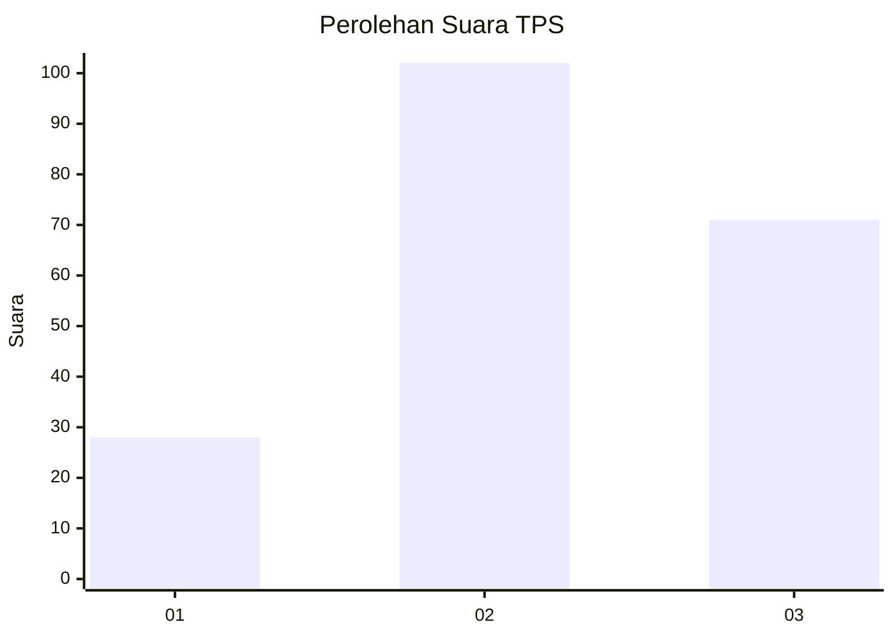
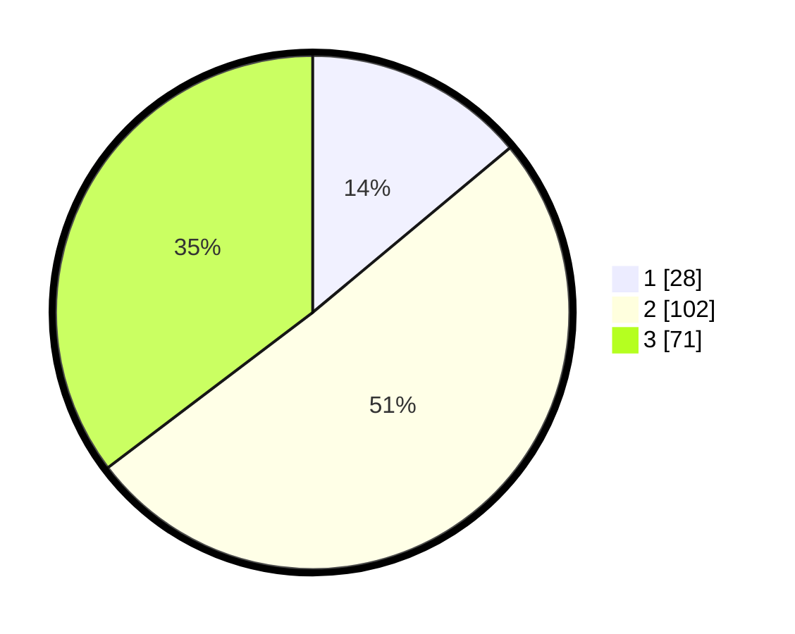

# Hasil

## Grafik

## Tabel

| No. | Nama Paslon    | Suara | Suara (raw) | Persentase |
|:--- |:-------------- | -----:| -----------:| ----------:|
| 1   | ANIES MUHAIMIN | 28    | [28][p-1]   | 13,93      |
| 2   | PRABOWO GIBRAN | 102   | [102][p-2]  | 50,75      |
| 3   | GANJAR MAHFUD  | 71    | [71][p-3]   | 35,32      |

[p-1]: https://github.com/gigit-pemilu/pemilu-2024-51-bali/blob/main/pilpres/hitung-suara/sub/51-bali/sub/02-tabanan/sub/06-kediri/sub/2014-abian-tuwung/sub/033-tps/sub/paslon-1.txt
[p-2]: https://github.com/gigit-pemilu/pemilu-2024-51-bali/blob/main/pilpres/hitung-suara/sub/51-bali/sub/02-tabanan/sub/06-kediri/sub/2014-abian-tuwung/sub/033-tps/sub/paslon-2.txt
[p-3]: https://github.com/gigit-pemilu/pemilu-2024-51-bali/blob/main/pilpres/hitung-suara/sub/51-bali/sub/02-tabanan/sub/06-kediri/sub/2014-abian-tuwung/sub/033-tps/sub/paslon-3.txt

## Foto C Plano

https://sirekap-obj-formc.kpu.go.id/0aab/pemilu/ppwp/51/02/06/20/14/5102062014033-20240214-155333--77885f1e-c3d0-4e72-9966-3c7620ac348d.jpg

https://sirekap-obj-formc.kpu.go.id/0aab/pemilu/ppwp/51/02/06/20/14/5102062014033-20240214-155405--1785d4c8-7f7f-45d7-b304-17e2d02e37ff.jpg

## Metadata

| Key        | Value               |
| ---------- | ------------------- |
| Time Stamp | 2024-02-15 15:00:29 |

