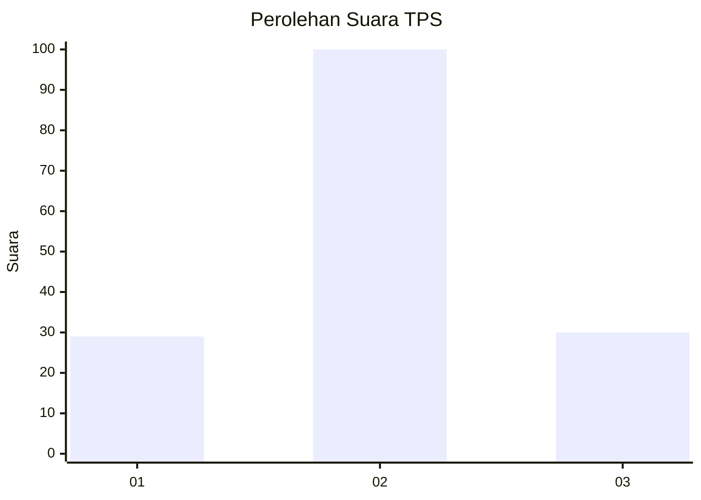
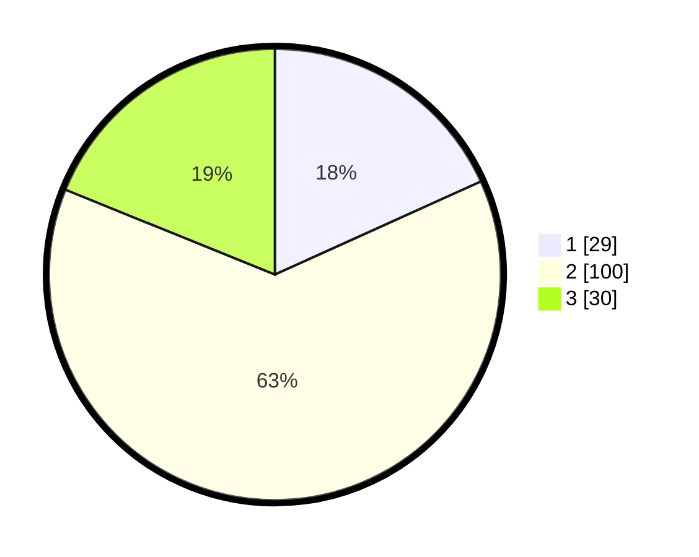

# Hasil

## Grafik

## Tabel

| No. | Nama Paslon    | Suara | Suara (raw) | Persentase |
|:--- |:-------------- | -----:| -----------:| ----------:|
| 1   | ANIES MUHAIMIN | 29    | [29][p-1]   | 18,24      |
| 2   | PRABOWO GIBRAN | 100   | [100][p-2]  | 62,89      |
| 3   | GANJAR MAHFUD  | 30    | [30][p-3]   | 18,87      |

[p-1]: https://github.com/gigit-pemilu/pemilu-2024-51-bali/blob/main/pilpres/hitung-suara/sub/51-bali/sub/02-tabanan/sub/06-kediri/sub/2014-abian-tuwung/sub/035-tps/sub/paslon-1.txt
[p-2]: https://github.com/gigit-pemilu/pemilu-2024-51-bali/blob/main/pilpres/hitung-suara/sub/51-bali/sub/02-tabanan/sub/06-kediri/sub/2014-abian-tuwung/sub/035-tps/sub/paslon-2.txt
[p-3]: https://github.com/gigit-pemilu/pemilu-2024-51-bali/blob/main/pilpres/hitung-suara/sub/51-bali/sub/02-tabanan/sub/06-kediri/sub/2014-abian-tuwung/sub/035-tps/sub/paslon-3.txt

## Foto C Plano

https://sirekap-obj-formc.kpu.go.id/3d7f/pemilu/ppwp/51/02/06/20/14/5102062014035-20240214-141855--fba21476-d770-4f8c-8700-436e83528352.jpg

https://sirekap-obj-formc.kpu.go.id/3d7f/pemilu/ppwp/51/02/06/20/14/5102062014035-20240214-194443--4aa0bb12-094a-4bb4-b1b7-62792a2eef49.jpg

https://sirekap-obj-formc.kpu.go.id/3d7f/pemilu/ppwp/51/02/06/20/14/5102062014035-20240214-194448--f30c924e-717f-465a-9562-0c29d57ab2af.jpg

## Metadata

| Key        | Value               |
| ---------- | ------------------- |
| Time Stamp | 2024-02-15 00:41:44 |

## DATA PEMILIH TETAP

Jumlah pemilih dalam DPT: **251**.
 * L: **123**.
 * P: **428**.

## DATA PENGGUNA HAK PILIH

Jumlah pengguna hak pilih dalam DPT: **161**.
 * L: **77**.
 * P: **84**.

Jumlah pengguna hak pilih dalam DPTb: **0**.
 * L: **0**.
 * P: **0**.

Jumlah pengguna hak pilih dalam DPK: **1**.
 * L: **0**.
 * P: **1**.

Jumlah pengguna hak pilih: **162**.
 * L: **77**.
 * P: **85**.

## JUMLAH SUARA SAH DAN TIDAK SAH

JUMLAH SELURUH SUARA SAH: **159**.

JUMLAH SUARA TIDAK SAH: **3**.

JUMLAH SELURUH SUARA SAH DAN SUARA TIDAK SAH: **162**.

