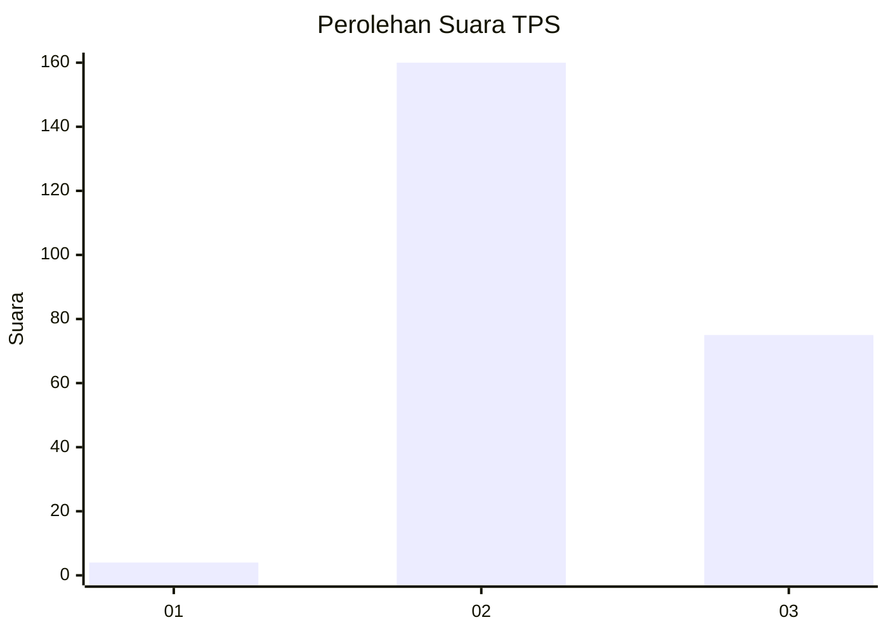
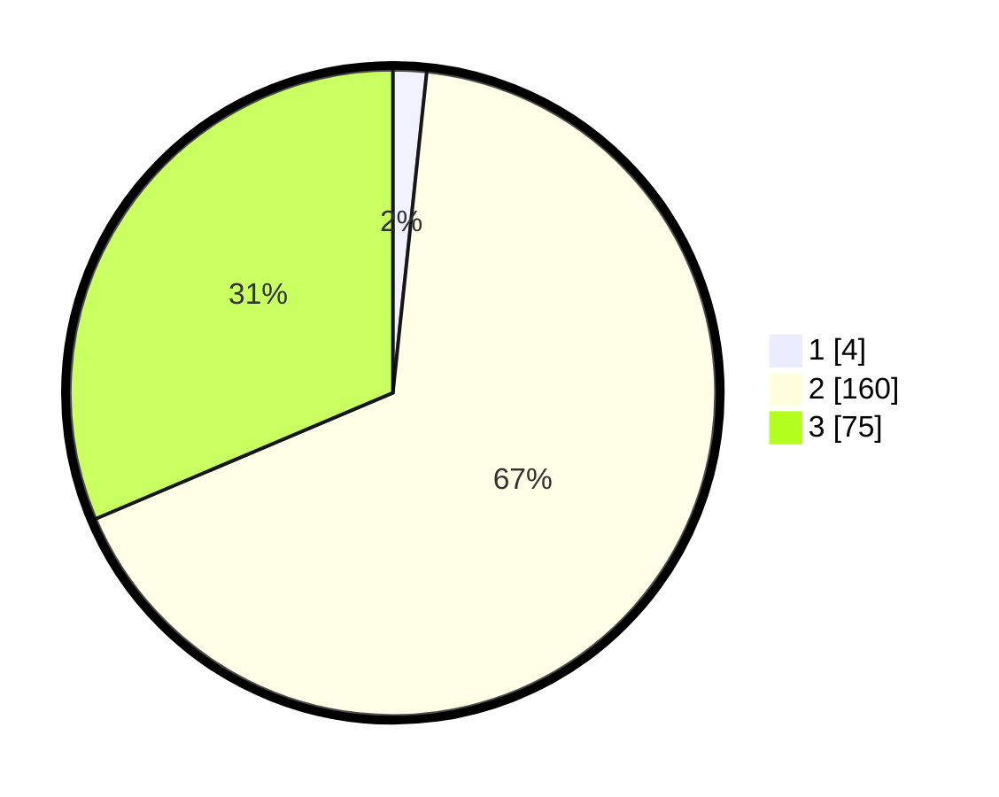

# Hasil

## Grafik

## Tabel

| No. | Nama Paslon    | Suara | Suara (raw) | Persentase |
|:--- |:-------------- | -----:| -----------:| ----------:|
| 1   | ANIES MUHAIMIN | 4     | [4][p-1]    | 1,67       |
| 2   | PRABOWO GIBRAN | 160   | [160][p-2]  | 66,95      |
| 3   | GANJAR MAHFUD  | 75    | [75][p-3]   | 31,38      |

[p-1]: https://github.com/gigit-pemilu/pemilu-2024-51-bali/blob/main/pilpres/hitung-suara/sub/51-bali/sub/02-tabanan/sub/06-kediri/sub/2015-banjar-anyar/sub/001-tps/sub/paslon-1.txt
[p-2]: https://github.com/gigit-pemilu/pemilu-2024-51-bali/blob/main/pilpres/hitung-suara/sub/51-bali/sub/02-tabanan/sub/06-kediri/sub/2015-banjar-anyar/sub/001-tps/sub/paslon-2.txt
[p-3]: https://github.com/gigit-pemilu/pemilu-2024-51-bali/blob/main/pilpres/hitung-suara/sub/51-bali/sub/02-tabanan/sub/06-kediri/sub/2015-banjar-anyar/sub/001-tps/sub/paslon-3.txt

## Foto C Plano

https://sirekap-obj-formc.kpu.go.id/0665/pemilu/ppwp/51/02/06/20/15/5102062015001-20240215-080902--83e5d94b-eddb-4ed5-8cbf-e10d1ff08ae4.jpg

https://sirekap-obj-formc.kpu.go.id/0665/pemilu/ppwp/51/02/06/20/15/5102062015001-20240215-080930--82dca8bd-f364-4b7a-8f63-5effe0aae886.jpg

https://sirekap-obj-formc.kpu.go.id/0665/pemilu/ppwp/51/02/06/20/15/5102062015001-20240215-080912--d0711a6c-6e2f-4384-a228-736838c75217.jpg

## Metadata

| Key        | Value               |
| ---------- | ------------------- |
| Time Stamp | 2024-02-15 22:40:13 |

## DATA PEMILIH TETAP

Jumlah pemilih dalam DPT: **290**.
 * L: **132**.
 * P: **158**.

## DATA PENGGUNA HAK PILIH

Jumlah pengguna hak pilih dalam DPT: **239**.
 * L: **105**.
 * P: **134**.

Jumlah pengguna hak pilih dalam DPTb: **2**.
 * L: **1**.
 * P: **1**.

Jumlah pengguna hak pilih dalam DPK: **3**.
 * L: **2**.
 * P: **1**.

Jumlah pengguna hak pilih: **244**.
 * L: **108**.
 * P: **136**.

## JUMLAH SUARA SAH DAN TIDAK SAH

JUMLAH SELURUH SUARA SAH: **239**.

JUMLAH SUARA TIDAK SAH: **5**.

JUMLAH SELURUH SUARA SAH DAN SUARA TIDAK SAH: **244**.

