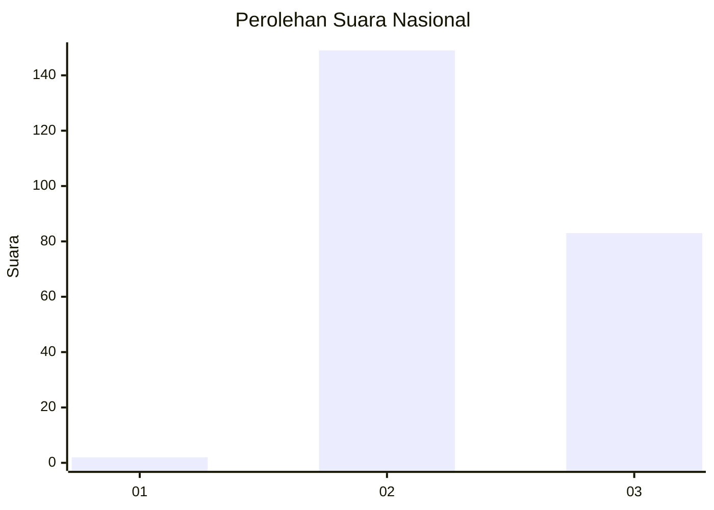
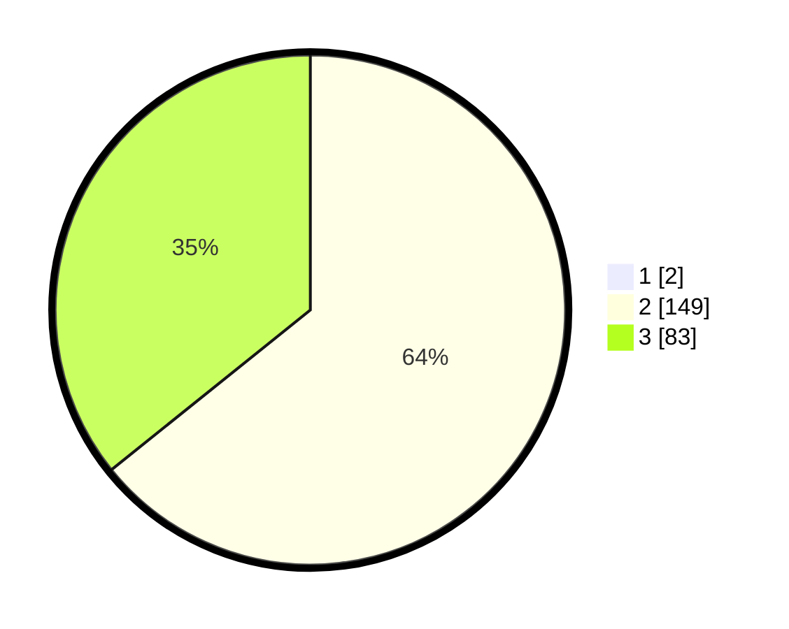

# Hasil

## Grafik

## Tabel

| No. | Nama Paslon    | Suara | Suara (raw) | Persentase |
|:--- |:-------------- | -----:| -----------:| ----------:|
| 1   | ANIES MUHAIMIN | 2     | [2][p-1]    | 0,85       |
| 2   | PRABOWO GIBRAN | 149   | [149][p-2]  | 63,68      |
| 3   | GANJAR MAHFUD  | 83    | [83][p-3]   | 35,47      |

[p-1]: https://github.com/gigit-pemilu/pemilu-2024/blob/main/pilpres/hitung-suara/sub/51-bali/sub/02-tabanan/sub/06-kediri/sub/2015-banjar-anyar/sub/002-tps/sub/paslon-1.txt
[p-2]: https://github.com/gigit-pemilu/pemilu-2024/blob/main/pilpres/hitung-suara/sub/51-bali/sub/02-tabanan/sub/06-kediri/sub/2015-banjar-anyar/sub/002-tps/sub/paslon-2.txt
[p-3]: https://github.com/gigit-pemilu/pemilu-2024/blob/main/pilpres/hitung-suara/sub/51-bali/sub/02-tabanan/sub/06-kediri/sub/2015-banjar-anyar/sub/002-tps/sub/paslon-3.txt

## Foto C Plano

https://sirekap-obj-formc.kpu.go.id/8788/pemilu/ppwp/51/02/06/20/15/5102062015002-20240214-200942--fdf3afb8-05cf-4912-8867-b7a1e9208612.jpg

https://sirekap-obj-formc.kpu.go.id/8788/pemilu/ppwp/51/02/06/20/15/5102062015002-20240214-201004--570ae8f7-c69a-4a34-b2d5-ebc81e301574.jpg

https://sirekap-obj-formc.kpu.go.id/8788/pemilu/ppwp/51/02/06/20/15/5102062015002-20240214-200953--3343d96a-6ad3-432f-9ebb-81c4de140916.jpg

## Metadata

| Key        | Value               |
| ---------- | ------------------- |
| Time Stamp | 2024-02-15 22:40:13 |

## DATA PEMILIH TETAP

Jumlah pemilih dalam DPT: **235**.
 * L: **118**.
 * P: **117**.

## DATA PENGGUNA HAK PILIH

Jumlah pengguna hak pilih dalam DPT: **235**.
 * L: **118**.
 * P: **117**.

Jumlah pengguna hak pilih dalam DPTb: **3**.
 * L: **1**.
 * P: **2**.

Jumlah pengguna hak pilih dalam DPK: **0**.
 * L: **0**.
 * P: **0**.

Jumlah pengguna hak pilih: **238**.
 * L: **119**.
 * P: **119**.

## JUMLAH SUARA SAH DAN TIDAK SAH

JUMLAH SELURUH SUARA SAH: **234**.

JUMLAH SUARA TIDAK SAH: **4**.

JUMLAH SELURUH SUARA SAH DAN SUARA TIDAK SAH: **238**.

