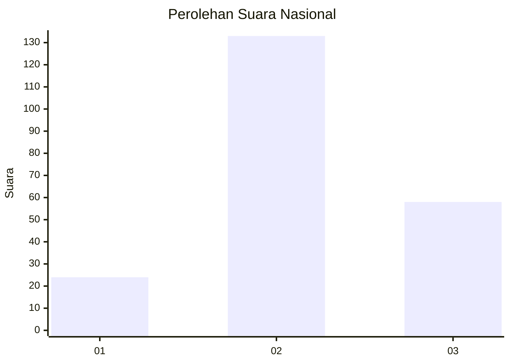
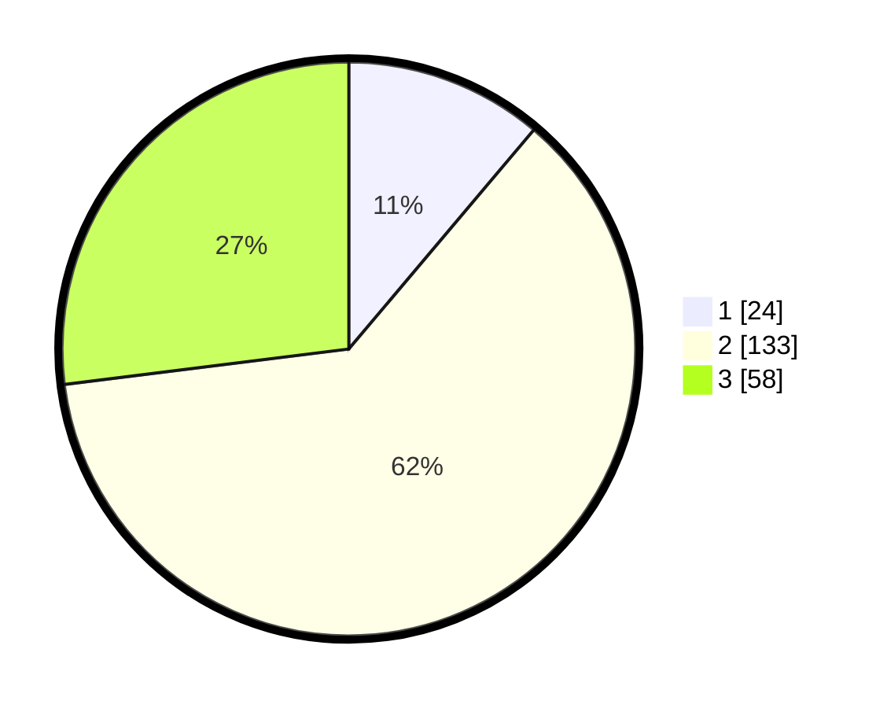

# Hasil

## Grafik

## Tabel

| No. | Nama Paslon    | Suara | Suara (raw) | Persentase |
|:--- |:-------------- | -----:| -----------:| ----------:|
| 1   | ANIES MUHAIMIN | 24    | [24][p-1]   | 11,16      |
| 2   | PRABOWO GIBRAN | 133   | [133][p-2]  | 61,86      |
| 3   | GANJAR MAHFUD  | 58    | [58][p-3]   | 26,98      |

[p-1]: https://github.com/gigit-pemilu/pemilu-2024/blob/main/pilpres/hitung-suara/sub/51-bali/sub/02-tabanan/sub/06-kediri/sub/2015-banjar-anyar/sub/005-tps/sub/paslon-1.txt
[p-2]: https://github.com/gigit-pemilu/pemilu-2024/blob/main/pilpres/hitung-suara/sub/51-bali/sub/02-tabanan/sub/06-kediri/sub/2015-banjar-anyar/sub/005-tps/sub/paslon-2.txt
[p-3]: https://github.com/gigit-pemilu/pemilu-2024/blob/main/pilpres/hitung-suara/sub/51-bali/sub/02-tabanan/sub/06-kediri/sub/2015-banjar-anyar/sub/005-tps/sub/paslon-3.txt

## Foto C Plano

https://sirekap-obj-formc.kpu.go.id/f17c/pemilu/ppwp/51/02/06/20/15/5102062015005-20240216-073744--a24af167-a1d3-418b-8bbd-d97f6cfa1e99.jpg

https://sirekap-obj-formc.kpu.go.id/f17c/pemilu/ppwp/51/02/06/20/15/5102062015005-20240214-141159--e79c6eac-b17f-4dfd-b3f1-fcbdcfde9005.jpg

https://sirekap-obj-formc.kpu.go.id/f17c/pemilu/ppwp/51/02/06/20/15/5102062015005-20240214-155419--a920a4db-b16f-44c2-a96d-d73f037060c1.jpg

## Metadata

| Key        | Value               |
| ---------- | ------------------- |
| Time Stamp | 2024-02-16 08:00:28 |

## DATA PEMILIH TETAP

Jumlah pemilih dalam DPT: **278**.
 * L: **130**.
 * P: **148**.

## DATA PENGGUNA HAK PILIH

Jumlah pengguna hak pilih dalam DPT: **214**.
 * L: **98**.
 * P: **116**.

Jumlah pengguna hak pilih dalam DPTb: **3**.
 * L: **2**.
 * P: **1**.

Jumlah pengguna hak pilih dalam DPK: **0**.
 * L: **0**.
 * P: **0**.

Jumlah pengguna hak pilih: **217**.
 * L: **100**.
 * P: **117**.

## JUMLAH SUARA SAH DAN TIDAK SAH

JUMLAH SELURUH SUARA SAH: **215**.

JUMLAH SUARA TIDAK SAH: **2**.

JUMLAH SELURUH SUARA SAH DAN SUARA TIDAK SAH: **217**.

