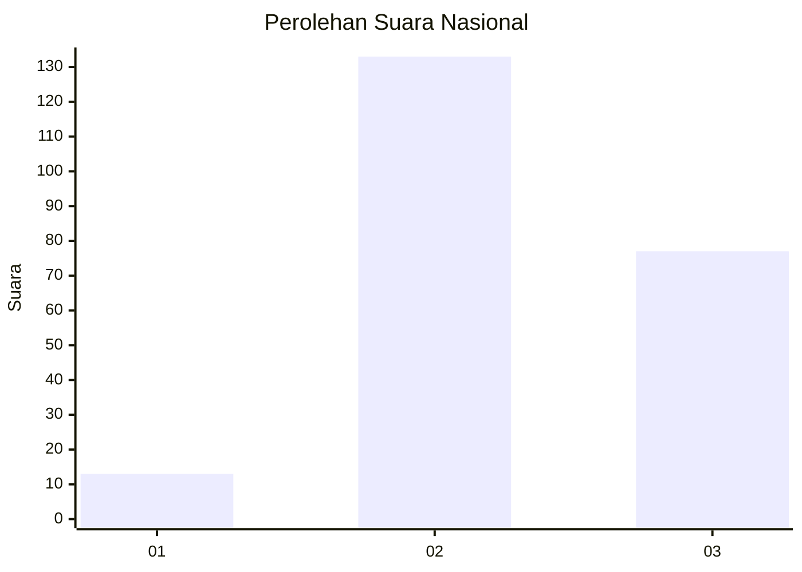
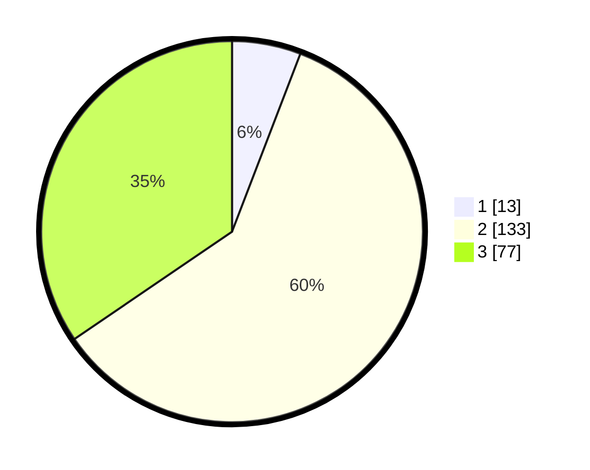

# Hasil

## Grafik

## Tabel

| No. | Nama Paslon    | Suara | Suara (raw) | Persentase |
|:--- |:-------------- | -----:| -----------:| ----------:|
| 1   | ANIES MUHAIMIN | 13    | [13][p-1]   | 5,83       |
| 2   | PRABOWO GIBRAN | 133   | [133][p-2]  | 59,64      |
| 3   | GANJAR MAHFUD  | 77    | [77][p-3]   | 34,53      |

[p-1]: https://github.com/gigit-pemilu/pemilu-2024/blob/main/pilpres/hitung-suara/sub/51-bali/sub/02-tabanan/sub/06-kediri/sub/2015-banjar-anyar/sub/006-tps/sub/paslon-1.txt
[p-2]: https://github.com/gigit-pemilu/pemilu-2024/blob/main/pilpres/hitung-suara/sub/51-bali/sub/02-tabanan/sub/06-kediri/sub/2015-banjar-anyar/sub/006-tps/sub/paslon-2.txt
[p-3]: https://github.com/gigit-pemilu/pemilu-2024/blob/main/pilpres/hitung-suara/sub/51-bali/sub/02-tabanan/sub/06-kediri/sub/2015-banjar-anyar/sub/006-tps/sub/paslon-3.txt

## Foto C Plano

https://sirekap-obj-formc.kpu.go.id/5764/pemilu/ppwp/51/02/06/20/15/5102062015006-20240214-223520--b205d8c6-dc6b-4836-9381-3b7e4a42e3c3.jpg

https://sirekap-obj-formc.kpu.go.id/5764/pemilu/ppwp/51/02/06/20/15/5102062015006-20240214-223521--116d8548-f9fe-4b47-906e-e6c471108aa1.jpg

https://sirekap-obj-formc.kpu.go.id/5764/pemilu/ppwp/51/02/06/20/15/5102062015006-20240214-223520--3db2e877-adda-4832-a2fd-39e42e42dddb.jpg

## Metadata

| Key        | Value               |
| ---------- | ------------------- |
| Time Stamp | 2024-02-15 22:40:13 |

## DATA PEMILIH TETAP

Jumlah pemilih dalam DPT: **277**.
 * L: **134**.
 * P: **143**.

## DATA PENGGUNA HAK PILIH

Jumlah pengguna hak pilih dalam DPT: **215**.
 * L: **106**.
 * P: **109**.

Jumlah pengguna hak pilih dalam DPTb: **8**.
 * L: **3**.
 * P: **5**.

Jumlah pengguna hak pilih dalam DPK: **3**.
 * L: **1**.
 * P: **2**.

Jumlah pengguna hak pilih: **226**.
 * L: **110**.
 * P: **116**.

## JUMLAH SUARA SAH DAN TIDAK SAH

JUMLAH SELURUH SUARA SAH: **223**.

JUMLAH SUARA TIDAK SAH: **3**.

JUMLAH SELURUH SUARA SAH DAN SUARA TIDAK SAH: **226**.

