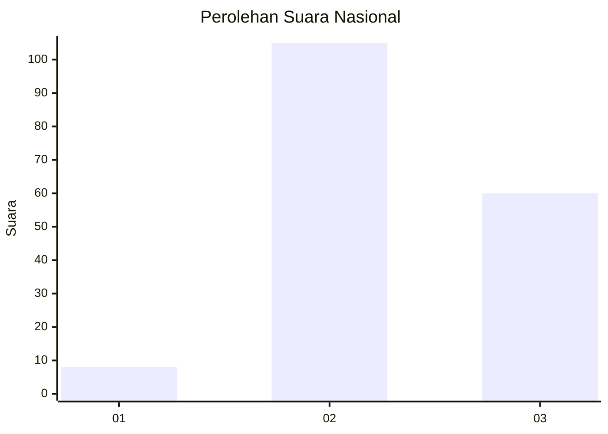
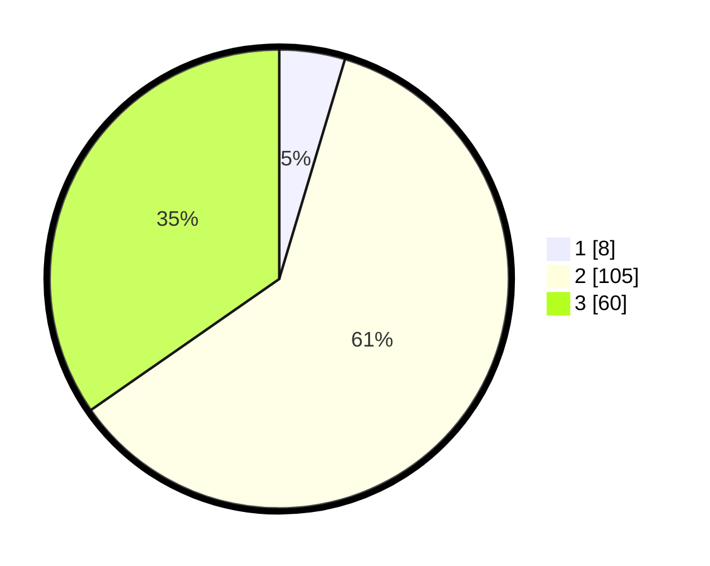

# Hasil

## Grafik

## Tabel

| No. | Nama Paslon    | Suara | Suara (raw) | Persentase |
|:--- |:-------------- | -----:| -----------:| ----------:|
| 1   | ANIES MUHAIMIN | 8     | [8][p-1]    | 4,62       |
| 2   | PRABOWO GIBRAN | 105   | [105][p-2]  | 60,69      |
| 3   | GANJAR MAHFUD  | 60    | [60][p-3]   | 34,68      |

[p-1]: https://github.com/gigit-pemilu/pemilu-2024/blob/main/pilpres/hitung-suara/sub/51-bali/sub/02-tabanan/sub/06-kediri/sub/2015-banjar-anyar/sub/009-tps/sub/paslon-1.txt
[p-2]: https://github.com/gigit-pemilu/pemilu-2024/blob/main/pilpres/hitung-suara/sub/51-bali/sub/02-tabanan/sub/06-kediri/sub/2015-banjar-anyar/sub/009-tps/sub/paslon-2.txt
[p-3]: https://github.com/gigit-pemilu/pemilu-2024/blob/main/pilpres/hitung-suara/sub/51-bali/sub/02-tabanan/sub/06-kediri/sub/2015-banjar-anyar/sub/009-tps/sub/paslon-3.txt

## Foto C Plano

https://sirekap-obj-formc.kpu.go.id/744f/pemilu/ppwp/51/02/06/20/15/5102062015009-20240216-034323--68717a09-ee5f-4e19-971a-2bded3fd96b7.jpg

https://sirekap-obj-formc.kpu.go.id/744f/pemilu/ppwp/51/02/06/20/15/5102062015009-20240216-033653--4f91d598-3557-429b-9378-c49a12ef8444.jpg

https://sirekap-obj-formc.kpu.go.id/744f/pemilu/ppwp/51/02/06/20/15/5102062015009-20240216-033651--9ec52890-ae59-4efc-9d0f-91a0c1af5c51.jpg

## Metadata

| Key        | Value               |
| ---------- | ------------------- |
| Time Stamp | 2024-02-16 11:00:29 |

## DATA PEMILIH TETAP

Jumlah pemilih dalam DPT: **221**.
 * L: **110**.
 * P: **111**.

## DATA PENGGUNA HAK PILIH

Jumlah pengguna hak pilih dalam DPT: **169**.
 * L: **83**.
 * P: **86**.

Jumlah pengguna hak pilih dalam DPTb: **4**.
 * L: **1**.
 * P: **3**.

Jumlah pengguna hak pilih dalam DPK: **2**.
 * L: **1**.
 * P: **1**.

Jumlah pengguna hak pilih: **175**.
 * L: **85**.
 * P: **90**.

## JUMLAH SUARA SAH DAN TIDAK SAH

JUMLAH SELURUH SUARA SAH: **173**.

JUMLAH SUARA TIDAK SAH: **2**.

JUMLAH SELURUH SUARA SAH DAN SUARA TIDAK SAH: **175**.

