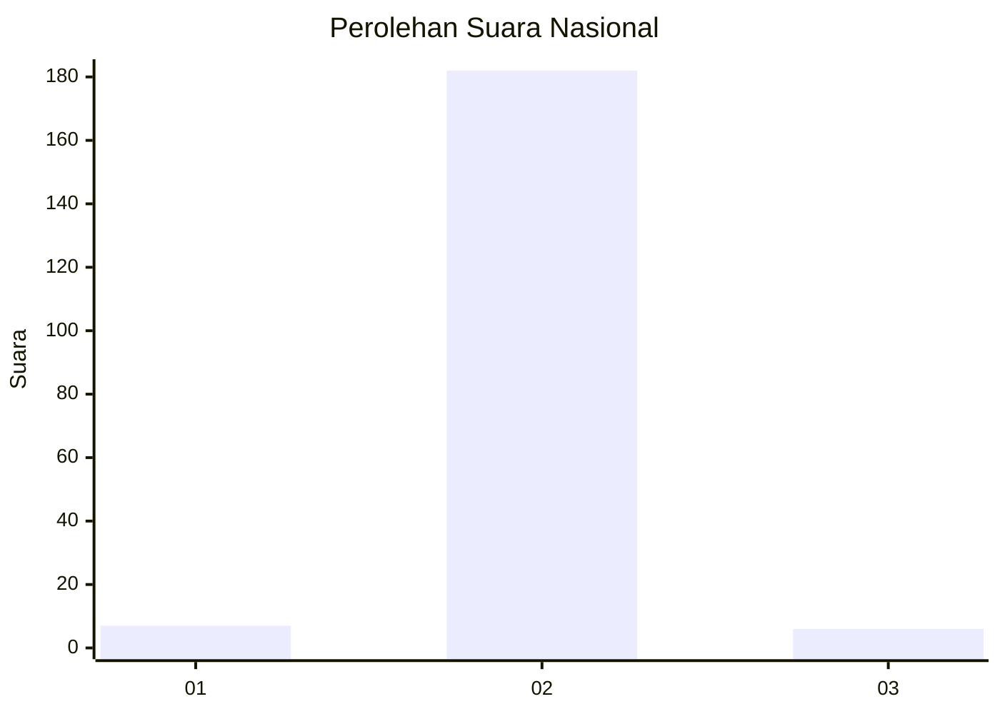
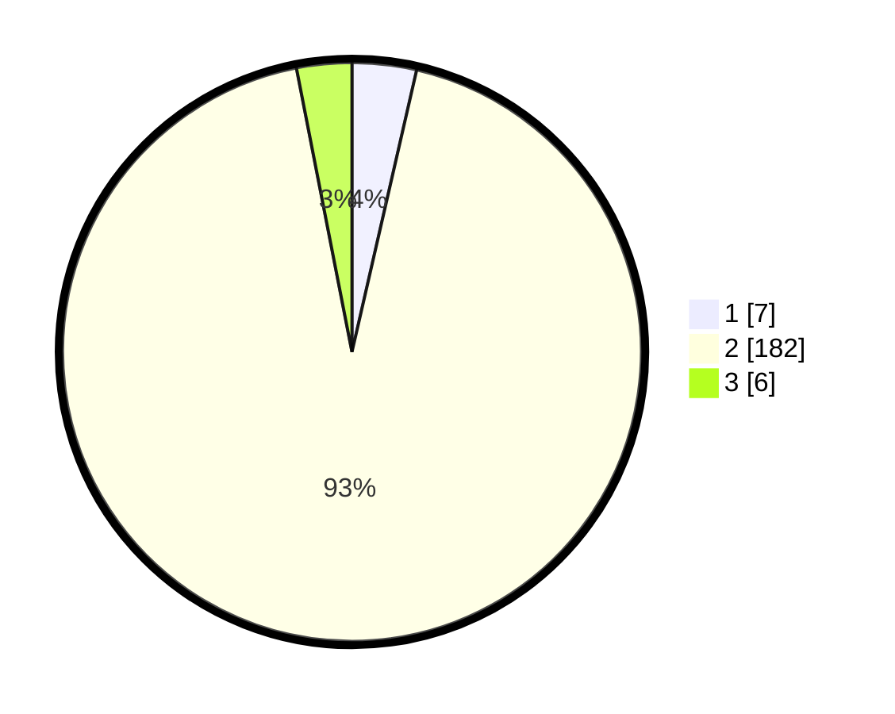

# Hasil

## Grafik

## Tabel

| No. | Nama Paslon    | Suara | Suara (raw) | Persentase |
|:--- |:-------------- | -----:| -----------:| ----------:|
| 1   | ANIES MUHAIMIN | 7     | [7][p-1]    | 3,59       |
| 2   | PRABOWO GIBRAN | 182   | [182][p-2]  | 93,33      |
| 3   | GANJAR MAHFUD  | 6     | [6][p-3]    | 3,08       |

[p-1]: https://github.com/gigit-pemilu/pemilu-2024/blob/main/pilpres/hitung-suara/sub/51-bali/sub/02-tabanan/sub/06-kediri/sub/2015-banjar-anyar/sub/012-tps/sub/paslon-1.txt
[p-2]: https://github.com/gigit-pemilu/pemilu-2024/blob/main/pilpres/hitung-suara/sub/51-bali/sub/02-tabanan/sub/06-kediri/sub/2015-banjar-anyar/sub/012-tps/sub/paslon-2.txt
[p-3]: https://github.com/gigit-pemilu/pemilu-2024/blob/main/pilpres/hitung-suara/sub/51-bali/sub/02-tabanan/sub/06-kediri/sub/2015-banjar-anyar/sub/012-tps/sub/paslon-3.txt

## Foto C Plano

https://sirekap-obj-formc.kpu.go.id/9d57/pemilu/ppwp/51/02/06/20/15/5102062015012-20240215-005457--68f0f850-3726-447d-a884-8cae6eb5f02d.jpg

https://sirekap-obj-formc.kpu.go.id/9d57/pemilu/ppwp/51/02/06/20/15/5102062015012-20240215-005746--32eb8491-3c34-4ff8-b8d2-e88372c1b4b5.jpg

https://sirekap-obj-formc.kpu.go.id/9d57/pemilu/ppwp/51/02/06/20/15/5102062015012-20240215-005909--5ee7a9e7-8a0e-41b9-a021-5a4f10fa8461.jpg

## Metadata

| Key        | Value               |
| ---------- | ------------------- |
| Time Stamp | 2024-02-15 23:29:50 |

