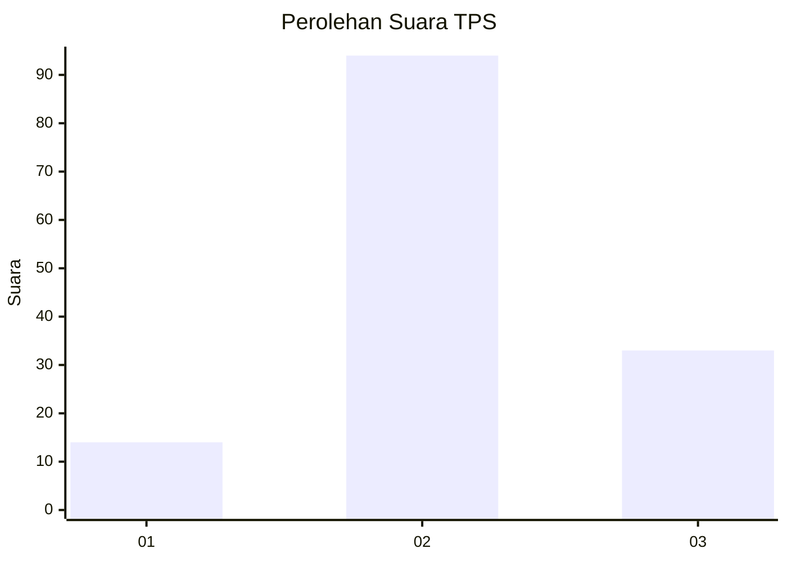
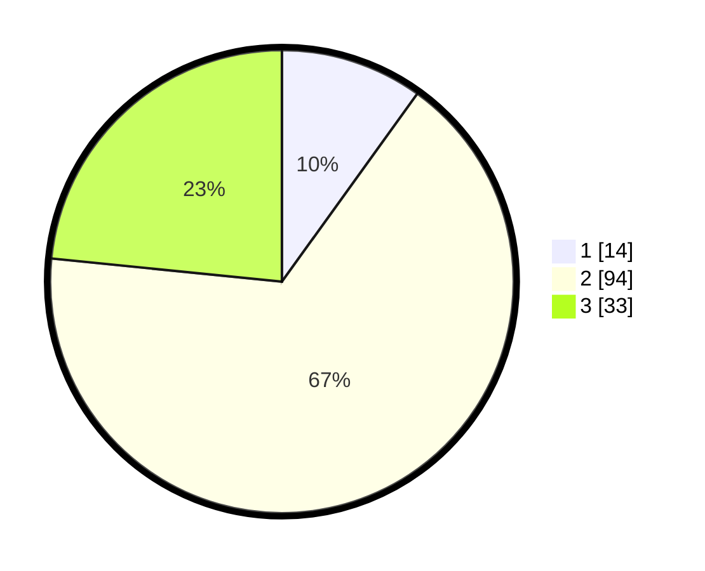

# Hasil

## Grafik

## Tabel

| No. | Nama Paslon    | Suara | Suara (raw) | Persentase |
|:--- |:-------------- | -----:| -----------:| ----------:|
| 1   | ANIES MUHAIMIN | 14    | [14][p-1]   | 9,93       |
| 2   | PRABOWO GIBRAN | 94    | [94][p-2]   | 66,67      |
| 3   | GANJAR MAHFUD  | 33    | [33][p-3]   | 23,40      |

[p-1]: https://github.com/gigit-pemilu/pemilu-2024-51-bali/blob/main/pilpres/hitung-suara/sub/51-bali/sub/02-tabanan/sub/06-kediri/sub/2015-banjar-anyar/sub/014-tps/sub/paslon-1.txt
[p-2]: https://github.com/gigit-pemilu/pemilu-2024-51-bali/blob/main/pilpres/hitung-suara/sub/51-bali/sub/02-tabanan/sub/06-kediri/sub/2015-banjar-anyar/sub/014-tps/sub/paslon-2.txt
[p-3]: https://github.com/gigit-pemilu/pemilu-2024-51-bali/blob/main/pilpres/hitung-suara/sub/51-bali/sub/02-tabanan/sub/06-kediri/sub/2015-banjar-anyar/sub/014-tps/sub/paslon-3.txt

## Foto C Plano

https://sirekap-obj-formc.kpu.go.id/3362/pemilu/ppwp/51/02/06/20/15/5102062015014-20240215-010929--33621964-8ab2-470f-8577-19e28df552bb.jpg

https://sirekap-obj-formc.kpu.go.id/3362/pemilu/ppwp/51/02/06/20/15/5102062015014-20240215-011446--a004300c-b99f-43ee-ab50-d2aa54b34720.jpg

https://sirekap-obj-formc.kpu.go.id/3362/pemilu/ppwp/51/02/06/20/15/5102062015014-20240215-011547--1713ebc3-d981-463f-bce4-994b3e8dd4c2.jpg

## Metadata

| Key        | Value               |
| ---------- | ------------------- |
| Time Stamp | 2024-02-24 22:31:28 |

