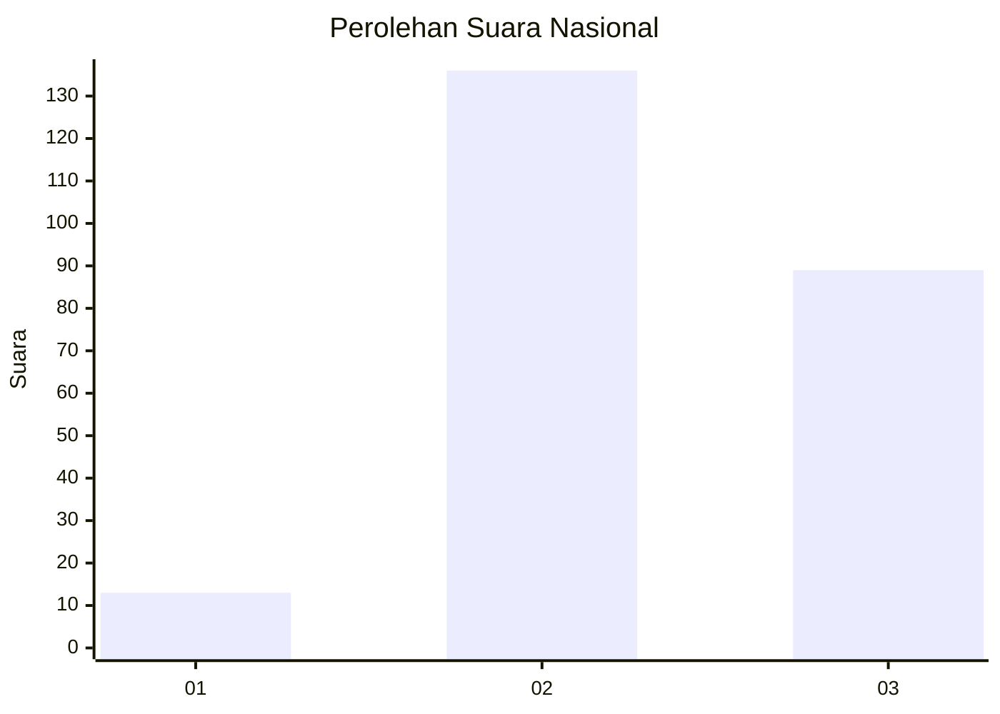
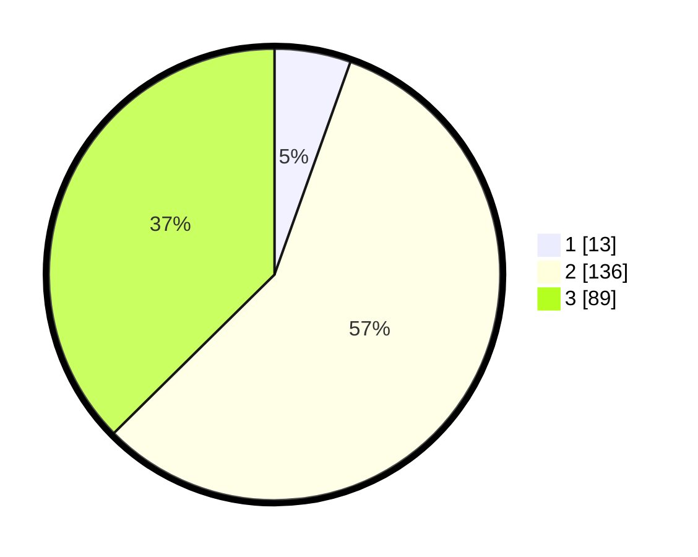

# Hasil

## Grafik

## Tabel

| No. | Nama Paslon    | Suara | Suara (raw) | Persentase |
|:--- |:-------------- | -----:| -----------:| ----------:|
| 1   | ANIES MUHAIMIN | 13    | [13][p-1]   | 5,46       |
| 2   | PRABOWO GIBRAN | 136   | [136][p-2]  | 57,14      |
| 3   | GANJAR MAHFUD  | 89    | [89][p-3]   | 37,39      |

[p-1]: https://github.com/gigit-pemilu/pemilu-2024/blob/main/pilpres/hitung-suara/sub/51-bali/sub/02-tabanan/sub/06-kediri/sub/2015-banjar-anyar/sub/017-tps/sub/paslon-1.txt
[p-2]: https://github.com/gigit-pemilu/pemilu-2024/blob/main/pilpres/hitung-suara/sub/51-bali/sub/02-tabanan/sub/06-kediri/sub/2015-banjar-anyar/sub/017-tps/sub/paslon-2.txt
[p-3]: https://github.com/gigit-pemilu/pemilu-2024/blob/main/pilpres/hitung-suara/sub/51-bali/sub/02-tabanan/sub/06-kediri/sub/2015-banjar-anyar/sub/017-tps/sub/paslon-3.txt

## Foto C Plano

https://sirekap-obj-formc.kpu.go.id/dc2a/pemilu/ppwp/51/02/06/20/15/5102062015017-20240214-141127--f7852665-ed61-4248-af8b-e0ec0bb55b30.jpg

https://sirekap-obj-formc.kpu.go.id/dc2a/pemilu/ppwp/51/02/06/20/15/5102062015017-20240214-141414--0e68b9df-8778-4e1f-a31e-ba0e28bcd3da.jpg

https://sirekap-obj-formc.kpu.go.id/dc2a/pemilu/ppwp/51/02/06/20/15/5102062015017-20240214-141721--4778b2ec-600d-4214-8642-82f260973d94.jpg

## Metadata

| Key        | Value               |
| ---------- | ------------------- |
| Time Stamp | 2024-02-15 22:40:13 |

## DATA PEMILIH TETAP

Jumlah pemilih dalam DPT: **274**.
 * L: **132**.
 * P: **142**.

## DATA PENGGUNA HAK PILIH

Jumlah pengguna hak pilih dalam DPT: **265**.
 * L: **127**.
 * P: **138**.

Jumlah pengguna hak pilih dalam DPTb: **0**.
 * L: **0**.
 * P: **0**.

Jumlah pengguna hak pilih dalam DPK: **0**.
 * L: **0**.
 * P: **0**.

Jumlah pengguna hak pilih: **265**.
 * L: **127**.
 * P: **138**.

## JUMLAH SUARA SAH DAN TIDAK SAH

JUMLAH SELURUH SUARA SAH: **238**.

JUMLAH SUARA TIDAK SAH: **27**.

JUMLAH SELURUH SUARA SAH DAN SUARA TIDAK SAH: **265**.

