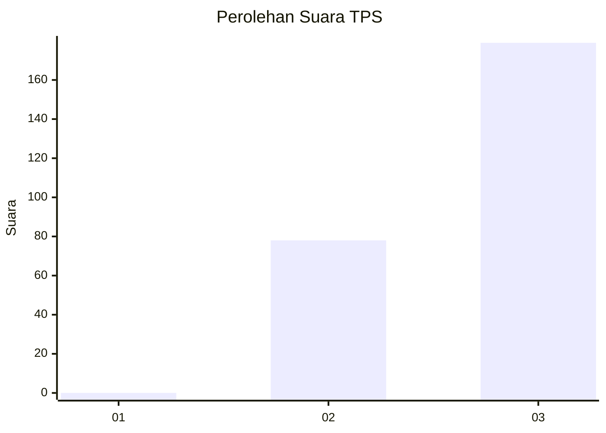
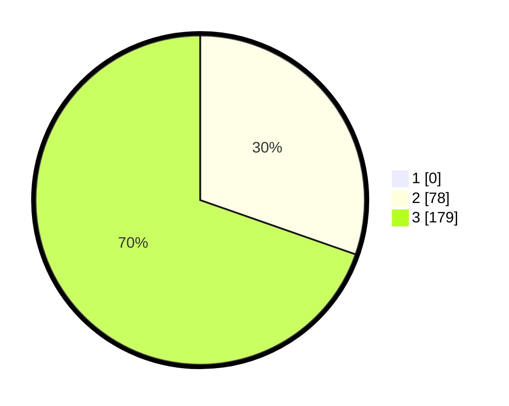

# Hasil

## Grafik

## Tabel

| No. | Nama Paslon    | Suara | Suara (raw) | Persentase |
|:--- |:-------------- | -----:| -----------:| ----------:|
| 1   | ANIES MUHAIMIN | 0     | [0][p-1]    | 0,00       |
| 2   | PRABOWO GIBRAN | 78    | [78][p-2]   | 30,35      |
| 3   | GANJAR MAHFUD  | 179   | [179][p-3]  | 69,65      |

[p-1]: https://github.com/gigit-pemilu/pemilu-2024-51-bali/blob/main/pilpres/hitung-suara/sub/51-bali/sub/02-tabanan/sub/06-kediri/sub/2015-banjar-anyar/sub/026-tps/sub/paslon-1.txt
[p-2]: https://github.com/gigit-pemilu/pemilu-2024-51-bali/blob/main/pilpres/hitung-suara/sub/51-bali/sub/02-tabanan/sub/06-kediri/sub/2015-banjar-anyar/sub/026-tps/sub/paslon-2.txt
[p-3]: https://github.com/gigit-pemilu/pemilu-2024-51-bali/blob/main/pilpres/hitung-suara/sub/51-bali/sub/02-tabanan/sub/06-kediri/sub/2015-banjar-anyar/sub/026-tps/sub/paslon-3.txt

## Foto C Plano

https://sirekap-obj-formc.kpu.go.id/94c3/pemilu/ppwp/51/02/06/20/15/5102062015026-20240216-104251--7281ff24-cfe6-4cae-8057-ca50992bc820.jpg

https://sirekap-obj-formc.kpu.go.id/94c3/pemilu/ppwp/51/02/06/20/15/5102062015026-20240216-104252--97a0f99c-7fad-4b0f-9d66-d3470479270f.jpg

https://sirekap-obj-formc.kpu.go.id/94c3/pemilu/ppwp/51/02/06/20/15/5102062015026-20240216-104252--813655bb-f622-415b-813e-04e71cc6413a.jpg

## Metadata

| Key        | Value               |
| ---------- | ------------------- |
| Time Stamp | 2024-02-16 11:00:29 |

## DATA PEMILIH TETAP

Jumlah pemilih dalam DPT: **287**.
 * L: **147**.
 * P: **140**.

## DATA PENGGUNA HAK PILIH

Jumlah pengguna hak pilih dalam DPT: **252**.
 * L: **129**.
 * P: **123**.

Jumlah pengguna hak pilih dalam DPTb: **1**.
 * L: **0**.
 * P: **1**.

Jumlah pengguna hak pilih dalam DPK: **5**.
 * L: **1**.
 * P: **4**.

Jumlah pengguna hak pilih: **258**.
 * L: **130**.
 * P: **128**.

## JUMLAH SUARA SAH DAN TIDAK SAH

JUMLAH SELURUH SUARA SAH: **257**.

JUMLAH SUARA TIDAK SAH: **1**.

JUMLAH SELURUH SUARA SAH DAN SUARA TIDAK SAH: **258**.

