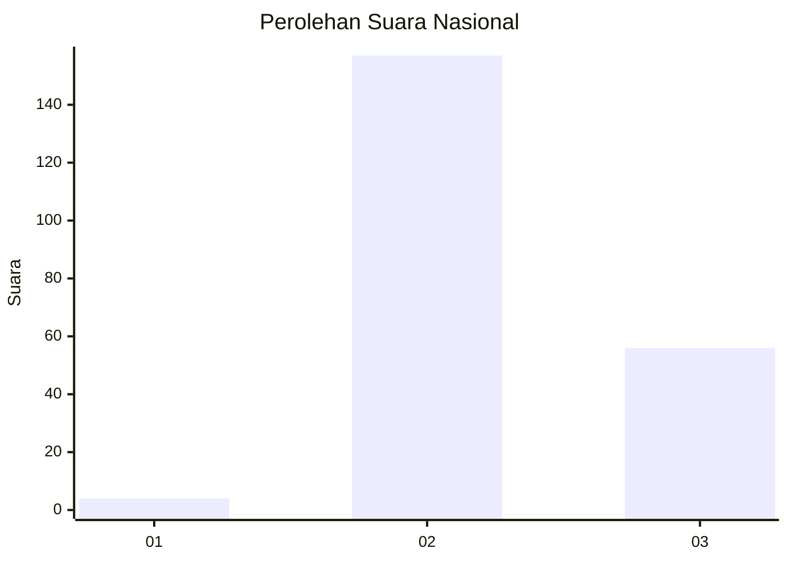
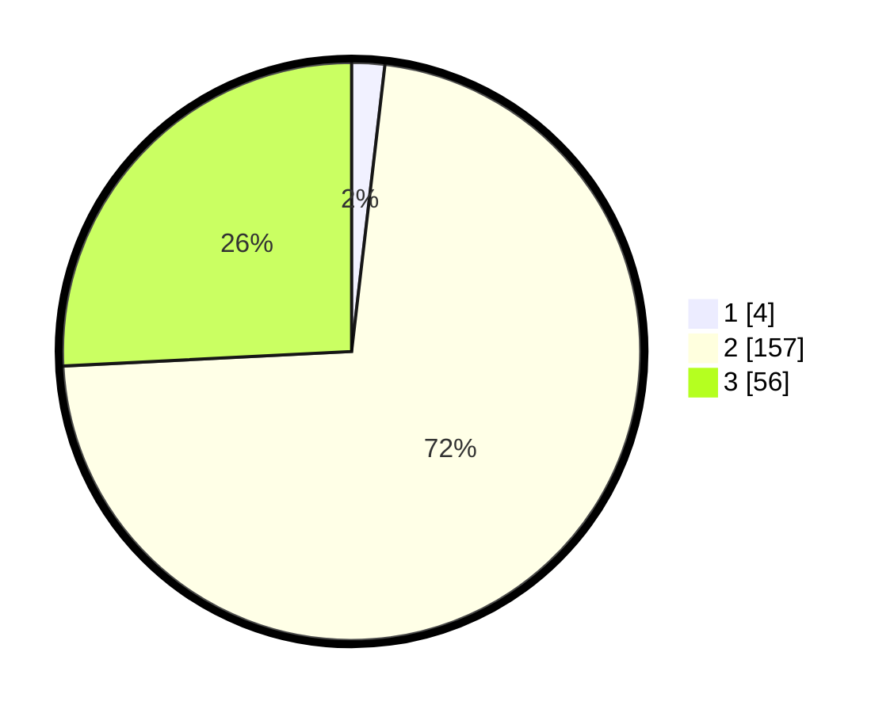

# Hasil

## Grafik

## Tabel

| No. | Nama Paslon    | Suara | Suara (raw) | Persentase |
|:--- |:-------------- | -----:| -----------:| ----------:|
| 1   | ANIES MUHAIMIN | 4     | [4][p-1]    | 1,84       |
| 2   | PRABOWO GIBRAN | 157   | [157][p-2]  | 72,35      |
| 3   | GANJAR MAHFUD  | 56    | [56][p-3]   | 25,81      |

[p-1]: https://github.com/gigit-pemilu/pemilu-2024/blob/main/pilpres/hitung-suara/sub/51-bali/sub/02-tabanan/sub/06-kediri/sub/2015-banjar-anyar/sub/029-tps/sub/paslon-1.txt
[p-2]: https://github.com/gigit-pemilu/pemilu-2024/blob/main/pilpres/hitung-suara/sub/51-bali/sub/02-tabanan/sub/06-kediri/sub/2015-banjar-anyar/sub/029-tps/sub/paslon-2.txt
[p-3]: https://github.com/gigit-pemilu/pemilu-2024/blob/main/pilpres/hitung-suara/sub/51-bali/sub/02-tabanan/sub/06-kediri/sub/2015-banjar-anyar/sub/029-tps/sub/paslon-3.txt

## Foto C Plano

https://sirekap-obj-formc.kpu.go.id/14cc/pemilu/ppwp/51/02/06/20/15/5102062015029-20240216-134503--32a07650-16c3-46a2-a875-52b98d578bbc.jpg

https://sirekap-obj-formc.kpu.go.id/14cc/pemilu/ppwp/51/02/06/20/15/5102062015029-20240216-134504--b390892e-f005-4477-aa98-9b911ebefd2f.jpg

https://sirekap-obj-formc.kpu.go.id/14cc/pemilu/ppwp/51/02/06/20/15/5102062015029-20240216-134504--f6e96754-774d-4e6e-b1db-9a1f376142be.jpg

## Metadata

| Key        | Value               |
| ---------- | ------------------- |
| Time Stamp | 2024-02-16 14:30:33 |

## DATA PEMILIH TETAP

Jumlah pemilih dalam DPT: **282**.
 * L: **136**.
 * P: **146**.

## DATA PENGGUNA HAK PILIH

Jumlah pengguna hak pilih dalam DPT: **225**.
 * L: **105**.
 * P: **120**.

Jumlah pengguna hak pilih dalam DPTb: **4**.
 * L: **1**.
 * P: **3**.

Jumlah pengguna hak pilih dalam DPK: **0**.
 * L: **0**.
 * P: **0**.

Jumlah pengguna hak pilih: **229**.
 * L: **106**.
 * P: **123**.

## JUMLAH SUARA SAH DAN TIDAK SAH

JUMLAH SELURUH SUARA SAH: **217**.

JUMLAH SUARA TIDAK SAH: **12**.

JUMLAH SELURUH SUARA SAH DAN SUARA TIDAK SAH: **229**.

