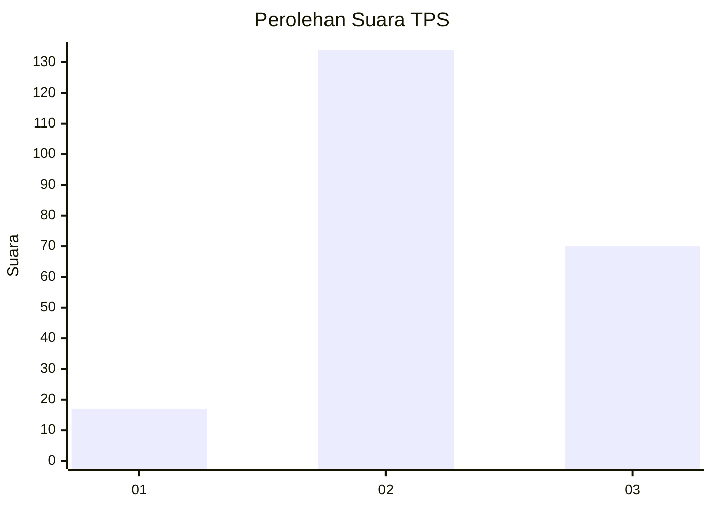
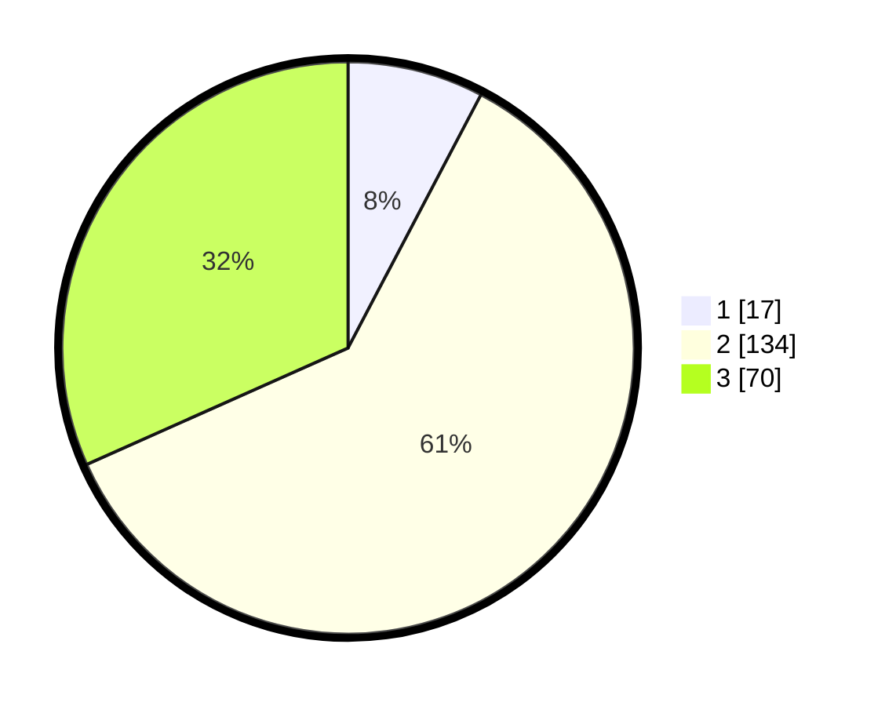

# Hasil

## Grafik

## Tabel

| No. | Nama Paslon    | Suara | Suara (raw) | Persentase |
|:--- |:-------------- | -----:| -----------:| ----------:|
| 1   | ANIES MUHAIMIN | 17    | [17][p-1]   | 7,69       |
| 2   | PRABOWO GIBRAN | 134   | [134][p-2]  | 60,63      |
| 3   | GANJAR MAHFUD  | 70    | [70][p-3]   | 31,67      |

[p-1]: https://github.com/gigit-pemilu/pemilu-2024-51-bali/blob/main/pilpres/hitung-suara/sub/51-bali/sub/02-tabanan/sub/06-kediri/sub/2015-banjar-anyar/sub/030-tps/sub/paslon-1.txt
[p-2]: https://github.com/gigit-pemilu/pemilu-2024-51-bali/blob/main/pilpres/hitung-suara/sub/51-bali/sub/02-tabanan/sub/06-kediri/sub/2015-banjar-anyar/sub/030-tps/sub/paslon-2.txt
[p-3]: https://github.com/gigit-pemilu/pemilu-2024-51-bali/blob/main/pilpres/hitung-suara/sub/51-bali/sub/02-tabanan/sub/06-kediri/sub/2015-banjar-anyar/sub/030-tps/sub/paslon-3.txt

## Foto C Plano

https://sirekap-obj-formc.kpu.go.id/21b9/pemilu/ppwp/51/02/06/20/15/5102062015030-20240214-140945--03c103b5-542c-4c32-973d-c6ab5752e59c.jpg

https://sirekap-obj-formc.kpu.go.id/21b9/pemilu/ppwp/51/02/06/20/15/5102062015030-20240214-141718--48cf9e12-370f-446c-a80f-f5950d47c94f.jpg

## Metadata

| Key        | Value               |
| ---------- | ------------------- |
| Time Stamp | 2024-02-15 22:40:13 |

