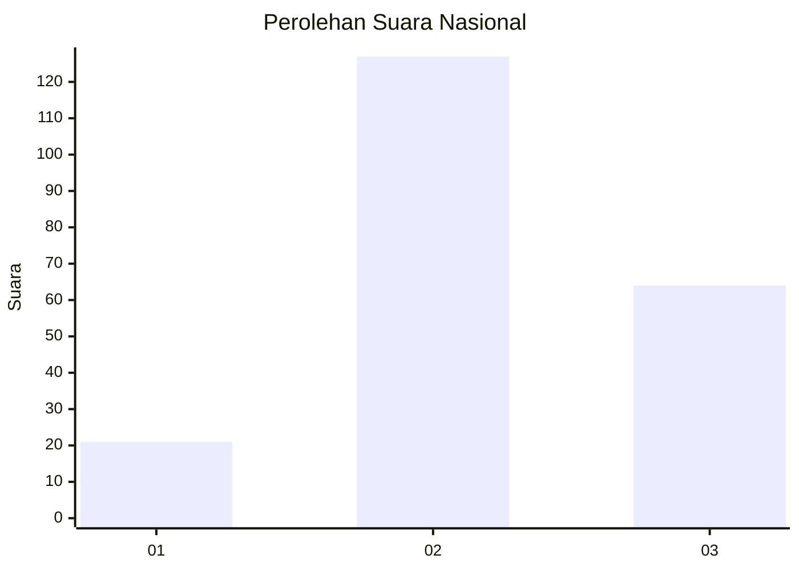
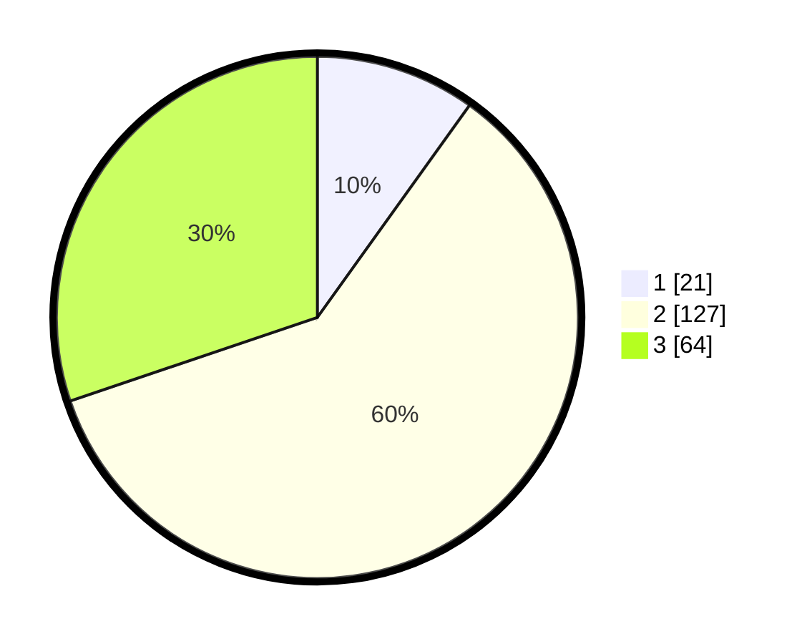

# Hasil

## Grafik

## Tabel

| No. | Nama Paslon    | Suara | Suara (raw) | Persentase |
|:--- |:-------------- | -----:| -----------:| ----------:|
| 1   | ANIES MUHAIMIN | 21    | [21][p-1]   | 9,91       |
| 2   | PRABOWO GIBRAN | 127   | [127][p-2]  | 59,91      |
| 3   | GANJAR MAHFUD  | 64    | [64][p-3]   | 30,19      |

[p-1]: https://github.com/gigit-pemilu/pemilu-2024/blob/main/pilpres/hitung-suara/sub/51-bali/sub/02-tabanan/sub/06-kediri/sub/2015-banjar-anyar/sub/031-tps/sub/paslon-1.txt
[p-2]: https://github.com/gigit-pemilu/pemilu-2024/blob/main/pilpres/hitung-suara/sub/51-bali/sub/02-tabanan/sub/06-kediri/sub/2015-banjar-anyar/sub/031-tps/sub/paslon-2.txt
[p-3]: https://github.com/gigit-pemilu/pemilu-2024/blob/main/pilpres/hitung-suara/sub/51-bali/sub/02-tabanan/sub/06-kediri/sub/2015-banjar-anyar/sub/031-tps/sub/paslon-3.txt

## Foto C Plano

https://sirekap-obj-formc.kpu.go.id/d995/pemilu/ppwp/51/02/06/20/15/5102062015031-20240216-044045--339ed4ca-fab1-4187-a311-30cbda20d54c.jpg

https://sirekap-obj-formc.kpu.go.id/d995/pemilu/ppwp/51/02/06/20/15/5102062015031-20240216-044047--200732b3-2455-4b70-bbb3-a7680c998a5e.jpg

https://sirekap-obj-formc.kpu.go.id/d995/pemilu/ppwp/51/02/06/20/15/5102062015031-20240216-044046--0e4d8ca3-f433-48c6-ad87-b3d766259a26.jpg

## Metadata

| Key        | Value               |
| ---------- | ------------------- |
| Time Stamp | 2024-02-16 11:00:29 |

## DATA PEMILIH TETAP

Jumlah pemilih dalam DPT: **290**.
 * L: **145**.
 * P: **145**.

## DATA PENGGUNA HAK PILIH

Jumlah pengguna hak pilih dalam DPT: **213**.
 * L: **105**.
 * P: **108**.

Jumlah pengguna hak pilih dalam DPTb: **1**.
 * L: **0**.
 * P: **1**.

Jumlah pengguna hak pilih dalam DPK: **2**.
 * L: **1**.
 * P: **1**.

Jumlah pengguna hak pilih: **216**.
 * L: **106**.
 * P: **110**.

## JUMLAH SUARA SAH DAN TIDAK SAH

JUMLAH SELURUH SUARA SAH: **212**.

JUMLAH SUARA TIDAK SAH: **4**.

JUMLAH SELURUH SUARA SAH DAN SUARA TIDAK SAH: **216**.

