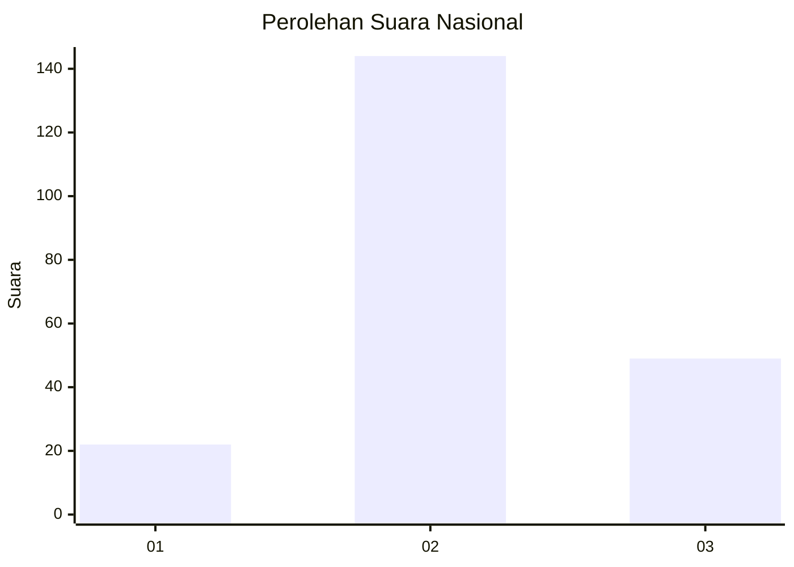
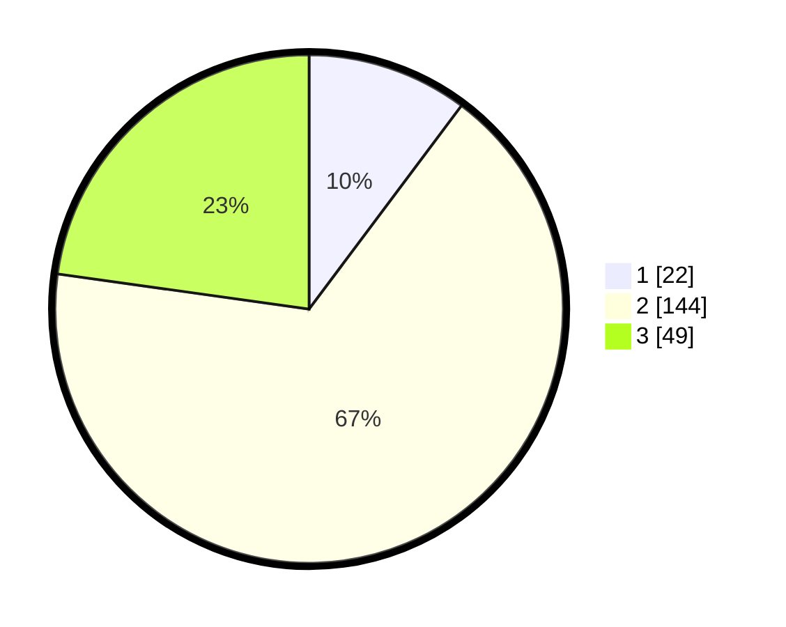

# Hasil

## Grafik

## Tabel

| No. | Nama Paslon    | Suara | Suara (raw) | Persentase |
|:--- |:-------------- | -----:| -----------:| ----------:|
| 1   | ANIES MUHAIMIN | 22    | [22][p-1]   | 10,23      |
| 2   | PRABOWO GIBRAN | 144   | [144][p-2]  | 66,98      |
| 3   | GANJAR MAHFUD  | 49    | [49][p-3]   | 22,79      |

[p-1]: https://github.com/gigit-pemilu/pemilu-2024/blob/main/pilpres/hitung-suara/sub/51-bali/sub/02-tabanan/sub/06-kediri/sub/2015-banjar-anyar/sub/032-tps/sub/paslon-1.txt
[p-2]: https://github.com/gigit-pemilu/pemilu-2024/blob/main/pilpres/hitung-suara/sub/51-bali/sub/02-tabanan/sub/06-kediri/sub/2015-banjar-anyar/sub/032-tps/sub/paslon-2.txt
[p-3]: https://github.com/gigit-pemilu/pemilu-2024/blob/main/pilpres/hitung-suara/sub/51-bali/sub/02-tabanan/sub/06-kediri/sub/2015-banjar-anyar/sub/032-tps/sub/paslon-3.txt

## Foto C Plano

https://sirekap-obj-formc.kpu.go.id/69fe/pemilu/ppwp/51/02/06/20/15/5102062015032-20240216-081012--3285d8a9-8aab-4be5-86d6-f9a288d41c8e.jpg

https://sirekap-obj-formc.kpu.go.id/69fe/pemilu/ppwp/51/02/06/20/15/5102062015032-20240214-155710--dd30cb5f-eb93-46d9-b7e5-ac1bc8994972.jpg

https://sirekap-obj-formc.kpu.go.id/69fe/pemilu/ppwp/51/02/06/20/15/5102062015032-20240214-155747--4e59c123-ace3-49ef-a974-991ae3acca6d.jpg

## Metadata

| Key        | Value               |
| ---------- | ------------------- |
| Time Stamp | 2024-02-16 08:30:27 |

## DATA PEMILIH TETAP

Jumlah pemilih dalam DPT: **294**.
 * L: **148**.
 * P: **146**.

## DATA PENGGUNA HAK PILIH

Jumlah pengguna hak pilih dalam DPT: **211**.
 * L: **103**.
 * P: **108**.

Jumlah pengguna hak pilih dalam DPTb: **4**.
 * L: **2**.
 * P: **2**.

Jumlah pengguna hak pilih dalam DPK: **2**.
 * L: **2**.
 * P: **0**.

Jumlah pengguna hak pilih: **217**.
 * L: **107**.
 * P: **110**.

## JUMLAH SUARA SAH DAN TIDAK SAH

JUMLAH SELURUH SUARA SAH: **215**.

JUMLAH SUARA TIDAK SAH: **2**.

JUMLAH SELURUH SUARA SAH DAN SUARA TIDAK SAH: **217**.

