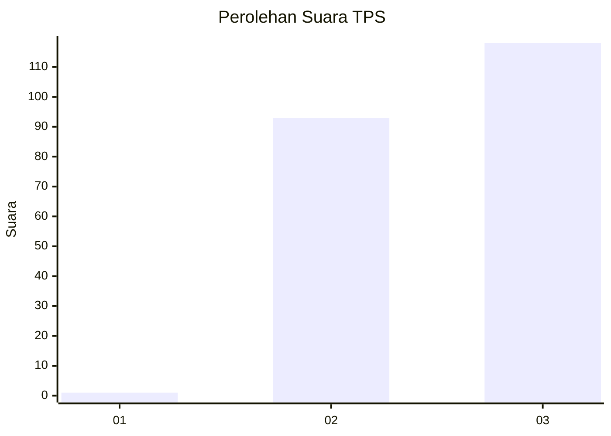
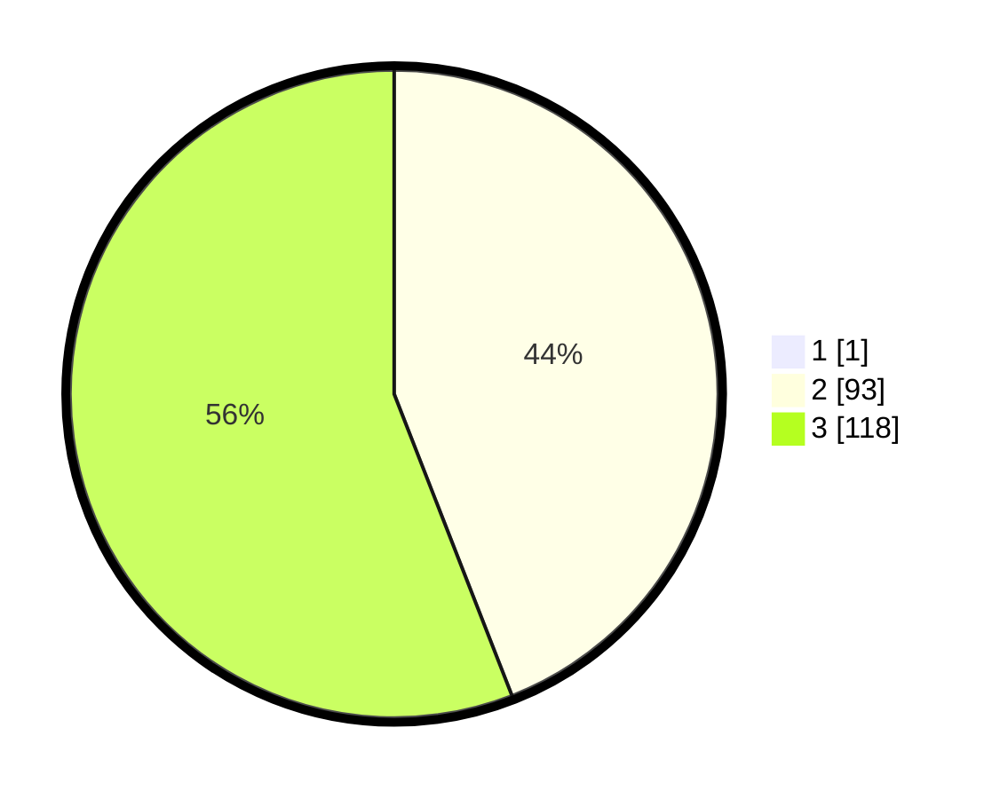

# Hasil

## Grafik

## Tabel

| No. | Nama Paslon    | Suara | Suara (raw) | Persentase |
|:--- |:-------------- | -----:| -----------:| ----------:|
| 1   | ANIES MUHAIMIN | 1     | [1][p-1]    | 0,47       |
| 2   | PRABOWO GIBRAN | 93    | [93][p-2]   | 43,87      |
| 3   | GANJAR MAHFUD  | 118   | [118][p-3]  | 55,66      |

[p-1]: https://github.com/gigit-pemilu/pemilu-2024-51-bali/blob/main/pilpres/hitung-suara/sub/51-bali/sub/02-tabanan/sub/06-kediri/sub/2015-banjar-anyar/sub/034-tps/sub/paslon-1.txt
[p-2]: https://github.com/gigit-pemilu/pemilu-2024-51-bali/blob/main/pilpres/hitung-suara/sub/51-bali/sub/02-tabanan/sub/06-kediri/sub/2015-banjar-anyar/sub/034-tps/sub/paslon-2.txt
[p-3]: https://github.com/gigit-pemilu/pemilu-2024-51-bali/blob/main/pilpres/hitung-suara/sub/51-bali/sub/02-tabanan/sub/06-kediri/sub/2015-banjar-anyar/sub/034-tps/sub/paslon-3.txt

## Foto C Plano

https://sirekap-obj-formc.kpu.go.id/5270/pemilu/ppwp/51/02/06/20/15/5102062015034-20240214-184523--5c16f7dc-bd3a-4389-baa3-6f319cf9c98e.jpg

https://sirekap-obj-formc.kpu.go.id/5270/pemilu/ppwp/51/02/06/20/15/5102062015034-20240214-184926--51dd1bd4-2ccc-407e-9b0e-a40de35b2fc2.jpg

https://sirekap-obj-formc.kpu.go.id/5270/pemilu/ppwp/51/02/06/20/15/5102062015034-20240214-185107--03db571a-05b1-4dd0-967e-6d8193271fd6.jpg

## Metadata

| Key        | Value               |
| ---------- | ------------------- |
| Time Stamp | 2024-02-14 21:46:01 |

## DATA PEMILIH TETAP

Jumlah pemilih dalam DPT: **224**.
 * L: **105**.
 * P: **119**.

## DATA PENGGUNA HAK PILIH

Jumlah pengguna hak pilih dalam DPT: **207**.
 * L: **96**.
 * P: **111**.

Jumlah pengguna hak pilih dalam DPTb: **4**.
 * L: **2**.
 * P: **2**.

Jumlah pengguna hak pilih dalam DPK: **5**.
 * L: **1**.
 * P: **4**.

Jumlah pengguna hak pilih: **216**.
 * L: **99**.
 * P: **117**.

## JUMLAH SUARA SAH DAN TIDAK SAH

JUMLAH SELURUH SUARA SAH: **212**.

JUMLAH SUARA TIDAK SAH: **4**.

JUMLAH SELURUH SUARA SAH DAN SUARA TIDAK SAH: **216**.

