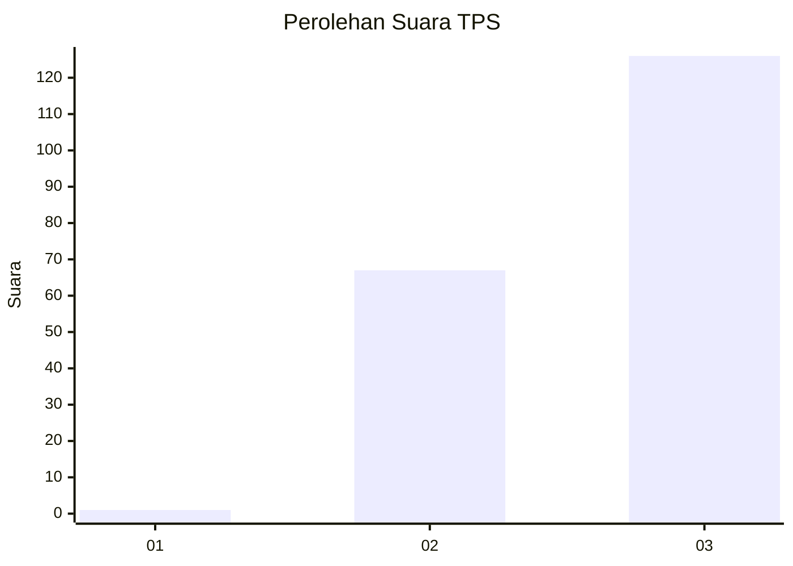
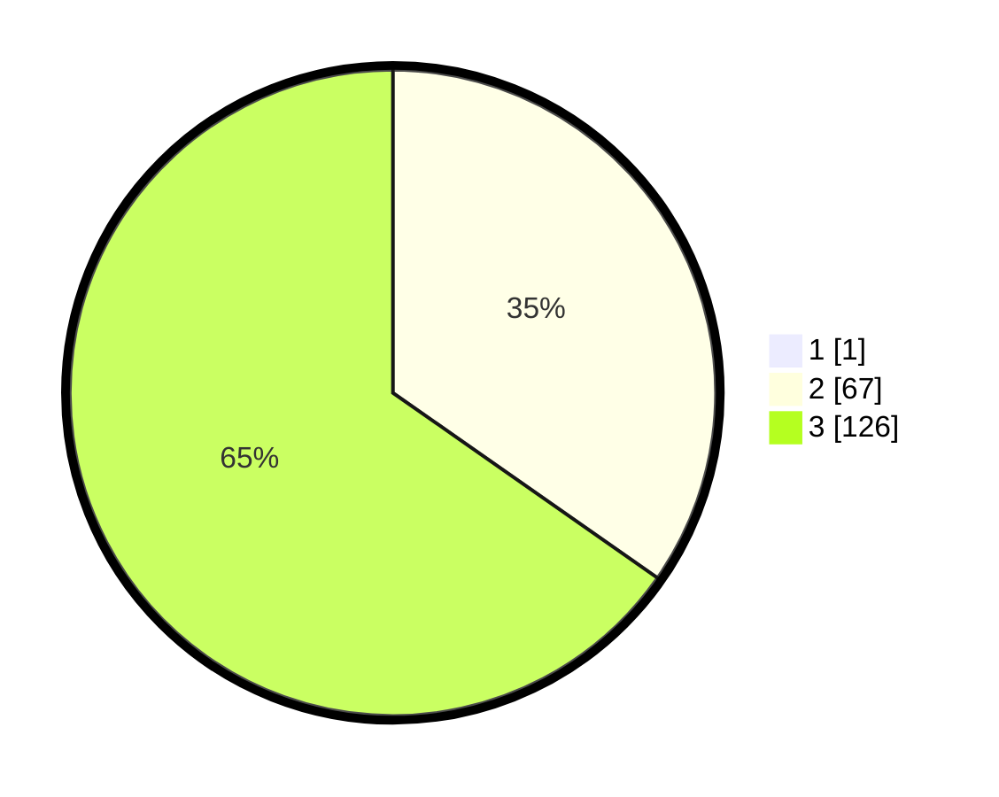

# Hasil

## Grafik

## Tabel

| No. | Nama Paslon    | Suara | Suara (raw) | Persentase |
|:--- |:-------------- | -----:| -----------:| ----------:|
| 1   | ANIES MUHAIMIN | 1     | [1][p-1]    | 0,52       |
| 2   | PRABOWO GIBRAN | 67    | [67][p-2]   | 34,54      |
| 3   | GANJAR MAHFUD  | 126   | [126][p-3]  | 64,95      |

[p-1]: https://github.com/gigit-pemilu/pemilu-2024-51-bali/blob/main/pilpres/hitung-suara/sub/51-bali/sub/02-tabanan/sub/06-kediri/sub/2015-banjar-anyar/sub/036-tps/sub/paslon-1.txt
[p-2]: https://github.com/gigit-pemilu/pemilu-2024-51-bali/blob/main/pilpres/hitung-suara/sub/51-bali/sub/02-tabanan/sub/06-kediri/sub/2015-banjar-anyar/sub/036-tps/sub/paslon-2.txt
[p-3]: https://github.com/gigit-pemilu/pemilu-2024-51-bali/blob/main/pilpres/hitung-suara/sub/51-bali/sub/02-tabanan/sub/06-kediri/sub/2015-banjar-anyar/sub/036-tps/sub/paslon-3.txt

## Foto C Plano

https://sirekap-obj-formc.kpu.go.id/15dd/pemilu/ppwp/51/02/06/20/15/5102062015036-20240216-035428--d8be1301-283e-4d17-8bc9-c76a420d710a.jpg

https://sirekap-obj-formc.kpu.go.id/15dd/pemilu/ppwp/51/02/06/20/15/5102062015036-20240216-035432--36aa7262-b3ca-4540-8994-18d401c88dd8.jpg

https://sirekap-obj-formc.kpu.go.id/15dd/pemilu/ppwp/51/02/06/20/15/5102062015036-20240216-035428--08574f2b-a2c6-429e-9016-019a25670435.jpg

## Metadata

| Key        | Value               |
| ---------- | ------------------- |
| Time Stamp | 2024-02-16 11:00:29 |

## DATA PEMILIH TETAP

Jumlah pemilih dalam DPT: **220**.
 * L: **110**.
 * P: **110**.

## DATA PENGGUNA HAK PILIH

Jumlah pengguna hak pilih dalam DPT: **189**.
 * L: **93**.
 * P: **96**.

Jumlah pengguna hak pilih dalam DPTb: **5**.
 * L: **1**.
 * P: **4**.

Jumlah pengguna hak pilih dalam DPK: **0**.
 * L: **0**.
 * P: **0**.

Jumlah pengguna hak pilih: **194**.
 * L: **94**.
 * P: **100**.

## JUMLAH SUARA SAH DAN TIDAK SAH

JUMLAH SELURUH SUARA SAH: **194**.

JUMLAH SUARA TIDAK SAH: **0**.

JUMLAH SELURUH SUARA SAH DAN SUARA TIDAK SAH: **194**.

