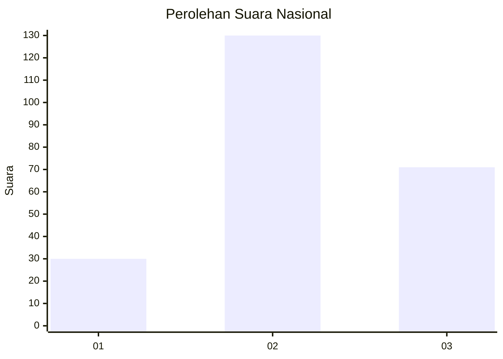
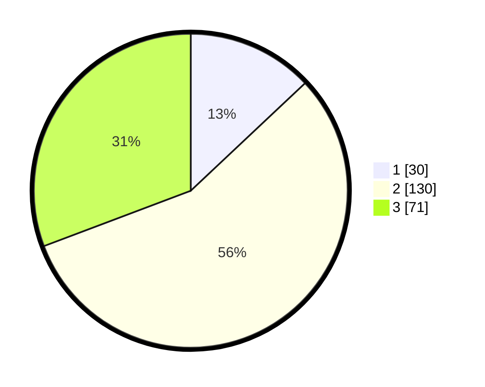

# Hasil

## Grafik

## Tabel

| No. | Nama Paslon    | Suara | Suara (raw) | Persentase |
|:--- |:-------------- | -----:| -----------:| ----------:|
| 1   | ANIES MUHAIMIN | 30    | [30][p-1]   | 12,99      |
| 2   | PRABOWO GIBRAN | 130   | [130][p-2]  | 56,28      |
| 3   | GANJAR MAHFUD  | 71    | [71][p-3]   | 30,74      |

[p-1]: https://github.com/gigit-pemilu/pemilu-2024/blob/main/pilpres/hitung-suara/sub/51-bali/sub/02-tabanan/sub/06-kediri/sub/2015-banjar-anyar/sub/037-tps/sub/paslon-1.txt
[p-2]: https://github.com/gigit-pemilu/pemilu-2024/blob/main/pilpres/hitung-suara/sub/51-bali/sub/02-tabanan/sub/06-kediri/sub/2015-banjar-anyar/sub/037-tps/sub/paslon-2.txt
[p-3]: https://github.com/gigit-pemilu/pemilu-2024/blob/main/pilpres/hitung-suara/sub/51-bali/sub/02-tabanan/sub/06-kediri/sub/2015-banjar-anyar/sub/037-tps/sub/paslon-3.txt

## Foto C Plano

https://sirekap-obj-formc.kpu.go.id/0396/pemilu/ppwp/51/02/06/20/15/5102062015037-20240214-232255--ed1e14ac-6bb3-4999-a835-a694811b45e4.jpg

https://sirekap-obj-formc.kpu.go.id/0396/pemilu/ppwp/51/02/06/20/15/5102062015037-20240214-232305--60db568b-fc1a-4490-a733-c29763416c67.jpg

https://sirekap-obj-formc.kpu.go.id/0396/pemilu/ppwp/51/02/06/20/15/5102062015037-20240214-232311--32f89bd1-555e-4677-ab2d-7f5a129f4cda.jpg

## Metadata

| Key        | Value               |
| ---------- | ------------------- |
| Time Stamp | 2024-02-15 23:29:50 |

