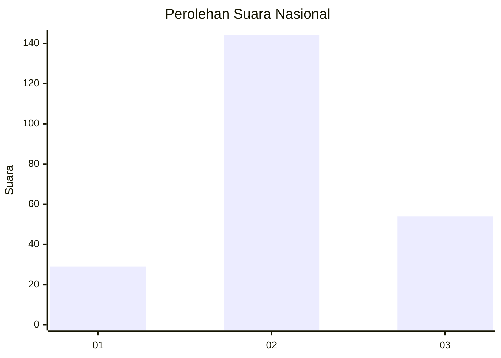
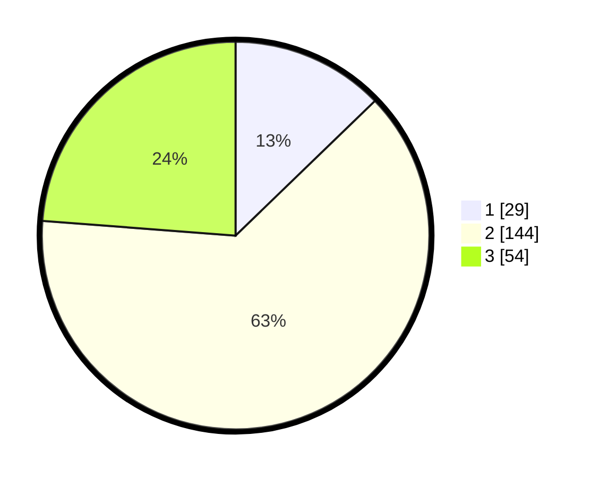

# Hasil

## Grafik

## Tabel

| No. | Nama Paslon    | Suara | Suara (raw) | Persentase |
|:--- |:-------------- | -----:| -----------:| ----------:|
| 1   | ANIES MUHAIMIN | 29    | [29][p-1]   | 12,78      |
| 2   | PRABOWO GIBRAN | 144   | [144][p-2]  | 63,44      |
| 3   | GANJAR MAHFUD  | 54    | [54][p-3]   | 23,79      |

[p-1]: https://github.com/gigit-pemilu/pemilu-2024/blob/main/pilpres/hitung-suara/sub/51-bali/sub/02-tabanan/sub/06-kediri/sub/2015-banjar-anyar/sub/038-tps/sub/paslon-1.txt
[p-2]: https://github.com/gigit-pemilu/pemilu-2024/blob/main/pilpres/hitung-suara/sub/51-bali/sub/02-tabanan/sub/06-kediri/sub/2015-banjar-anyar/sub/038-tps/sub/paslon-2.txt
[p-3]: https://github.com/gigit-pemilu/pemilu-2024/blob/main/pilpres/hitung-suara/sub/51-bali/sub/02-tabanan/sub/06-kediri/sub/2015-banjar-anyar/sub/038-tps/sub/paslon-3.txt

## Foto C Plano

https://sirekap-obj-formc.kpu.go.id/5909/pemilu/ppwp/51/02/06/20/15/5102062015038-20240216-090602--62206eb6-27f8-4c27-b203-138b96047d63.jpg

https://sirekap-obj-formc.kpu.go.id/5909/pemilu/ppwp/51/02/06/20/15/5102062015038-20240216-090604--cc889809-d5b5-4c59-a15b-8311d3d28649.jpg

https://sirekap-obj-formc.kpu.go.id/5909/pemilu/ppwp/51/02/06/20/15/5102062015038-20240216-090603--f0450e77-54ce-47cc-b7df-72a81fef6dd2.jpg

## Metadata

| Key        | Value               |
| ---------- | ------------------- |
| Time Stamp | 2024-02-16 11:00:29 |

## DATA PEMILIH TETAP

Jumlah pemilih dalam DPT: **293**.
 * L: **141**.
 * P: **152**.

## DATA PENGGUNA HAK PILIH

Jumlah pengguna hak pilih dalam DPT: **223**.
 * L: **107**.
 * P: **116**.

Jumlah pengguna hak pilih dalam DPTb: **4**.
 * L: **1**.
 * P: **3**.

Jumlah pengguna hak pilih dalam DPK: **0**.
 * L: **0**.
 * P: **0**.

Jumlah pengguna hak pilih: **0**.
 * L: **0**.
 * P: **0**.

## JUMLAH SUARA SAH DAN TIDAK SAH

JUMLAH SELURUH SUARA SAH: **227**.

JUMLAH SUARA TIDAK SAH: **0**.

JUMLAH SELURUH SUARA SAH DAN SUARA TIDAK SAH: **227**.

