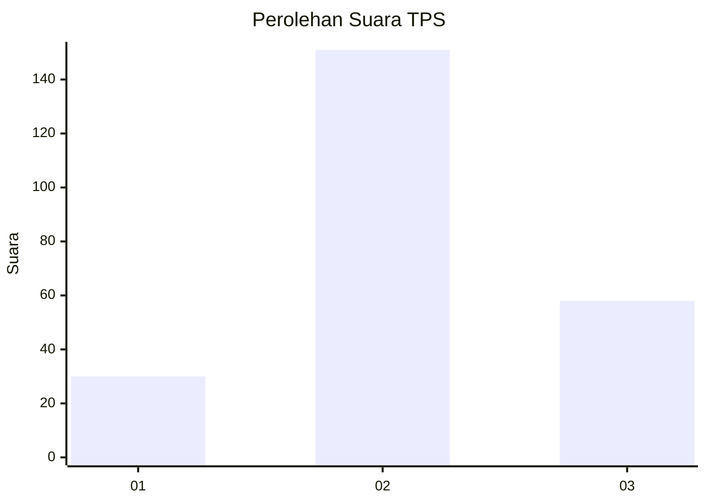
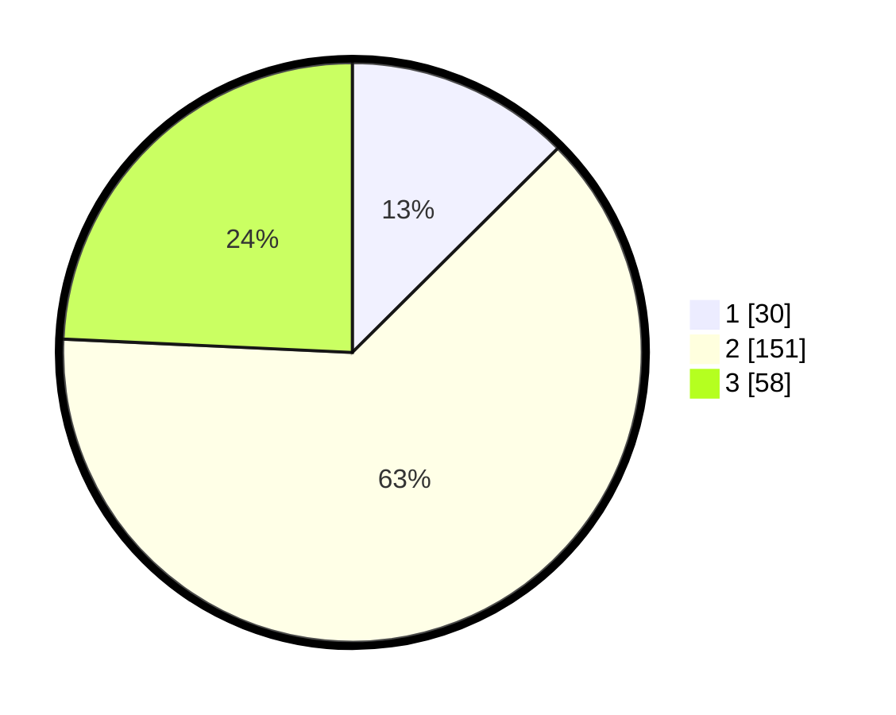

# Hasil

## Grafik

## Tabel

| No. | Nama Paslon    | Suara | Suara (raw) | Persentase |
|:--- |:-------------- | -----:| -----------:| ----------:|
| 1   | ANIES MUHAIMIN | 30    | [30][p-1]   | 12,55      |
| 2   | PRABOWO GIBRAN | 151   | [151][p-2]  | 63,18      |
| 3   | GANJAR MAHFUD  | 58    | [58][p-3]   | 24,27      |

[p-1]: https://github.com/gigit-pemilu/pemilu-2024-51-bali/blob/main/pilpres/hitung-suara/sub/51-bali/sub/02-tabanan/sub/06-kediri/sub/2015-banjar-anyar/sub/041-tps/sub/paslon-1.txt
[p-2]: https://github.com/gigit-pemilu/pemilu-2024-51-bali/blob/main/pilpres/hitung-suara/sub/51-bali/sub/02-tabanan/sub/06-kediri/sub/2015-banjar-anyar/sub/041-tps/sub/paslon-2.txt
[p-3]: https://github.com/gigit-pemilu/pemilu-2024-51-bali/blob/main/pilpres/hitung-suara/sub/51-bali/sub/02-tabanan/sub/06-kediri/sub/2015-banjar-anyar/sub/041-tps/sub/paslon-3.txt

## Foto C Plano

https://sirekap-obj-formc.kpu.go.id/cf40/pemilu/ppwp/51/02/06/20/15/5102062015041-20240215-221230--22040171-281e-4e92-908a-bfbfe5999532.jpg

https://sirekap-obj-formc.kpu.go.id/cf40/pemilu/ppwp/51/02/06/20/15/5102062015041-20240215-221234--2ebe54c2-7d17-4b47-92d7-8414efa47205.jpg

https://sirekap-obj-formc.kpu.go.id/cf40/pemilu/ppwp/51/02/06/20/15/5102062015041-20240215-221232--80eac155-8cc0-49c9-93e9-79a714aceedd.jpg

## Metadata

| Key        | Value               |
| ---------- | ------------------- |
| Time Stamp | 2024-02-15 22:40:13 |

## DATA PEMILIH TETAP

Jumlah pemilih dalam DPT: **294**.
 * L: **150**.
 * P: **144**.

## DATA PENGGUNA HAK PILIH

Jumlah pengguna hak pilih dalam DPT: **232**.
 * L: **118**.
 * P: **114**.

Jumlah pengguna hak pilih dalam DPTb: **4**.
 * L: **2**.
 * P: **2**.

Jumlah pengguna hak pilih dalam DPK: **3**.
 * L: **3**.
 * P: **0**.

Jumlah pengguna hak pilih: **239**.
 * L: **123**.
 * P: **116**.

## JUMLAH SUARA SAH DAN TIDAK SAH

JUMLAH SELURUH SUARA SAH: **239**.

JUMLAH SUARA TIDAK SAH: **0**.

JUMLAH SELURUH SUARA SAH DAN SUARA TIDAK SAH: **239**.

